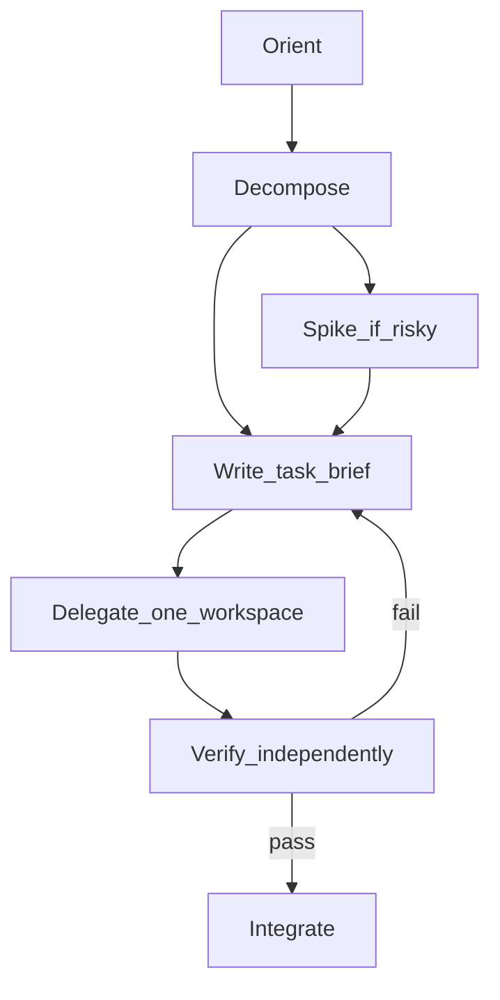

# Agent orchestrator

**Read this skill first** for any task that is not obviously single-shot (see [Triage](#triage-single-shot-vs-orchestrate) below). Apply **common sense**: a senior dev does not write a task brief to fix a typo; they also do not spin up three agents without a spec.

When orchestration applies, you are the **coordinator**. Workers get **one brief, one workspace, one definition of done**. You **orient**, **spec**, **delegate**, **verify**, and **integrate**.

Pair with [git-worktrees](../git-worktrees/SKILL.md), [concurrent-cli-agents](../concurrent-cli-agents/SKILL.md), [split-to-prs](../split-to-prs/SKILL.md). Load domain skills for workers ([react-client-expert](../react-client-expert/SKILL.md), [fix-dependency-security](../fix-dependency-security/SKILL.md), etc.).

---

## Triage: single-shot vs orchestrate

**Default:** mentally triage in ~10 seconds before acting. Do **not** run the full checklist for trivial work.

### Single-shot (implement directly — no brief, no worktree, no subagents)

All of the following should be true:

| Signal | Examples |
|--------|----------|
| **One clear change** | Fix typo, adjust copy, rename symbol, tweak one constant |
| **≤1–2 files**, known pattern | Lint fix, import cleanup, small type fix |
| **Low risk** | No new deps, no auth/data model, no cross-cutting refactor |
| **Verification is obvious** | `pnpm lint` / `pnpm type-check` on touched files |
| **No concurrent workers** | Only you (or one session) touching the tree |

**Still do:** read relevant file context, run verification commands after editing, minimal diff.

**Skip:** task-brief template, worktrees, merge choreography, orchestrator report.

### Light orchestration (mini spec in chat — no template file)

One or two of these — stay in **one checkout**, no worker delegation:

- User asked for a **plan** or **review** only (no implementation yet)
- **3–5 files** but same concern (e.g. one component + its test)
- **Resume** with a tiny gap (“finish the AGENTS.md link”)
- Uncertain but **fast to disprove** — try the fix; escalate to full orchestration if it spreads

Write 3–5 bullets in the reply: outcome, files, commands you will run. Then implement.

### Full orchestration (this skill end-to-end)

Any of these:

| Signal | Action |
|--------|--------|
| **Multiple agents** or worktrees | Brief per worker + verify each + merge order |
| **Unknown hard part** | Spike wave first |
| **Large / vague ask** | Decompose; user approves waves ([split-to-prs](../split-to-prs/SKILL.md)) |
| **High stakes** | Security, deps, prod config, migration |
| **Prior agent “done”** | Independent verification required |
| **Resume after days** | Orient + gap-only brief |

```text
User request
    → triage
        → single-shot?  → edit + verify + done
        → light?        → short bullets + edit + verify
        → full          → checklist + briefs + workers + verify + integrate
```

**Escalation:** If single-shot grows past ~2 files or new unknowns appear, **stop**, say what changed, switch to light or full orchestration.

---

## How a human dev starts or resumes (first principles)

| Phase | What humans do | Orchestrator equivalent |
|-------|----------------|-------------------------|
| **Orient** | Read ticket, `git status`, recent commits, run app/tests once | Recover branch, diff, chat intent; list unknowns |
| **Decompose** | Split “hard/unknown” from “mechanical” | Wave 0 spike vs Wave 1 implementation |
| **Spike** | Prove the risky part (API shape, repro bug, one file) | Small brief, time-boxed, explicit learnings output |
| **Implement** | Fill in the rest with known patterns | Full brief only after spike succeeds or risk is low |
| **Verify** | Run checks, click path, read diff — not trust memory | Run commands yourself; compare diff to spec |
| **Integrate** | Merge, PR, note follow-ups | merge/cherry-pick per [git-worktrees](../git-worktrees/SKILL.md) |
| **Resume** | `git log`, half-done branch, “where was I?” | Re-read brief + diff; new brief for **remaining gap only** |

**Rule:** Solve the **core hard issue** (or de-risk it) **before** assigning a worker the entire surface area. Do not ask one agent to “refactor the app” when auth/session shape is still unknown.



---

## Roles

| Role | Responsibility |
|------|----------------|
| **Orchestrator** (you) | Spec, sequencing, verification, merge order, user updates |
| **Worker** | Implement inside one worktree/sandbox; commit on agent branch |
| **User** | Approves scope splits, merge/PR, destructive git |

Orchestrator **may** implement only when the task is trivial or verification failed twice and fix is faster inline — then say so explicitly.

---

## Workflow checklist

```
- [ ] 1. Orient — branch, diff, user goal, blockers, relevant skills
- [ ] 2. Decompose — spike vs implementation waves; disjoint file ownership
- [ ] 3. Write task brief (template below) — outcome, standards, verification commands
- [ ] 4. Create workspace — worktree or sandbox; record in brief
- [ ] 5. After the work is done (especially multi-worker or execute-plan style): run `git worktree prune` + local git-worktrees scripts first for `.worktrees/`; use `git-worktrees/scripts/agent-worktree-clean.sh` (see git-worktrees "Disk hygiene" + new "Preference in this project" for local-default vs global-fallback)
- [ ] 5. Delegate — paste brief; point to AGENTS.md + domain skills
- [ ] 6. Worker claims done → orchestrator verifies (never accept on claim alone)
- [ ] 7. Pass → integrate (merge order); fail → narrow fix brief → back to 6
- [ ] 8. Report — what landed, commands run, leftovers, next wave
```

---

## Step 1: Orient (start or resume)

Before writing a worker prompt:

1. **Goal in one sentence** — what changes for the user when this is done?
2. **Base ref** — branch and commit (`git log -3`, `git diff main...HEAD`).
3. **Constraints** — no new deps, no push, files to avoid, E2E on host Brave, etc. ([`AGENTS.md`](../../../AGENTS.md)).
4. **Resume inventory** — if continuing prior work: what is already merged vs only on agent branch vs uncommitted?
5. **Risk** — unknown API, flaky test, cross-cutting refactor → **spike first**.

---

## Step 2: Decompose

| Slice type | When | Worker scope |
|------------|------|----------------|
| **Spike** | Unknown root cause, new library, architectural choice | ≤1–2 files or read-only investigation + written recommendation |
| **Foundation** | Types, shared util, API route used by others | Merge before dependent tasks |
| **Feature** | User-visible behavior with clear acceptance | Full brief + verification |
| **Hygiene** | Docs, lint-only, rename | Separate brief; never mixed with risky spike |

**Concurrent workers:** only when slices are **independent** ([concurrent-cli-agents](../concurrent-cli-agents/SKILL.md)). Assign **disjoint paths** in each brief.

---

## Step 3: Task brief (required for every delegation)

Use [templates/task-brief.md](templates/task-brief.md). Minimum sections:

1. **Problem** — why this exists (user/system symptom).
2. **Outcome** — observable result when correct (not “refactor X”).
3. **Non-goals** — what not to change.
4. **Standards** — skills to follow (`react-client-expert`, `git-worktrees`, …).
5. **Files / ownership** — may touch; must not touch.
6. **Verification** — exact commands orchestrator will run (copy from repo):

   ```bash
   pnpm type-check
   pnpm lint
   # optional: pnpm test:e2e --grep '…'  # host Brave — see tests/e2e/README.md
   ```

7. **Workspace** — branch name, worktree path, or cloud sandbox id.
8. **Done artifact** — commit on `agent/<tool>/<slug>`; short summary of **what** and **how verified by worker**.

Workers must **commit in their workspace** before claiming done ([git-worktrees](../git-worktrees/SKILL.md)).

---

## Step 4: Delegate

- One prompt per worker; include the full brief.
- Reference repo root `AGENTS.md` and applicable `.agents/skills/*/SKILL.md`.
- Prefer **non-interactive** commands ([cli-for-agents](https://cursor.com/docs/agent/skills) patterns).
- Do not ask worker to merge into integration branch unless brief explicitly includes it.

---

## Step 5: Verify (orchestrator-owned)

When a worker says “done”, **assume incomplete** until verified.

| Check | Action |
|-------|--------|
| **Scope** | `git diff <base>...<agent-branch>` — only allowed files/hunks? |
| **Claims** | Worker’s summary matches actual diff? |
| **Automated** | Run **every** command from brief yourself in correct checkout |
| **Regression** | Any obvious break (imports, types, removed exports)? |
| **Standards** | Spot-check against cited skill (effects, no `cp` integration, etc.) |

**Pass:** all verification commands exit 0 (or documented known flake with user ack).  
**Fail:** write a **fix brief** — only the gap (“lint fails on line 42”, “missing Suspense boundary”) — same workspace if possible; do not re-run full feature from scratch.

Never merge on worker testimony alone.

---

## Step 6: Integrate

1. Merge agent branches **one at a time** on integration branch ([agent-worktree-merge.sh](../git-worktrees/scripts/agent-worktree-merge.sh)).
2. Re-run verification on integration branch after each merge.
3. Open PR or report per [split-to-prs](../split-to-prs/SKILL.md) if user wants reviewable chunks.
4. Remove worktrees only after merge + verify.

---

## Resume playbook

When picking up stale work:

1. Read last brief (chat or `.agents/workspaces.json` if used).
2. `git log`, `git diff`, `git worktree list`.
3. Identify **remaining outcome gap** — one paragraph.
4. New brief titled **“Resume: …”** with only unfinished verification items + files still wrong.
5. Do **not** re-delegate the entire original scope unless the branch was reset.

---

## Quality bar (this repo defaults)

Pull from [`AGENTS.md`](../../../AGENTS.md) unless brief overrides:

- `pnpm` + frozen lockfile policy when deps change
- `pnpm type-check`, `pnpm lint` (Biome errors only)
- React client work → [react-client-expert](../react-client-expert/SKILL.md)
- Dependency changes → [fix-dependency-security](../fix-dependency-security/SKILL.md)
- Minimal diff — no drive-by refactors

Add task-specific acceptance (E2E path, screenshot, API response) in the brief.

---

## Anti-patterns

- Vague briefs (“make it better”, “clean up components”)
- Skipping spike when integration approach is unknown
- Accepting “done” without running verification commands
- `cp` from worktrees instead of merge ([git-worktrees](../git-worktrees/SKILL.md))
- One mega-prompt for unrelated files and agents
- Re-delegating full scope on resume instead of gap-only brief
- Orchestrator implementing large features while also “verifying” the same diff without separation
- Choosing “natural” feature branch names for the final integration/stack output of a long plan (high risk of collision with user’s pre-existing local branch of the same name)

## Long-running plans and final stack handoff (execute-plan patterns)

For multi-session efforts that produce many reviewed PRs and must eventually become a Graphite stack the user manages:

- **Naming discipline for the final branch**: Never reuse a plausible user feature name (e.g. `feature/xai-agentic-profile-qa-reactor`). Collisions with the user’s existing local work are expensive. Default to `-stack`, plan-ID prefixes (`ep/<id>-...`), or clearly artificial names. Confirm the name with the user before the final push.
- **Environment reality**: The orchestrator session runs in a `.grok` worktree. The user’s primary terminal (where `gt` is authenticated and they run `gt submit --stack`, `gt restack`, etc.) is usually elsewhere. Plan for an explicit handoff instead of assuming the agent can complete the Graphite submission.
- **What the agent should leave the user**: 
  - A clean pushed branch containing the full reviewed work (linear is acceptable).
  - The list of original clean `execute-plan/...-pr-N-*` branches (with their final SHAs).
  - Clear instructions: “Fetch in your main terminal, then either `gt submit --stack` on the linear result or use `gt split --by-commit` / manual level branches if you want a true multi-level Graphite stack.”
- Document the two common final paths so the user can choose.

These patterns were heavily exercised during an 8-PR execute-plan + Graphite stack effort. See `docs/agent-workflow-lessons.md` for the detailed write-up.

---

## Orchestrator report template

After a wave completes, tell the user:

```markdown
## Orchestrator summary

**Goal:** …
**Workers:** tool/branch → outcome (pass/fail)

### Verified
- `pnpm type-check` — pass
- `pnpm lint` — pass

### Integrated
- Merged `agent/cursor/…` into `refactor/…`

### Leftovers
- …

### Next wave (if any)
- Spike: …
- Then: …
```
