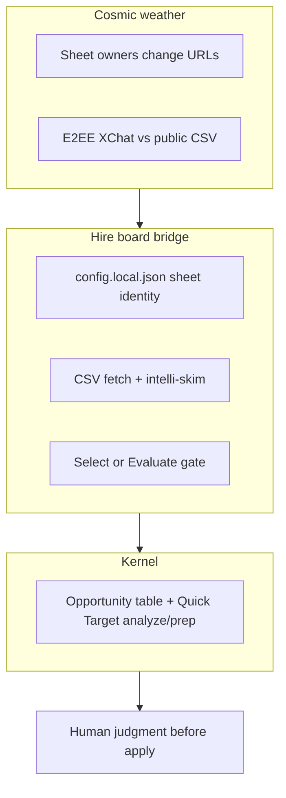
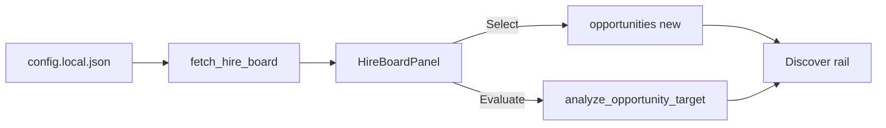

# Coming next — hire board

**Audience:** You · implementer · agents  
**Contract:** [PRODUCT.md](../PRODUCT.md) · [data/hire-board/README.md](../data/hire-board/README.md)  
**Method:** stellar-spacemap · collab-finder blueprint style

*Last updated: 2026-07-29*

---

## 0. Mission (one sentence)

Skim a configured public hire spreadsheet in Discover, rank fit-friendly companies first, and persist only Select/Evaluate rows into SQLite opportunities.

---

## 0b. Thrive picture

| Role | What it is | Why it wins |
|------|------------|-------------|
| **Kernel** | Existing opportunities + analyze/prep | One pipeline, no CRM fork |
| **Bridge** | Ephemeral sheet leads | Fresh list without polluting DB |
| **Boundary** | gitignored sheet config | No secrets/ids in git |

---

## 1. Scorecard

| Area | Grade | One line | Evidence |
|------|-------|----------|----------|
| Config isolation | A | Sheet id not in source | `config.example.json` + gitignore; `hire_board::resolve_export_url` |
| Offline parse | A | Fixture tests | `cargo test hire_board` + `data/hire-board/sample.csv` |
| Skim rank | B | Heuristic geo + URL | `skim_rank` in `hire_board.rs` |
| Persist gate | A | Select/Evaluate only | `select_hire_board_lead` / analyze upsert |
| Discover UI | B | Panel + chips | `hire-board-panel.tsx` |

**Plain rule:** Never bulk-import the sheet; never commit `config.local.json`.

---

## 2. System map (today)

---

## 7. Blueprint cards (shipped this wave)

### SN-1 · Dogfood parse fixture
**Done when:** `cargo test hire_board` green offline.

### SN-2 · Fetch + skim from local config
**Done when:** Refresh fails clearly without config; succeeds with `config.local.json`.

### SN-3 · Select / Evaluate → DB
**Done when:** Select creates/updates one opportunity; Evaluate runs analyze.

### SN-4 · Discover panel
**Done when:** Hire board visible on Discover with geo chips.

### SN-5 · Docs
**Done when:** `docs/tauri-commands.md` lists both commands; this report exists.

---

## 13. References

| Source | Use |
|--------|-----|
| [data/hire-board/README.md](../data/hire-board/README.md) | Config setup |
| [docs/tauri-commands.md](../docs/tauri-commands.md) | Command contract |
| [candidate-preferences.md](../data/distillation/curation/candidate-preferences.md) | Geo skim priors |
