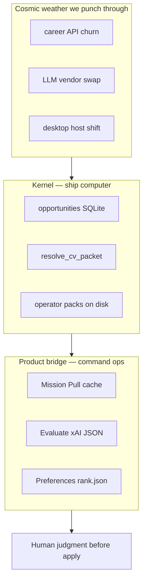
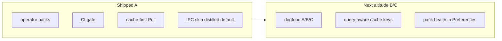
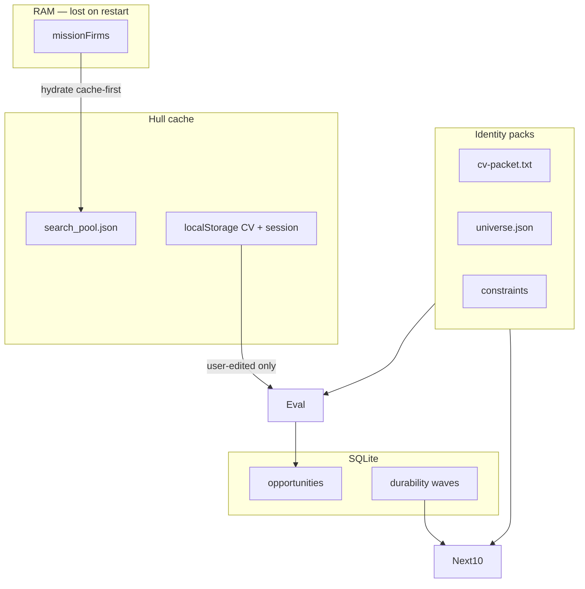
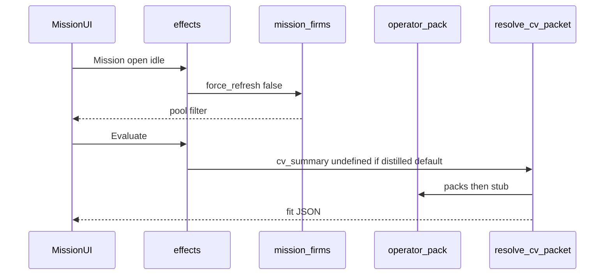
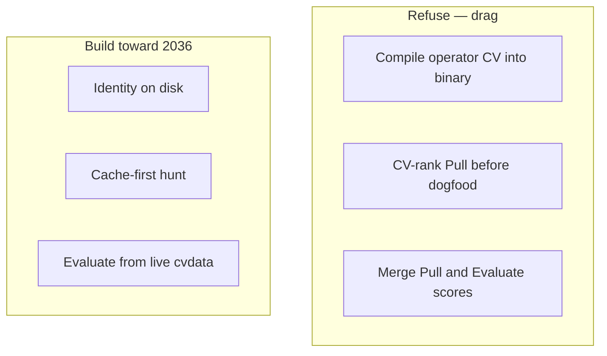
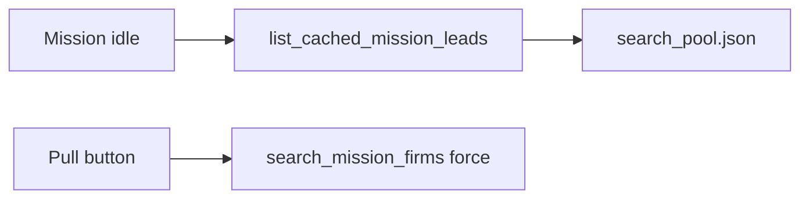
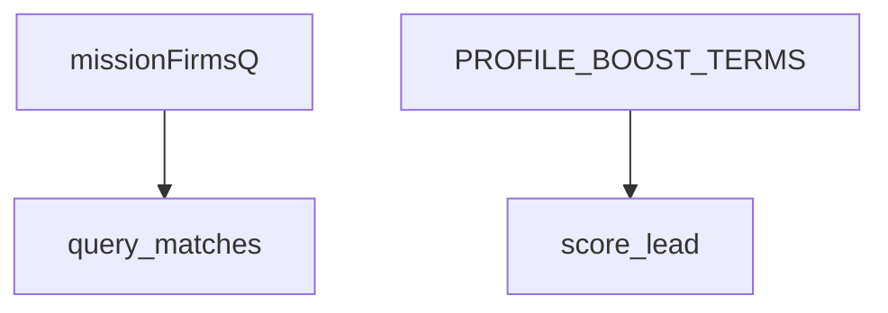
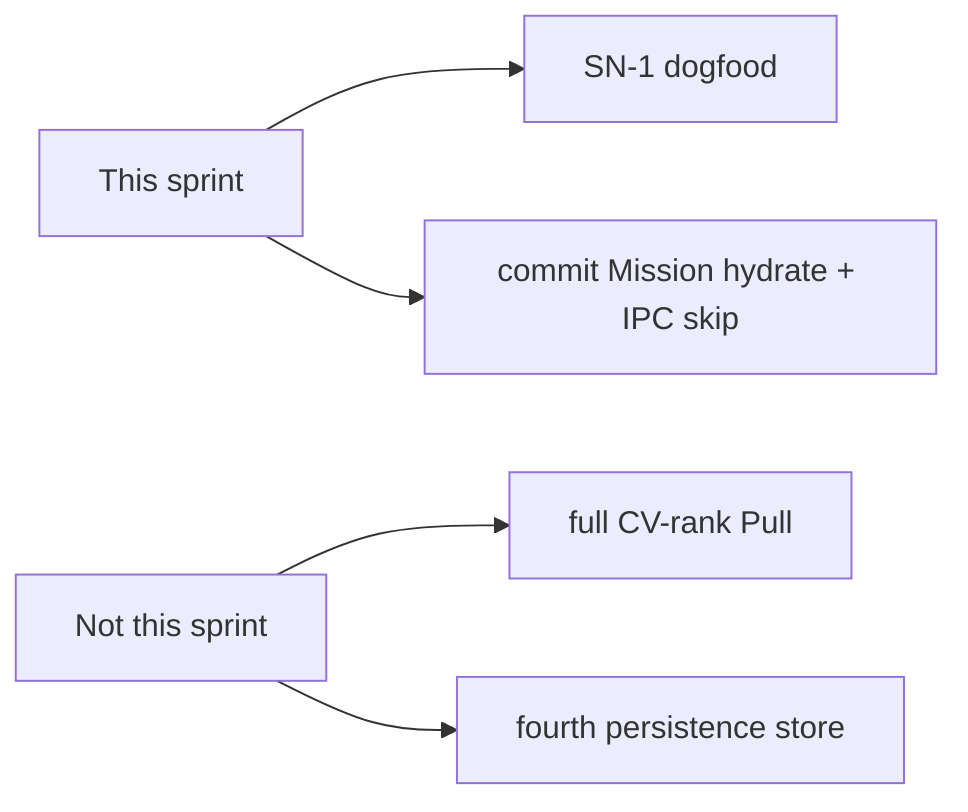
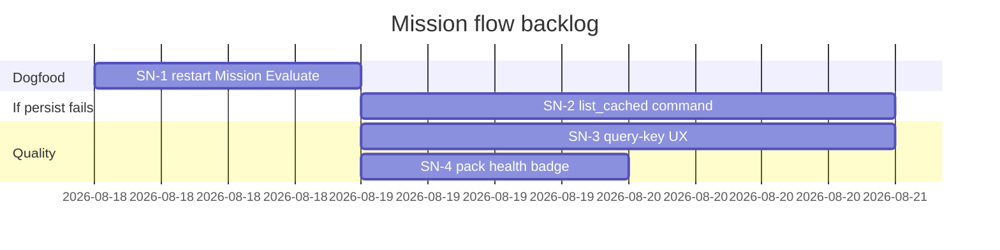
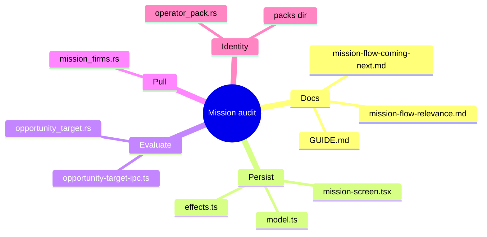

# Coming next — Mission flow (audit)

**Audience:** You · implementer · agents  
**Style:** Short words. Diagrams over prose. Optimism grounded in evidence.  
**Contract:** [PRODUCT.md](../PRODUCT.md) · [docs/config.md](../docs/config.md) · [docs/mission-flow-relevance.md](../docs/mission-flow-relevance.md)  
**Method:** [stellar-spacemap](https://github.com/p10ns11y/skills) · collab-finder blueprint style

*Last updated: 2026-08-18*

---

## 0. Mission (one sentence)

Mission hunt restores last board scan from hull cache, ranks titles toward your stack, and Evaluate/Prepare scores against live identity on disk — so restart never resets the hiring loop.

---

## 0b. Ten-year thrive picture (2036 — not survival, ascent)

Operator identity stays on disk; career boards remain adapters; judgment stays human before apply.

| 2036 role | What it is | Why it still wins |
|-----------|------------|-------------------|
| **Kernel** | Opportunity rows + CV resolution + packs | Survives UI and model swaps |
| **Bridge** | Mission Pull / Next 10 / Evaluate | Three lanes, one screen |
| **Boundary** | No compiled identity; HITL on apply | Public git stays pointers |

**Design bet:** Disk identity (`~/.config/collab-finder/packs/`) and SQLite opportunities are forever. Renderer, xAI model, and career-board APIs are today's hull.

**Fused abstraction:** *Identity on disk, hunt in RAM, truth in SQLite.* Traced to `operator_pack.rs`, `mission_firms.rs` (`search_pool.json`), `resolve_cv_packet` in `opportunity_target.rs`.

---

## 1. Scorecard — what landed (PR #25 + Mission audit)

| Area | Grade | One line | Evidence |
|------|-------|----------|----------|
| Operator pack | A | Same distillation files, no `include_str!` | `src-tauri/src/operator_pack.rs`; `~/.config/collab-finder/packs/` seeded 7 KB cv-packet |
| CI | A | Gate + complexity + CRAP green on latest | `scripts/gate.sh`; PR #25 jobs after `e0e1712` |
| Mission persist (A) | B | Cache-first hydrate shipped, uncommitted; dogfood pending | `mission-screen.tsx` idle → `forceRefresh: false`; `effects.ts` default true→false |
| Pull relevance (B) | B | Profile title boost; not CV-rank | `mission_firms.rs` `PROFILE_BOOST_TERMS` + `profile_title_boost` |
| Evaluate CV (C) | B | Distilled default no longer shadows packs | `opportunity-target-ipc.ts` `cvSummaryForIpc`; verify `opportunity-target-ipc.verify.mjs` |
| Docs | A | Flow diagrams + this spacemap | `docs/mission-flow-relevance.md`; this file |
| Pack health UI | D | Stubs silent if seed skipped | `STUB_CV_PACKET` in `operator_pack.rs` — no Preferences badge |
| Pull = CV score | F | Intentionally not built | Pull `score_lead` uses firm + query + durability, not packet body |

**Plain rule:** Three Mission lanes; fix the lane that hurts — do not merge them.

---

## 2. System map (today)

---

## 3. Precedence / data-flow (CV + Pull)

| Layer | Owns | Must not |
|-------|------|----------|
| Pull | Board titles + firm chips + pool | Pretend to score CV |
| Next 10 | `universe.json` + `rank.json` | Fetch job JDs |
| Evaluate | `resolve_cv_packet` + constraints | Send unused distilled IPC when user never edited |
| localStorage | Fast CV cache | Block disk identity |

---

## 4. Musk five-step — applied to backlog

| Step | Question | Verdict |
|------|----------|---------|
| 1 Requirements | Did A+B+C all fail? | Yes — persist, rank, Evaluate. Documented. |
| 2 Delete | Full CV-rank on Pull? | Delete for now — different lane; boost titles instead |
| 3 Simplify | One store for Mission? | No — RAM vs pool vs SQLite is correct; hydrate RAM from pool |
| 4 Accelerate | Dogfood before more rankers | SN-1 restart → Mission without Pull |
| 5 Automate | Preferences pack health | After SN-1 pass |

---

## 5. Trajectory forces (evidence-weighted)

| Force | P(horizon) | Effect on us | Response | Confidence |
|-------|------------|--------------|----------|------------|
| Career APIs change | 0.7 | Pull fetch breaks | Pool still serves last scan | 70% |
| xAI / model swap | 0.6 | Evaluate schema stays | Structured JSON contract | 65% |
| Operator forgets seed | 0.4 | Stub CV tanks Evaluate | Pack health badge (SN-4) | 80% |
| Tailwind: disk identity | 0.8 | Packs portable across hosts | Keep packs out of git | 85% |

**Acceleration trigger:** If SN-1 dogfood still shows empty list with `search_pool.json` >100 KB, invest in explicit `list_cached_mission_leads` command — do not add a fourth store.

---

## 6. Trajectory guardrails

| Risk | Guard | Status |
|------|-------|--------|
| IPC shadows packs | Skip distilled default unless user edited | Shipped uncommitted |
| Force refresh default true | Only Pull sets `forceRefresh: true` | Shipped uncommitted |
| Stubs silent | Preferences pack-health (SN-4) | Open |
| Profile boost hardcoded | Later: extract tokens from packet | Open |

---

## 7. Blueprint cards — next work

### SN-1 · Dogfood gate (no new code)

**Problem:** Code claims A/B/C are fixed; operator has not flown the hull.

| Step | Pass if |
|------|---------|
| Restart app | Process cold start |
| Open Mission | List fills without clicking Pull |
| Check pool | `wc -c ~/.local/share/collab-finder/mission_firms_cache/search_pool.json` > 100000 |
| Evaluate without editing CV | Packet preview matches devprofile/kanithanj.cv, not only distilled |
| Pull | Titles with TypeScript/Rust/agent rank above generic hardware-only when query empty |

**Verify:** Visual + the `wc` command. If list empty and pool large → SN-2. If Evaluate still distilled → check `cf.cvSummaryUserEdited` in localStorage.

---

### SN-2 · Named cache-list command (if SN-1 fails persist)

**Problem:** Hydrate still goes through `search_mission_firms` and can look like a Pull.

| File | Work |
|------|------|
| `src-tauri/src/mission_firms.rs` | `list_cached` without HTTP client |
| `src-tauri/src/lib.rs` | Tauri command |
| `src/core/finder/effects.ts` | Boot uses list, not search |

**Done when:** Mission open never prints `fetch+append` in logs.

**Verify:** `grep mission_firms` in terminal on open; only `cache hit` or list path.

---

### SN-3 · Query-key UX (if SN-1 Pull still noisy)

**Problem:** Empty default query + many firms still dumps boards; profile boost is title-only.

| File | Work |
|------|------|
| `src/view/screens/mission-screen.tsx` | Require a rail chip or query before first network Pull |
| `src-tauri/src/mission_firms.rs` | Optional: parse boost terms from `cv_packet()` nouns |

**Done when:** Empty query + Pull still hydrates cache but new fetch is gated or labeled.

**Verify:** Pull with empty q vs rail chip; rank_reasons include `profile_hits`.

---

### SN-4 · Pack health in Preferences

**Problem:** Missing seed → stub CV; operator thinks Evaluate is “broken relevance.”

| File | Work |
|------|------|
| `src-tauri/src/operator_pack.rs` | Status: files present, stub vs real |
| `src/view/screens/preferences-panels.tsx` | Badge + seed hint |

**Done when:** Preferences shows pack path + “seeded” / “stub” without opening a terminal.

**Verify:** Temporarily rename `cv-packet.txt`; badge flips; restore file.

---

## 8. Scope lock (user decision)

**In:** Documented flow, cache-first hydrate, IPC skip default, profile title boost, this spacemap.  
**Out:** LLM re-rank of Pull list; Neo4j; compiled packs.

---

## 9. Sprint order

---

## 10. Monitoring signals (command the mission)

| Signal | Healthy | Invest more when |
|--------|---------|------------------|
| Mission open | List without Pull | Empty + pool file large |
| Evaluate `cv_used_fallback` | false with packs seeded | true after seed |
| `profile_hits` on Pull | ≥1 on software titles | never appears |
| CI gate | pass | secrets/keyring cascade |

---

## 11. Done log (2026-08-18)

| # | Item | Area |
|---|------|------|
| 1 | Operator pack + rank.json on disk | config |
| 2 | Preferences split; kanithanj.cv install | UI |
| 3 | CI gate / lizard / CRAP | ci |
| 4 | Headless keyring best-effort clear | secrets |
| 5 | Analyze → Evaluate route copy | UI |
| 6 | Flow diagrams `docs/mission-flow-relevance.md` | docs |
| 7 | Cache-first Mission hydrate (local) | persist |
| 8 | `cvSummaryForIpc` skip distilled default | Evaluate |
| 9 | Profile title boost on Pull | relevance |

---

## 12. File touch map

---

## 13. References

| Doc | Use |
|-----|-----|
| [docs/mission-flow-relevance.md](../docs/mission-flow-relevance.md) | Lane diagrams + sneaky bugs |
| [docs/config.md](../docs/config.md) | Pack paths |
| [PRODUCT.md](../PRODUCT.md) | Product boundary |
| [reports/intuitive-shell-plan.md](./intuitive-shell-plan.md) | Blueprint card style |
| [reports/batch-2-engineering-blueprints.md](./batch-2-engineering-blueprints.md) | Scorecard / gantt |
| [reports/single-pr-intuitive-product.md](./single-pr-intuitive-product.md) | Musk 5-step |
| [reports/hire-board-coming-next.md](./hire-board-coming-next.md) | Sibling spacemap |

**Footer:** Restart, open Mission, do not Pull — if the list is there, persist is honest.

---

*Plain rule: Identity on disk. Hunt from cache. Evaluate from live CV — not the bundled default.*
