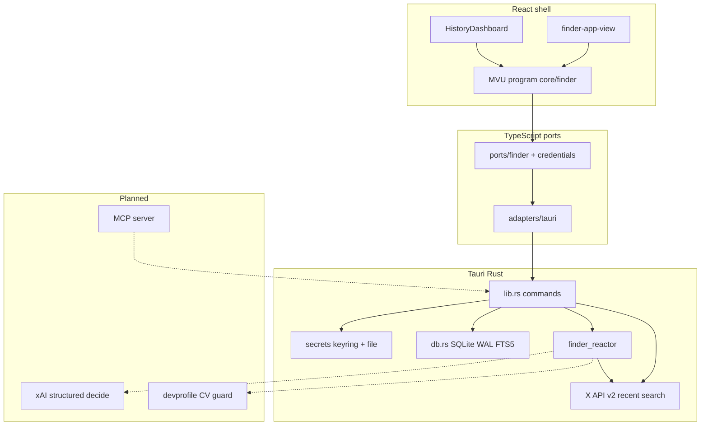
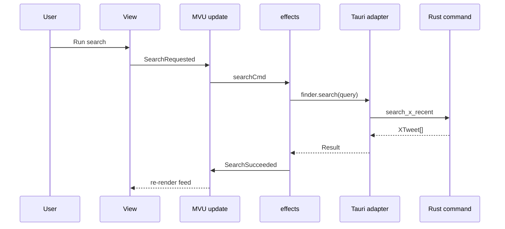
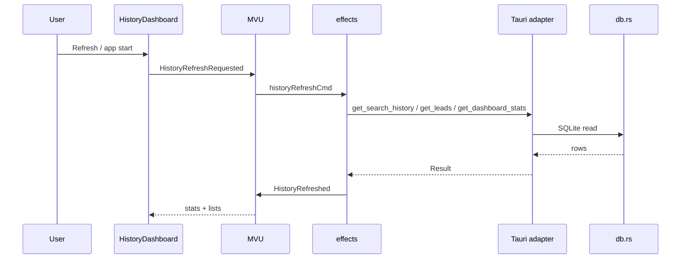
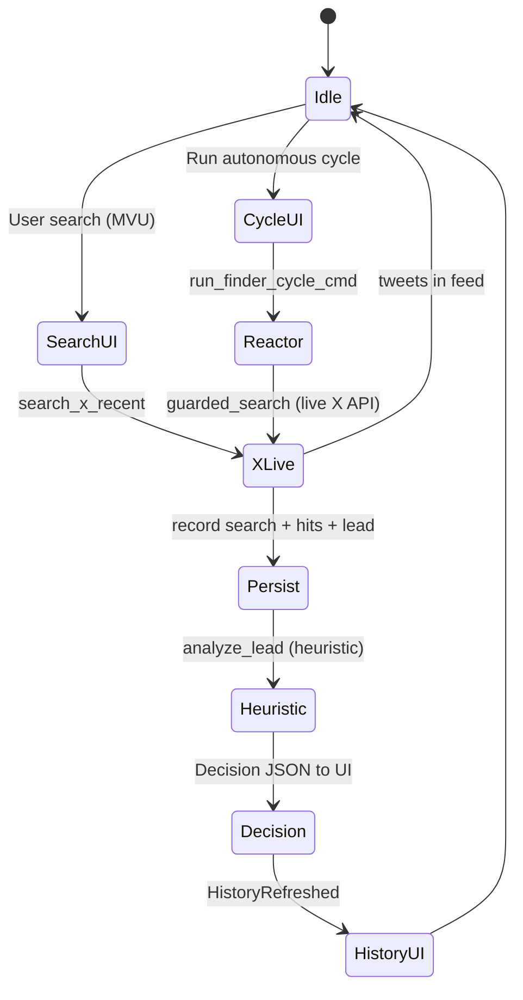

# Agentic architecture — collab-finder

Living map of how autonomy, guards, and the desktop shell fit together. Skills with full detail: `.agents/skills/agentic-reactor/`, `finder-reactor/`, `tauri-agentic/`, `cv-promote-guard/`, `x-agent-resources/`.

## Principles

- **Autonomy with self-guards** — no silent high-stakes actions (CV promote, spend, post).
- **Structured decisions** — xAI JSON with confidence, rationale, guards (target; partial stubs today).
- **Composability** — Tauri commands today; MCP exposure planned for external agents.
- **X official resources** — vendored under [.agents/x-resources/](../.agents/x-resources/README.md) (`skill.md`, `llms.txt`; refresh from upstream).
- **CV promote** — sidecar, diff preview, explicit confirm (`cv-promote-guard` skill).

## System overview

## TypeScript layers (shipped)

| Layer | Path | Role |
|-------|------|------|
| **Domain** | `src/core/domain/finder.ts` | Tweet, Decision, ReactorState types |
| **MVU** | `src/core/mvu/engine.ts` | Program/update/cmd loop |
| **Finder model** | `src/core/finder/*` | Model, messages, update, effects, selectors |
| **Policy** | `src/core/security/credentials-policy.ts` | Bearer validation, connection gate |
| **Ports** | `src/ports/*` | Interfaces for testability |
| **Adapters** | `src/adapters/tauri/*` | `invoke` + `Result` error mapping |
| **Runtime** | `src/runtime/finder-runtime.ts` | Wires program + ports for React |
| **View** | `src/view/finder-app-view.tsx` | Composes finder panels |
| **History domain** | `src/core/domain/history.ts` | SearchRun, Lead, DashboardStats |

## Rust backend

| Module | Role |
|--------|------|
| `src-tauri/src/lib.rs` | Tauri commands; wires search/cycle to persistence |
| `src-tauri/src/db.rs` | SQLite history (searches, tweets, leads, pauses, events, FTS5) |
| `src-tauri/src/secrets.rs` | Keyring + shared `app_data_dir` + file_store bearer |
| `src-tauri/src/finder_reactor.rs` | Guards, live `guarded_search`; heuristic `analyze_lead` (xAI planned) |
| `src-tauri/src/x_search.rs` | Shared recent-search HTTP for UI + reactor |
| `src-tauri/src/x_query.rs` | Rejects invalid v2 query operators before API call |

**Guard examples** (reactor; enforcement grows with real xAI/X):

- Cost — before xAI calls
- X rate — from skill context + headers
- Fit — threshold → pause
- CV promote — delegate to cv-promote-guard (not wired to devprofile yet)

## Autonomous cycle (current behavior)

`guarded_search` uses the same `x_search` module as `search_x_recent`. Search/cycle results are persisted best-effort to SQLite. xAI `analyze_lead` and CV promote remain heuristic/stub until their milestones.

**Backend-ready, UI pending:** `search_past_tweets` (FTS), `get_search_run` (full replay) — commands exist; dashboard today shows stats, reuse query, and lists only.

## Pauses and intervention

- **UI** — guard dashboard, pause log, decision panel, credentials gate
- **Future MCP** — pause responses + `ask_user`
- **Logging** — pause reasons in reactor state for meta-improvement

## Milestone matrix

| Capability | Shipped | Next |
|------------|---------|------|
| X recent search | Yes (`lib.rs`) | Query presets, rate telemetry |
| Secure bearer | Yes (`secrets`) | OAuth / xurl alignment |
| MVU UI shell | Yes | More guard-driven pauses |
| Reactor live search in cycle | Yes (`x_search` + shared `AppReactor`) | xAI analyze; rate telemetry in UI |
| Durable history (sqlite) + dashboard | Yes (db.rs + history MVU slice + HistoryDashboard) | FTS search box + run replay in UI; export/prune |
| xAI decisions | No | Pruned CV + skill.md prefix |
| MCP agent API | No | stdio server over commands |
| CV promote guard | No | devprofile path config + sidecar UI |

## Related docs

- [SETUP.md](./SETUP.md) — install, credentials, verify commands
- [tauri-commands.md](./tauri-commands.md) — invoke contract table
- [tauri-ipc-and-intent-engine.md](./tauri-ipc-and-intent-engine.md) — mental model (IPC) + Intent Engine (MVU → invoke)
- [tauri-ipc-debugging.md](./tauri-ipc-debugging.md) — dev: trace and intercept `invoke`
- [x-tools.md](./x-tools.md) — official X agent resources
- [data/distillation/](../data/distillation/README.md) — qualified X queries, curation context, xAI analyze prompts
- [.agents/x-resources/README.md](../.agents/x-resources/README.md) — official X skill/llms snapshots + agent read order
- **Interactive canvas (Cursor only):** [collab-finder-architecture.canvas.tsx](/home/sustainableabundance/.cursor/projects/home-sustainableabundance-Work-personal-collab-finder/canvases/collab-finder-architecture.canvas.tsx) — open beside chat via the canvas link (not in-repo TSX)

## Exponential development

- `.agents/` skills + fusion/fission for compounding dev velocity
- BDD on guard tables (`bdd-strategizer`) as behavior hardens
- Worktrees for parallel reactor vs UI vs prompt work (`git-worktrees`)

This doc is the canonical architecture reference; keep it aligned with `docs-reliability-review` findings when milestones land.
