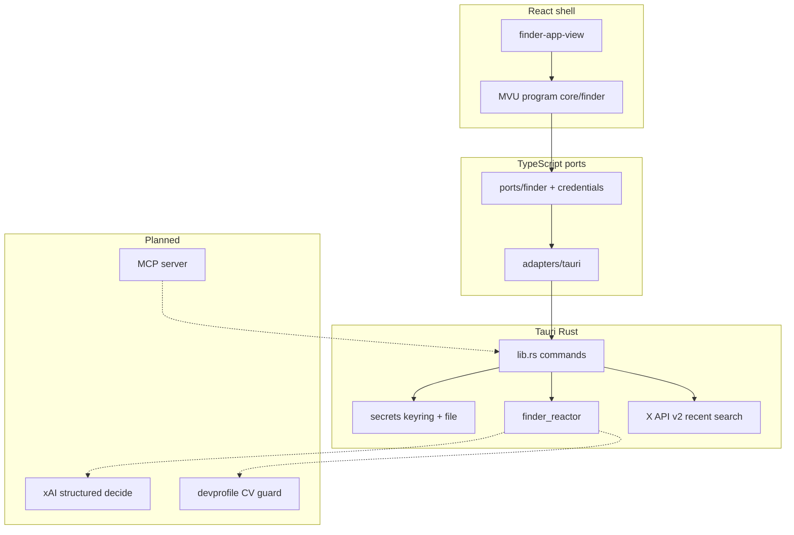
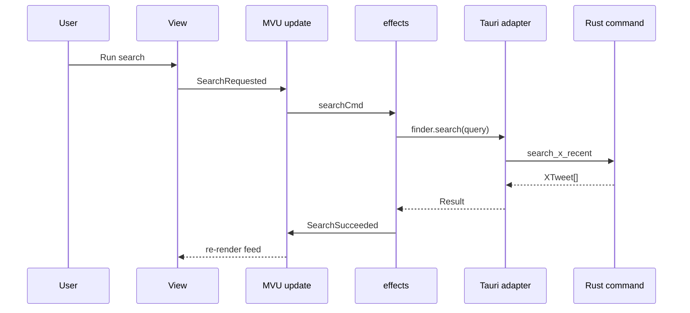
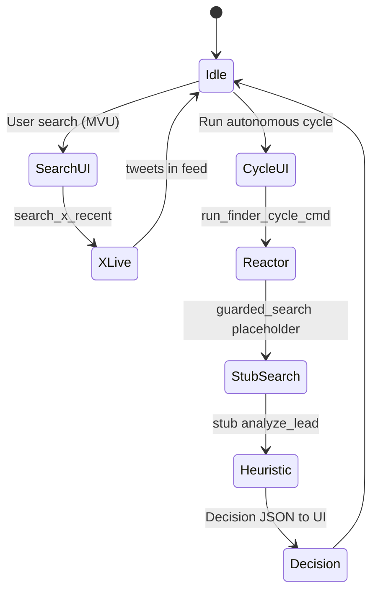

# Agentic architecture — collab-finder

Living map of how autonomy, guards, and the desktop shell fit together. Skills with full detail: `.agents/skills/agentic-reactor/`, `finder-reactor/`, `tauri-agentic/`, `cv-promote-guard/`, `x-agent-resources/`.

## Principles

- **Autonomy with self-guards** — no silent high-stakes actions (CV promote, spend, post).
- **Structured decisions** — xAI JSON with confidence, rationale, guards (target; partial stubs today).
- **Composability** — Tauri commands today; MCP exposure planned for external agents.
- **X official resources** — `skill.md` / `llms.txt` vendored under `.agents/x-resources/` for prompts.
- **CV promote** — sidecar, diff preview, explicit confirm (`cv-promote-guard` skill).

## System overview

## TypeScript layers (shipped)

| Layer | Path | Role |
|-------|------|------|
| **Domain** | `src/core/domain/finder.ts` | Tweet, Decision, ReactorState types |
| **MVU** | `src/core/mvu/engine.ts` | Program/update/cmd loop |
| **Finder model** | `src/core/finder/*` | Model, messages, update, effects, selectors |
| **Policy** | `src/core/security/credentials-policy.ts` | Bearer validation, connection gate |
| **Ports** | `src/ports/*` | Interfaces for testability |
| **Adapters** | `src/adapters/tauri/*` | `invoke` + `Result` error mapping |
| **Runtime** | `src/runtime/finder-runtime.ts` | Wires program + ports for React |
| **View** | `src/view/finder-app-view.tsx` | Composes finder panels |

## Rust backend

| Module | Role |
|--------|------|
| `src-tauri/src/lib.rs` | Tauri commands, live `search_x_recent` |
| `src-tauri/src/secrets.rs` | Keyring + file_store for bearer |
| `src-tauri/src/finder_reactor.rs` | Guards, lead state, stub cycle/xAI |

**Guard examples** (reactor; enforcement grows with real xAI/X):

- Cost — before xAI calls
- X rate — from skill context + headers
- Fit — threshold → pause
- CV promote — delegate to cv-promote-guard (not wired to devprofile yet)

## Autonomous cycle (current behavior)

Until `guarded_search` delegates to the same HTTP path as `search_x_recent`, the cycle can return decisions without live tweets.

## Pauses and intervention

- **UI** — guard dashboard, pause log, decision panel, credentials gate
- **Future MCP** — pause responses + `ask_user`
- **Logging** — pause reasons in reactor state for meta-improvement

## Milestone matrix

| Capability | Shipped | Next |
|------------|---------|------|
| X recent search | Yes (`lib.rs`) | Query presets, rate telemetry |
| Secure bearer | Yes (`secrets`) | OAuth / xurl alignment |
| MVU UI shell | Yes | More guard-driven pauses |
| Reactor live search in cycle | No | Wire `guarded_search` → X API |
| xAI decisions | No | Pruned CV + skill.md prefix |
| MCP agent API | No | stdio server over commands |
| CV promote guard | No | devprofile path config + sidecar UI |

## Related docs

- [SETUP.md](./SETUP.md) — install, credentials, verify commands
- [tauri-commands.md](./tauri-commands.md) — invoke contract table
- [x-tools.md](./x-tools.md) — official X agent resources
- Interactive walkthrough: [architecture canvas](/home/sustainableabundance/.cursor/projects/home-sustainableabundance-Work-personal-collab-finder/canvases/collab-finder-architecture.canvas.tsx) (open beside chat in Cursor)

## Exponential development

- `.agents/` skills + fusion/fission for compounding dev velocity
- BDD on guard tables (`bdd-strategizer`) as behavior hardens
- Worktrees for parallel reactor vs UI vs prompt work (`git-worktrees`)

This doc is the canonical architecture reference; keep it aligned with `docs-reliability-review` findings when milestones land.
