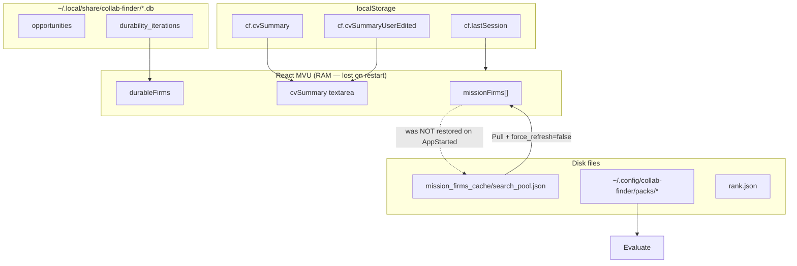
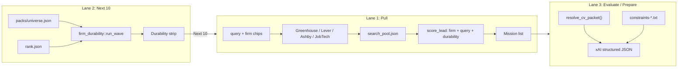
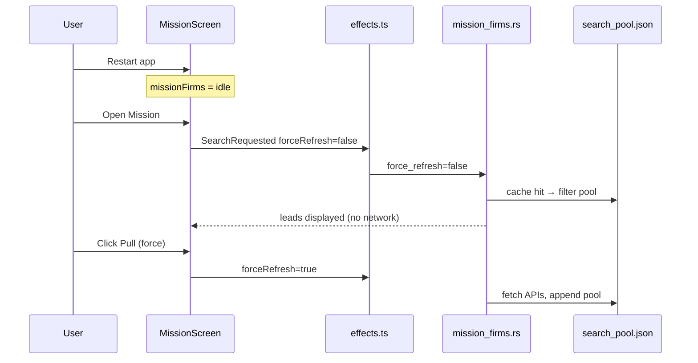
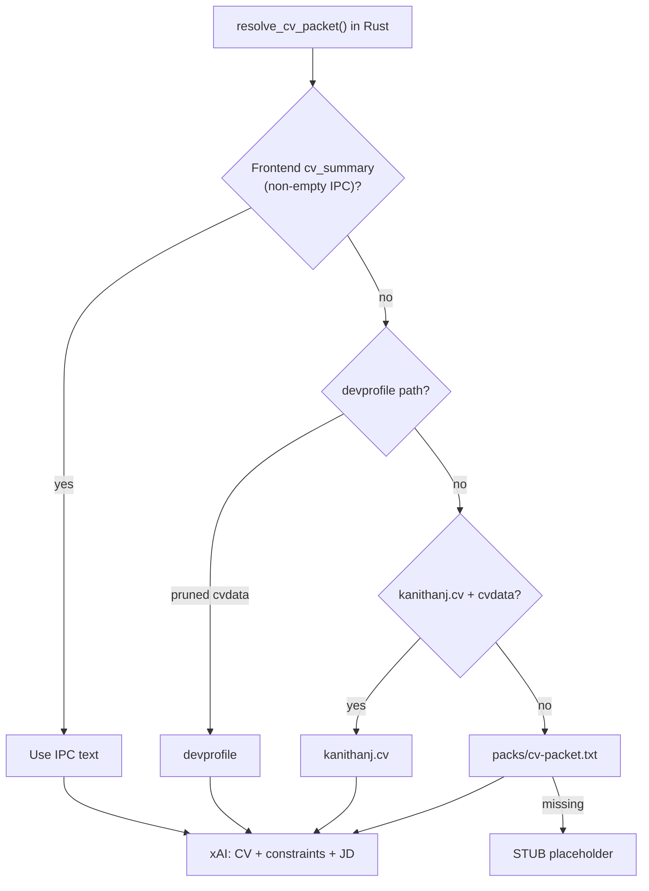
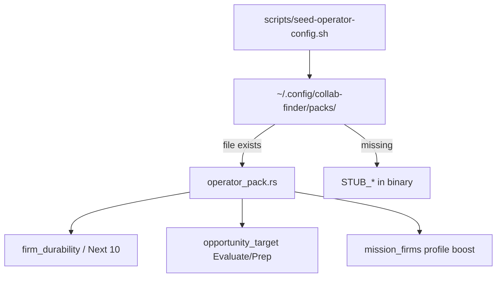

# Mission flow, persistence, and relevance

How Mission **Pull**, **Next 10**, and **Evaluate/Prepare** connect — and why restart + relevance pain can hit all three at once even when operator packs are seeded correctly.

## TL;DR findings

| Pain | Root cause | Fix direction |
|------|------------|---------------|
| **A** List empty after restart | Mission leads live in RAM (`missionFirms` MVU state); disk cache (`search_pool.json`) exists but UI never loads it on boot | Hydrate from cache on Mission mount; cache-first search |
| **B** Pull jobs feel off-profile | Pull ranks by firm heuristics + query tokens — **not** your CV | Profile keyword boost on titles; clearer UI copy |
| **C** Evaluate scores feel wrong | Frontend always sent bundled `defaultCvSummary` as `cv_summary`, **blocking** devprofile / kanithanj.cv / pack resolution on Rust | Treat distilled default as “no IPC override” unless user edited textarea |

Operator-pack-on-disk did **not** remove data — it moved the same distillation files to `~/.config/collab-finder/packs/`. Stubs only appear when seed was skipped.

---

## Four persistence lanes

Mission touches four stores that do not auto-sync on boot:



| Store | Survives restart? | Used by |
|-------|-------------------|---------|
| `missionFirms` (RAM) | No | Mission list UI |
| `search_pool.json` | Yes | Pull cache (Rust) |
| `localStorage` CV | Yes | Discover textarea → **was** always sent to Evaluate |
| `packs/*` | Yes | Next 10, Evaluate constraints, CV fallback |
| SQLite | Yes | Imported opps, durability waves |

---

## Mission — three relevance lanes

Users treat Mission as one surface; code runs **three pipelines**:



| Lane | Uses CV? | Uses operator pack? |
|------|----------|---------------------|
| Pull | Optional profile boost (added) | Durability score only |
| Next 10 | No | `universe.json` + `rank.json` |
| Evaluate | Yes | constraints, proof, projects, cv-packet |

---

## Pull cache vs force refresh



**Previous bug:** `MissionFirmsSearchRequested` defaulted `forceRefresh` to true when omitted, so Enter and filter toggles always hit the network and ignored cache.

---

## CV packet resolution (Evaluate / Prepare)



### Sneaky bug (Lane 3)

Boot flow always set `cvSummary` to bundled `defaultCvSummary` from `queries.json` and persisted it to `localStorage`. Analyze sent that ~6k string as `cv_summary` on **every** Evaluate — so Rust never reached devprofile or kanithanj.cv even when configured.

**Fix:** `cvSummaryForIpc` returns `undefined` when the textarea still holds the distilled default and the user has not edited it (`cf.cvSummaryUserEdited`). Rust then runs the full resolution chain.

Priority after fix:

1. User-edited textarea
2. devprofile path → pruned `cvdata.json`
3. kanithanj.cv home
4. `~/.config/collab-finder/packs/cv-packet.txt`
5. Stub (only if packs unseeded)

---

## Operator pack abstraction



Same distillation sources as before (`data/distillation/`, `data/durability/`). Nothing compiled into the binary anymore.

Verify packs:

```bash
ls ~/.config/collab-finder/packs/
./scripts/seed-operator-config.sh   # if empty or stub-sized
```

---

## Verify locally

```bash
# Cache exists after at least one Pull
wc -c ~/.local/share/collab-finder/mission_firms_cache/search_pool.json

# Packs seeded
ls -la ~/.config/collab-finder/packs/cv-packet.txt universe.json

# IPC contract
node src/core/domain/opportunity-target-ipc.verify.mjs
```

In app:

1. Restart → open Mission → list should hydrate from cache without Pull.
2. Preferences → set devprofile path → Evaluate without editing CV textarea → packet should come from live cvdata.
3. Pull → titles with your stack keywords should rank higher (profile boost).

---

## Related code

| Area | Path |
|------|------|
| Mission UI | `src/view/screens/mission-screen.tsx` |
| Search effects | `src/core/finder/effects.ts` |
| Pull cache | `src-tauri/src/mission_firms.rs` |
| CV IPC contract | `src/core/domain/opportunity-target-ipc.ts` |
| CV resolve | `src-tauri/src/opportunity_target.rs` → `resolve_cv_packet` |
| Operator pack | `src-tauri/src/operator_pack.rs` |
| Config docs | `docs/config.md` |
