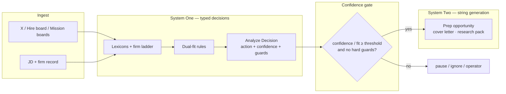
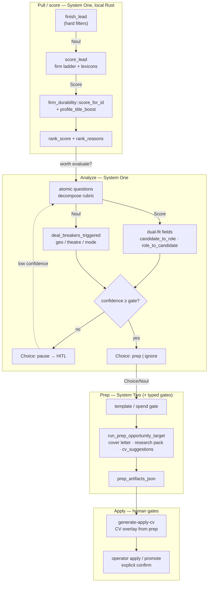

# TypeSafe System One / Jev — operator note

**Source:** Frontier Desk reading note, 2026-09-22. Vendor claims marked as such. **No Jev integration in-repo** — pattern reference only.

TypeSafe primitives (per [docs.typesafe.ai](https://docs.typesafe.ai)): **Choice** (discrete action), **Score** (0–100 calibrated probability), **Noul** (boolean / hard predicate). No free-form string generation.

---

## What it is

**TypeSafe Jev** is TypeSafe’s **System One** model: unstructured program state in → typed probabilistic decisions out (`Choice` / `Score` / `Noul`). Trained with RLCD; parallel sampling; calibrated confidence.

| Resource | URL |
|----------|-----|
| Launch post | https://typesafe.ai/blog/introducing-system-one-models-and-jev |
| Docs | https://docs.typesafe.ai |
| API | `POST https://api.typesafe.ai/v1/systemone` — Bearer `TYPESAFE_API_KEY`; model e.g. `jev-1.13.0` |
| Vercel AI Gateway | `typesafe-ai/jev` |

**Pricing (vendor claim):** ~$0.042 / MTok input; outputs free; latency ~70–500ms on System-One-shaped queries.

**Access (as of 2026-09-22):**

| Date | Status |
|------|--------|
| Sep 15 | Early-access waitlist at launch |
| Sep 20 | TypeSafe said no waitlist (`console.typesafe.ai`) |
| Sep 22 | **New signups paused** (demand/QoS); existing accounts continue |

Confirm live access at [console.typesafe.ai](https://console.typesafe.ai) before planning on a key. No public weights / self-host.

---

## Decision vs string generation

System One / Jev answers **typed questions over program state** with calibrated probabilities. It does **not** generate free-form strings.

- **In-scope (System One):** closed answer spaces — **Choice** (pick from enum), **Score** (calibrated 0–100 / probs), **Noul** (true/false predicate). Software can branch, sort, threshold, and escalate on confidence without parsing prose.
- **Out-of-scope (chat LLMs / xAI):** open answer spaces — cover letters, research narrative, reply drafts, CV prose, any artifact whose value *is* the text.

Same hunt stage can host both: Prep may use System One for “which pack template?” / “worth spending tokens?” (**Choice** / **Noul**) while the letter body stays on xAI. Pull is mostly already System-One-shaped in Rust; that does not mean “Pull = Jev” — it means those *questions* are the right shape.

**Anti-pattern:** do not judge a slot by UI label — judge by whether the output must be a string humans read vs a typed value code consumes.

| Shape | Use System One (or local Rust equivalent) | Keep string models (xAI/Grok) |
|-------|--------------------------------------------|-------------------------------|
| Answer space | Closed: enums, scores, booleans | Open: prose, packs, drafts |
| Failure mode | Wrong branch / miscalibrated confidence | Hallucinated facts in text |
| Kanithanj examples | theatre vs mission **Noul**; geo hard-reject; dual-fit factor **Scores**; “prep vs pause vs ignore” **Choice**; confidence gate before reactor spend | cover letter; research pack; email/X reply; apply-CV narrative |
| Not a reason by itself | Stage name (“Pull”, “Analyze”) | Stage name (“Prep”) |

---

## System One ↔ System Two in Kanithanj

- **System One** = closed answers code branches on (**Choice** / **Score** / **Noul** + confidence). Today: Rust lexicons/ladder/dual-fit + analyze `Decision`; later optional Jev swap on that surface only.
- **System Two** = open prose humans read (cover letter, research pack, apply-CV narrative). Stays on xAI/Grok. **Never** call this System One.

### Primitive map (today)

| Primitive | Kanithanj surface |
|-----------|-------------------|
| **Choice** | `Decision.action`, `recommended_action` (`prep` / `pause` / `ignore`) |
| **Score** | `score_lead` rank, dual-fit `overall` / `candidate_to_role` / `role_to_candidate`, `fit_score` |
| **Noul** | `finish_lead` hard rejects, `deal_breakers_triggered`, theatre/geo predicates |
| **confidence** | `Decision.confidence`, analyze confidence gate, FitThreshold guard |

---

## Hunt stages (drill-down)

Implementation detail for System One layers — same pipeline as above, with repo symbols.

**Confidence gates today:** `finder_reactor::analyze_lead` → `Decision { action, confidence, guards_triggered }`; FitThreshold when score &lt; 70; cost / X-rate guards before reactor spend. Analyze prompt: action `pause` when confidence &lt; 70 or guards non-empty ([xai-analyze-opportunity.md](../data/distillation/prompts/xai-analyze-opportunity.md)).

---

## Code seams (where decisions live)

| Seam | Path | System One shape | Persisted |
|------|------|------------------|-----------|
| Pull hard-filter | `mission_firms::finish_lead` | **Noul** — mixed SW/HW, query match, `texas_only` | dropped lead |
| Pull rank | `mission_firms::score_lead` | **Score** — firm ladder, lexicons, query tokens, profile boost/penalty | `MissionFirmLead.rank_score`, `rank_reasons` |
| Firm dual-fit (local) | `firm_durability::profile_match_firm`, `local_role_match`, `score_for_id` | **Score** + **Noul** hits/misses vs locked constraints | durability overlay on Pull; `commands/hunt.rs` blend |
| Xplore lexicon | `finder_reactor::fit_score` | **Score** — keyword heuristic (stub for xAI) | in-memory lead |
| Reactor decision | `finder_reactor::analyze_lead` → `Decision { action, confidence, guards_triggered }` | **Choice** + confidence gate | lead status |
| Analyze (Quick Target / Mission) | `opportunity_target::run_analyze_opportunity_target` | **Score** (`overall`, `candidate_to_role`, `role_to_candidate`) + **Choice** (`recommended_action`) | `opportunities.fit_score`, `analysis_json` |
| Analyze rubric / constraints | `data/distillation/prompts/xai-analyze-opportunity.md`, `curation/candidate-preferences.md`, `candidate-constraints-compact.txt` | atomic **Score** / **Noul** decomposition source | baked via `include_str` / operator packs |
| Prep (strings) | `opportunity_target::run_prep_opportunity_target`, `build_prep_user_prompt` | **System Two** — xAI structured JSON with generated prose | `prep_artifacts_json` |
| Apply | `generate-apply-cv`, `build_cv_sidecar_proposal` | human **Choice** only (cv-promote-guard) | `outcome_status`, `applied_at` |

**Score SoT problem (orient):** Pull `rank_score`, durability overlay, reactor `fit_score`, and analyze `overall` can disagree. Collapse to one ranked field + reason trace **before** swapping any layer to Jev — do not bolt Jev as a fourth ranker on top.

---

## Workflow (operator)

1. **Pull typed** — theatre vs mission (**Noul**), geo hard-reject, firm ladder + lexicons (`score_lead`), durability admit (`firm_durability`). All System One; no prose.
2. **Compose** — decompose analyze into atomic **Score** / **Noul** items (one per dual-fit factor in [candidate-preferences](../data/distillation/curation/candidate-preferences.md)); merge into `Decision` / `analysis_json`.
3. **Gate** — confidence + guards before reactor spend (`Decision.confidence`, FitThreshold, cost/X-rate). Low confidence → HITL pause, even on current xAI JSON.
4. **Prep strings** — only after gate passes: cover letters, research packs, `cv_suggestions`, email drafts in `run_prep_opportunity_target` (System Two / xAI). Typed gates (template pick, spend) stay System-One-shaped.
5. **Optional Jev** — swap decision surface only (step 2–3), with a live key and **after** collapsing score SoT. Never a fourth ranker on top of firm ladder + lexicons + pack. See [mission-flow-relevance](./mission-flow-relevance.md), [mission-firms](../data/mission-firms/README.md).

---

## Related

| Doc | Why |
|-----|-----|
| [data/distillation/README.md](../data/distillation/README.md) | Fit/scoring artifacts, analyze prompts, seam index |
| [docs/agentic-architecture.md](./agentic-architecture.md) | Structured decisions + guard model |
| [prompts/xai-analyze-opportunity.md](../data/distillation/prompts/xai-analyze-opportunity.md) | Current analyze rubric (xAI JSON) |
