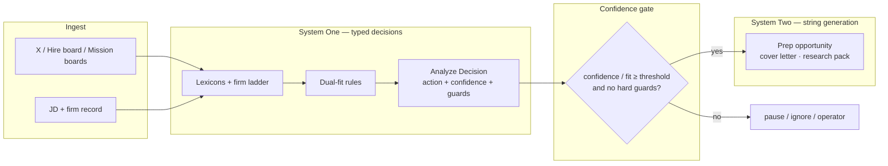

# Kanithanj System One + System Two — operator note

**Kanithanj** (collab-finder) is already a two-system hunt loop. **System One** (Fit Reflex) is typed triage and fit: **Choice**, **Score**, **Noul**, and confidence gates that code branches on without parsing prose. **System Two** is string artifacts humans read — cover letters, research packs, apply-CV narrative — generated on xAI/Grok after gates pass. TypeSafe **Jev** is an optional future swap for the One decision surface only; nothing in this note implements it.

**Source:** Frontier Desk reading note, 2026-09-22. **No Jev integration in-repo.**

---

## System One vs System Two

Judge by **answer space**, not hunt stage name.

| | System One (Fit Reflex) | System Two |
|--|-------------------------|------------|
| Answers | Closed: enums, scores, booleans | Open: prose, packs, drafts |
| Primitives | **Choice**, **Score**, **Noul** + confidence | Generated text (value *is* the string) |
| Failure mode | Wrong branch / miscalibrated confidence | Hallucinated facts in prose |
| Today | Rust lexicons/ladder/dual-fit + analyze `Decision` | `run_prep_opportunity_target` on xAI |

A single stage can host both — e.g. Prep may use One for template/spend gates while the letter body stays Two. **Anti-pattern:** labeling a UI screen “System One” or “System Two”; ask whether output is typed for code or prose for humans.

---

## Hunt loop (primary map)

---

## Primitive map

| Primitive | Kanithanj surface |
|-----------|-------------------|
| **Choice** | `Decision.action`, `recommended_action` (`prep` / `pause` / `ignore`) |
| **Score** | `score_lead` rank, dual-fit `overall` / `candidate_to_role` / `role_to_candidate`, `fit_score` |
| **Noul** | `finish_lead` hard rejects, `deal_breakers_triggered`, theatre/geo predicates |
| **confidence** | `Decision.confidence`, analyze gate, FitThreshold guard |

---

## Code seams

| Layer | Path | System | Persisted |
|-------|------|--------|-----------|
| Pull filter | `mission_firms::finish_lead` | One (**Noul**) | dropped lead |
| Pull rank | `mission_firms::score_lead` | One (**Score**) | `rank_score`, `rank_reasons` |
| Firm dual-fit | `firm_durability::*`, `commands/hunt.rs` | One (**Score** + **Noul**) | durability overlay |
| Xplore lexicon | `finder_reactor::fit_score` | One (**Score**) | in-memory lead |
| Reactor decision | `finder_reactor::analyze_lead` → `Decision` | One (**Choice** + confidence) | lead status |
| Analyze | `opportunity_target::run_analyze_opportunity_target` | One | `fit_score`, `analysis_json` |
| Rubric / constraints | `data/distillation/prompts/*`, `candidate-preferences.md` | One decomposition source | operator packs |
| Prep | `opportunity_target::run_prep_opportunity_target` | **Two** | `prep_artifacts_json` |
| Apply | `generate-apply-cv`, cv-promote path | human **Choice** | `outcome_status`, `applied_at` |

**Score SoT (orient):** `rank_score`, durability overlay, reactor `fit_score`, and analyze `overall` can disagree. Collapse to one ranked field + reason trace before any Jev swap — **no fourth ranker** on firm ladder + lexicons + pack. See [mission-flow-relevance](./mission-flow-relevance.md), [mission-firms](../data/mission-firms/README.md).

Pull symbols: `finish_lead` → `score_lead` → `firm_durability::score_for_id` → analyze atomic questions → gate → `run_prep_opportunity_target`. Gates: FitThreshold (&lt; 70), cost/X-rate ([xai-analyze-opportunity.md](../data/distillation/prompts/xai-analyze-opportunity.md)).

---

## Workflow

1. **Pull typed** — theatre/mission **Noul**, geo hard-reject, ladder + lexicons (`score_lead`), durability (`firm_durability`). One only.
2. **Compose** — atomic **Score** / **Noul** per dual-fit factor ([candidate-preferences](../data/distillation/curation/candidate-preferences.md)) → `Decision` / `analysis_json`.
3. **Gate** — `Decision.confidence` + guards before reactor spend; low confidence → HITL pause.
4. **Prep strings** — after gate: cover letter, research pack, `cv_suggestions` (Two / xAI). Template/spend gates stay One-shaped.
5. **Optional Jev** — swap One decision call (steps 2–3) only, with live key and collapsed score SoT.

---

## TypeSafe Jev (appendix)

Vendor **System One** model: state in → `Choice` / `Score` / `Noul` out. RLCD-trained; calibrated confidence; no string generation. Could replace today’s analyze decision call — not Prep/Apply prose.

| Resource | URL |
|----------|-----|
| Launch post | https://typesafe.ai/blog/introducing-system-one-models-and-jev |
| Docs | https://docs.typesafe.ai |
| API | `POST https://api.typesafe.ai/v1/systemone` — Bearer `TYPESAFE_API_KEY`; model e.g. `jev-1.13.0` |
| Vercel AI Gateway | `typesafe-ai/jev` |

**Pricing (vendor claim):** ~$0.042 / MTok input; outputs free; ~70–500ms on One-shaped queries.

**Access (2026-09-22):** Sep 15 waitlist → Sep 20 no waitlist → **Sep 22 new signups paused** (existing accounts continue). Confirm at [console.typesafe.ai](https://console.typesafe.ai). No public weights / self-host.

---

## Related

| Doc | Why |
|-----|-----|
| [data/distillation/README.md](../data/distillation/README.md) | Fit/scoring artifacts, analyze prompts |
| [docs/agentic-architecture.md](./agentic-architecture.md) | Guards + structured decisions |
| [prompts/xai-analyze-opportunity.md](../data/distillation/prompts/xai-analyze-opportunity.md) | Current analyze rubric |
