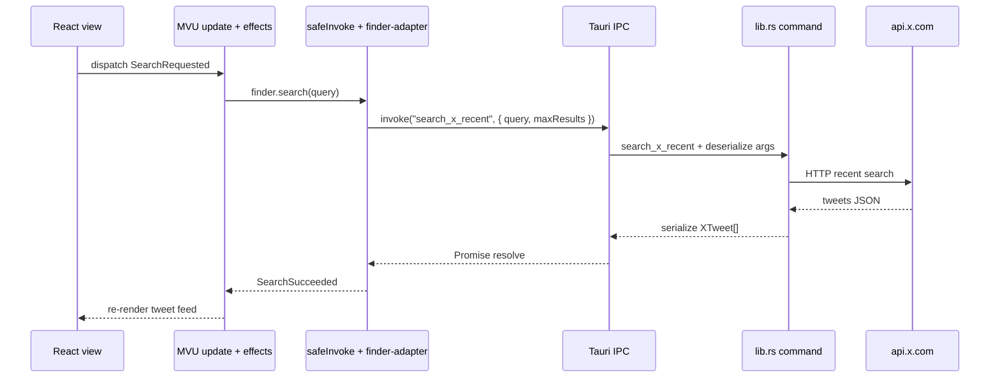

# Tauri IPC and the Intent Engine

How the React shell talks to Rust in collab-finder: what `invoke` actually is, and how user intent flows from the MVU layer to Tauri commands.

See also [tauri-commands.md](./tauri-commands.md) (command tables), [agentic-architecture.md](./agentic-architecture.md) (full system map), and [tauri-ipc-debugging.md](./tauri-ipc-debugging.md) (dev: intercept and trace `invoke`).

## Mental model

### `invoke` is in-process IPC, not HTTP and not CLI

When the UI calls `invoke` from `@tauri-apps/api/core`, it does **not**:

- Send REST to `localhost` (Vite’s `http://localhost:5173` only loads HTML/JS/CSS in dev).
- Spawn a shell subprocess per action.

It **does**:

- Post a structured message from the **WebView** (JavaScript) to the **Tauri host** (Rust) inside **one desktop process**.
- Look up a handler by **command name** (e.g. `search_x_recent`).
- Pass **JSON-serialized** arguments and return values (serde on the Rust side).
- Resolve a JavaScript `Promise` when the Rust handler finishes.

Think of it as **RPC by name** inside the app:

```text
invoke("get_dashboard_stats")  →  async fn get_dashboard_stats(...)  →  JSON back to JS
```

### Three channels (do not confuse them)

| Channel | What it is | In this repo |
|---------|------------|--------------|
| **Asset loading (dev)** | HTTP from Vite | `tauri.conf.json` → `devUrl: http://localhost:5173` |
| **Asset loading (prod)** | Bundled `dist/` or `tauri://` assets | `frontendDist: ../dist` |
| **`invoke` IPC** | WebView ↔ Rust bridge | All commands in `src-tauri/src/lib.rs` `generate_handler!` |
| **External HTTP** | Normal network from Rust | `x_search` → `api.x.com`; not used for UI↔Rust |

Dev and production use the **same IPC** for commands; only where the React bundle is loaded differs.

### The adapter seam: `safe-invoke.ts`

Only adapters touch `@tauri-apps/api`. Everything above speaks ports and `Result`:

```typescript
// src/adapters/tauri/safe-invoke.ts
invoke<T>(command, args)  →  Promise  →  wrapped as Result<T, AppError>
```

`src/adapters/tauri/finder-adapter.ts` maps port methods to command names and args. The MVU core (`src/core/finder/`) has **no** Tauri imports — swappable for tests or a future MCP client.

### Rust can inject state the UI never passes

Handlers are registered with `#[tauri::command]` and listed in `lib.rs`:

```rust
.invoke_handler(tauri::generate_handler![
    search_x_recent,
    run_finder_cycle_cmd,
    // ...
])
```

Rust injects `State<'_, AppDb>`, `State<'_, AppReactor>`, etc. The frontend does not pass DB handles or bearer tokens on each search; commands call `x_bearer()` and sqlite internally. That is why credentials are saved once in the UI but used on every search/cycle in Rust.

### End-to-end (one search)



External HTTP (X API) happens **after** IPC lands in Rust — not as a substitute for `invoke`.

---

## Intent Engine

**Intent Engine** here means the path that turns **user intent** (clicks, palette, presets) into **guarded side effects** without putting I/O in React components or in pure `update` functions.

Layers, outside → in:

| Layer | Role | Tauri? |
|-------|------|--------|
| **View** | `finder-app-view.tsx` — dispatches `FinderMsg` only | No |
| **MVU update** | Pure state transitions (`updateFinder`) | No |
| **MVU effects** | `effectForMsg` — runs `Cmd`s after update | No |
| **Ports** | `FinderPort`, credentials interfaces | No |
| **Adapters** | `safeInvoke` → `invoke` | **Yes** |
| **Commands** | `lib.rs` — reactor, sqlite, secrets, X HTTP | Rust |

### Intent flow (canonical)

```text
User intent
  → FinderMsg (e.g. SearchRequested, CycleRequested, HistoryRefreshRequested)
  → updateFinder (pure model change)
  → effectForMsg (ports: search, runCycle, getSearchHistory, …)
  → adapter safeInvoke(command, args)
  → Rust #[tauri::command]
  → side effects (sqlite, X API, reactor, keyring/file)
  → Result back as success/failure Msg
  → model + view re-render
```

The **engine** is the combination of:

1. **Msg** — typed intents (`src/core/finder/msg.ts`).
2. **Update** — what should change in memory (`src/core/finder/update.ts`).
3. **Effects** — what must run in the world (`src/core/finder/effects.ts`).
4. **Adapters** — how those effects reach Rust (`src/adapters/tauri/`).

React never calls `invoke` directly; that keeps the Intent Engine testable and MCP-ready (same msgs/ports, different adapter later).

### Example intents → commands

| User intent | Msg | Tauri command (via adapter) |
|-------------|-----|-----------------------------|
| Run search | `SearchRequested` | `search_x_recent` |
| Autonomous cycle | `CycleRequested` | `run_finder_cycle_cmd` |
| Refresh history panel | `HistoryRefreshRequested` | `get_search_history`, `get_leads`, `get_dashboard_stats`, … |
| Save bearer | `CredentialsSaveRequested` | `set_x_bearer` |
| Promote (guarded) | `PromoteRequested` | `promote_lead` |

Palette and presets only dispatch **Msg**; the effect layer chooses the command.

### Why separate Mental model and Intent Engine

- **Mental model** — transport: IPC, JSON, no HTTP for commands, adapter seam.
- **Intent Engine** — product architecture: MVU turns UI events into port calls; Tauri is one implementation of those ports.

Future **MCP** exposure should call the same Rust logic (or the same ports through a different adapter), not bypass the Intent Engine and talk to X from the webview.

## External links (Tauri official)

Official docs use **asynchronous message passing** for IPC; **Commands** (`invoke`) are an FFI-like API on top of that with JSON-serialized requests and responses — similar in spirit to `fetch`, but not HTTP to your app server.

- [Inter-Process Communication](https://v2.tauri.app/concept/inter-process-communication/) — Events vs Commands, message-passing security model
- [Core Concepts](https://v2.tauri.app/concept/) — architecture, process model, IPC overview
- [What is Tauri?](https://v2.tauri.app/start/) — framework overview, `invoke` bindings, system webview
- [Prerequisites (Linux deps)](https://v2.tauri.app/start/prerequisites/) — WebKit/GTK packages per distro

## Arch Linux and minimal desktops

**`invoke` IPC is the same on every OS** — WebView ↔ Rust message passing does not change on Arch. What *does* change is the **side effects** Rust runs after a command lands (keyring, files, HTTP). Those are what bite on a minimal Arch / Hyprland setup.

### What Arch affects in the Intent Engine path

| After `invoke` | Arch / minimal desktop notes |
|----------------|------------------------------|
| **`set_x_bearer` / `has_x_bearer` / `get_x_bearer_storage`** | `set_x_bearer` dual-writes file (always) + keyring (best-effort). Reads prefer keyring when present, else file. `get_x_bearer_storage` returns `BearerStorageStatus` for the UI (no bearer on the wire). Secret Service via `keyring` crate (`sync-secret-service` on Linux). Hyprland-only installs often have **no secret service** → keyring read fails; file fallback still works (see `secrets.rs` logs). |
| **Search / cycle / history commands** | Bearer read inside Rust (`x_bearer()`), not from the webview. If keyring is empty but file store has the token, commands work. |
| **SQLite (`AppDb`)** | Same `app_data_dir` as secrets: typically `~/.local/share/collab-finder/collab-finder.db`. Directory created with `0o700` on Unix. |
| **X API HTTP** | Normal **reqwest** TLS; ensure `ca-certificates` (Arch: `ca-certificates` package) is installed. Unrelated to Tauri IPC. |
| **WebView (loads UI)** | System **WebKitGTK** — required to open the window at all. Missing libs → app fails before any `invoke`. Install via [Tauri prerequisites](https://v2.tauri.app/start/prerequisites/) (Arch section). |

### Typical paths on Arch (XDG)

```text
~/.local/share/collab-finder/x-bearer      # bearer fallback (mode 0600)
~/.local/share/collab-finder/collab-finder.db
```

Dev still loads the UI from `http://127.0.0.1:5173` (Vite); **commands do not go over that HTTP port**.

### Arch packages (install once)

Use the official Tauri prerequisite list for the current WebKit/GTK package names. Commonly on Arch:

```bash
# See https://v2.tauri.app/start/prerequisites/ — names change with Tauri 2 / webkit2gtk-4.1
sudo pacman -S --needed base-devel openssl pkg-config webkit2gtk-4.1 gtk3 libappindicator-gtk3 librsvg libsecret
```

Optional for keyring from the credentials panel (not required if you rely on file fallback):

```bash
sudo pacman -S --needed gnome-keyring   # or kwallet + secret service for your DE
# Ensure dbus user session is running (e.g. gnome-keyring-daemon with $DBUS_SESSION_BUS_ADDRESS set)
```

### Terminal messages that look like IPC failures (but are not)

| Log / symptom | Usually means |
|---------------|----------------|
| `[secrets] keyring read failed (falling back to file store)` | Arch has no Secret Service; **invoke still works** — token read from file on next command. |
| `[secrets] bearer token loaded from file store: …` | Expected fallback path. |
| Blank window / instant crash on `tauri dev` | Missing **WebKit/GTK** system libs, not broken `invoke`. |
| `X bearer not configured` | Neither keyring nor file has a token — save again in UI. |

### What not to put in this doc

- Full duplicate of [SETUP.md](./SETUP.md) install steps — keep package lists there if you expand it.
- Wayland/Hyprland window rules — desktop config, not IPC.
- **Events** (Tauri fire-and-forget IPC) — collab-finder uses **Commands** only today; see [Tauri IPC overview](https://v2.tauri.app/concept/inter-process-communication/) if you add Rust→UI push later.

## Related code

| File | Purpose |
|------|---------|
| `src/adapters/tauri/safe-invoke.ts` | Sole `invoke` import |
| `src/adapters/tauri/finder-adapter.ts` | Command name + args mapping |
| `src/core/finder/effects.ts` | Intent → port calls |
| `src/core/finder/program.ts` | Wires update + effects into MVU program |
| `src-tauri/src/lib.rs` | `#[tauri::command]` handlers + `generate_handler!` |
| `src-tauri/src/commands.rs` | Testable persist helpers (search/cycle/lead/promote) |
