# Batch 2 — Engineering blueprints

> **UX path superseded** by [single-pr-intuitive-product.md](./single-pr-intuitive-product.md) — one PR, 3 screens (Discover + Xplore), opportunities rail (generalized from `jobs` slice). Incremental B2 cards below remain valid for **non-UI** work (MCP, SSRF, cv-promote) if split later. Terminology note: "Jobs" → "Discover", "Hunt" → "Xplore" to match current code (opportunities beyond jobs).

**Branch:** `review/d83821fe-2026-06-08`  
**Audience:** Implementer + agent  
**Style:** Short words. Diagrams over prose.  
**Builds on:** [tech-debt-deep-dive.md](./tech-debt-deep-dive.md) · [ux-review-v0.2-job-target.md](./ux-review-v0.2-job-target.md) · d83821fe plan (PR1–PR7)

---

## 1. Scorecard — what landed

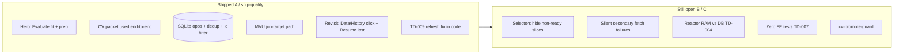

| Area | Grade | One line |
|------|-------|----------|
| First-run evaluate + prep | **A** | Works; right panel; real CV; prep keeps fit |
| Revisit after evaluate | **B** | Paths exist; refresh race **mitigated** (see §3) |
| History / Data trust | **B-** | Opportunities visible; stats better; not atomic refresh |
| Daily driver (many opps) | **B** | Persistence OK; pipeline UX thin |
| Platform / tests | **C** | No vitest; reactor split; MCP later |

**d83821fe plan:** PR1–PR7 + narrow UX polish = **~75%** of report-driven Phase 0–1.  
**Not missing:** data or hero loop. **Still noisy:** history projection + fan-out edges. (Note: target UI generalized to Discover/Xplore; "jobs slice" became opportunities rail in Discover.)

---

## 2. System map (today)

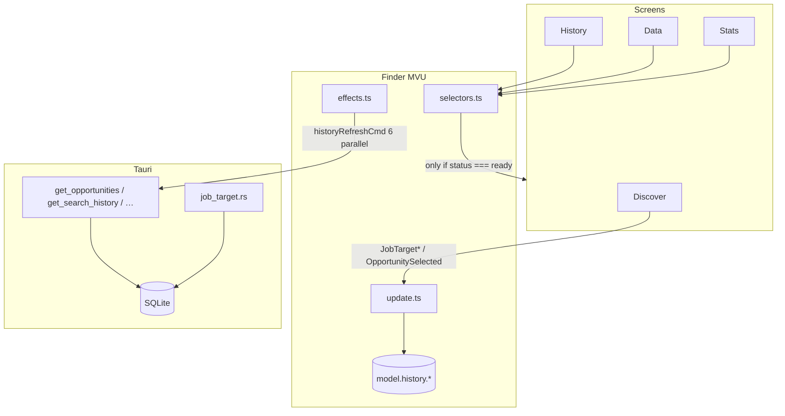

**Rule that bites:** `selectFinderView` returns `[]` unless `history.*.status === 'ready'`.  
Idle or loading with no prior ready → **empty tables**. (Current: rail lives in Discover when opportunities ready.)

---

## 3. TD-009 fix — shipped on this branch

### Before (bug)

```mermaid
sequenceDiagram
  participant Job as jobTargetAnalyzeCmd
  participant U as update
  participant E as historyRefreshCmd
  participant Sel as selectors
  participant UI as History/Data

  Job->>U: HistoryRefreshRequested
  U->>U: ALL slices → loading (data gone)
  Sel->>UI: [] for every slice
  E->>E: searches first; opps chained inside success
  Note over E, UI: User opens History → blank until restart
```
(Note: the Note syntax with space after comma helps GitHub Mermaid parser avoid treating it as continuation of previous message label.)

### After (current code)

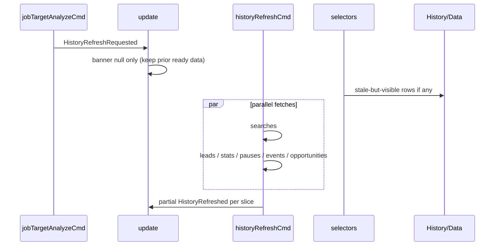

| File | Change |
|------|--------|
| `src/core/finder/update.ts` | `HistoryRefreshRequested` no longer blanks slices |
| `src/core/finder/effects.ts` | Secondaries run in parallel; not chained on searches |

**Verify (dogfood):** Evaluate → **immediately** History → Data opps → Resume last. No blank-until-restart.

---

## 4. Resume / prev opportunity path

```mermaid
sequenceDiagram
  participant User
  participant D as Discover
  participant U as update
  participant E as loadOpportunityCmd
  participant DB as getOpportunities id

  User->>D: Resume last / Data row / History Open
  D->>U: OpportunitySelected
  Note over U: target loading (jobTarget); lastActiveOppId; url?
  U->>E: effect
  E->>DB: { id }
  alt ok + blobs
    E->>U: AnalyzeSucceeded + PrepSucceeded
    E->>U: ScreenChanged discover
  else fail
    E->>U: GlobalError + JobTargetCleared
  else no blobs
    E->>U: JobTargetCleared
  end
```

**Depends on:** `historyOpportunities[0]` for Resume button → needs opps slice **ready** at least once (AppStarted refresh or post-opp partial). (Rail now in Discover.)

---

## 5. Next batch — blueprint cards

Priority order. Each card: problem → flow → files → done when → verify.

---

### B2-1 · Dogfood gate (no new code)

**Problem:** Ship confidence before more MVU churn.

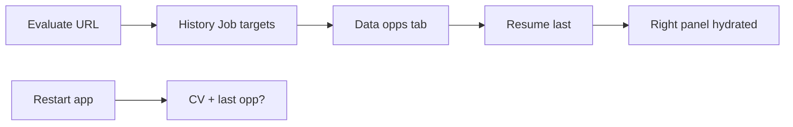

| Step | Pass if |
|------|---------|
| Post-evaluate History / Discover rail | Opportunities row visible (score / prepped) |
| Post-evaluate Data | Same opp in table |
| Resume / rail click | Fit + prep without new xAI call |
| Restart | CV text back; optional last-opp hydrate |

**Commands:** `cd src-tauri && cargo test` · `pnpm build`

---

### B2-2 · Per-slice refresh state (TD-009 finish)

**Problem:** Secondaries still fail silently (`if (r.ok) dispatch`). User sees stale data forever with no error.

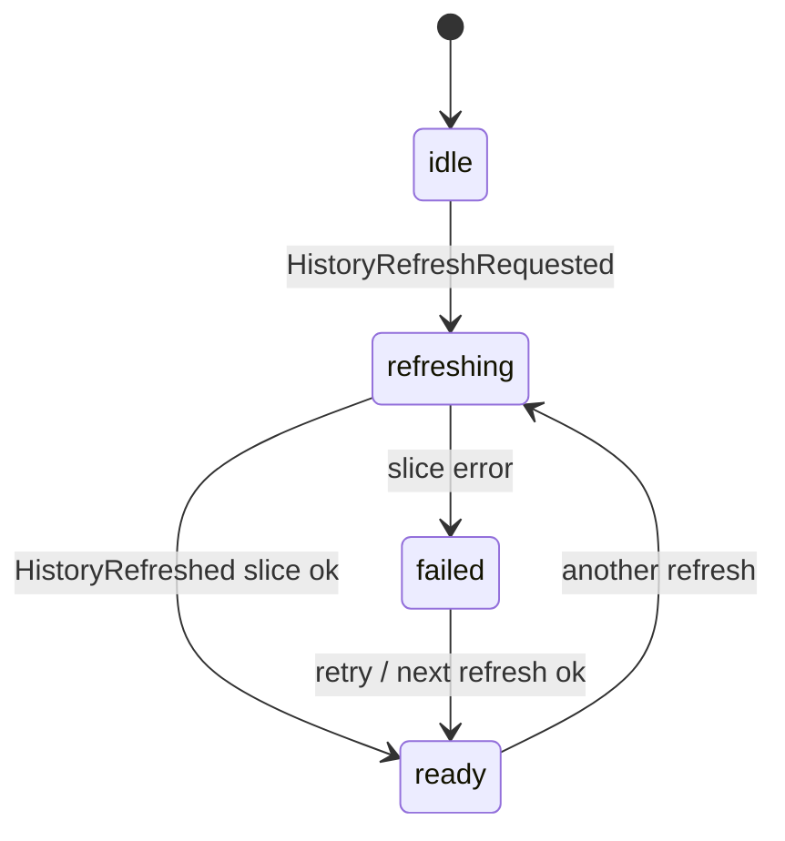

**Design:** Add optional `refreshing: boolean` per slice (or `status: 'refreshing'` + keep `data`).

| File | Work |
|------|------|
| `model.ts` | Extend `HistorySlice` type |
| `update.ts` | `HistoryRefreshRequested` → mark refreshing, not wipe |
| `effects.ts` | On `!r.ok` → `HistorySliceFailed { key, error }` |
| `selectors.ts` | Emit data when `ready \|\| (refreshing && data)` |
| `history-screen.tsx` / `data-screen.tsx` | Small “refreshing…” chip |

**Done when:** Kill network mid-refresh → banner or slice error; old rows stay visible.

---

### B2-3 · Optimistic opportunity row (post-job UX)

**Problem:** After analyze, user waits for full `getOpportunities` round-trip before new row appears.

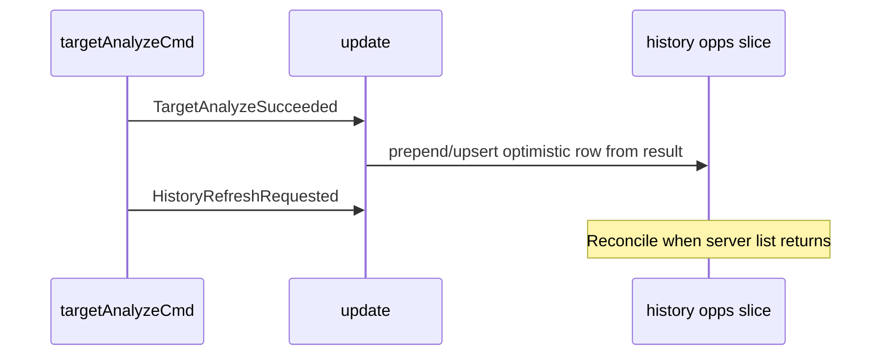

| File | Work |
|------|------|
| `update.ts` | `TargetAnalyzeSucceeded` / `PrepSucceeded` merge into `history.opportunities.data` (rail in Discover) |
| `effects.ts` | Refresh still runs; server wins on conflict |

**Done when:** New opp visible in Discover rail **before** parallel fetch completes.

---

### B2-4 · Selector projection (TD-023)

**Problem:** `loading` and `idle` both map to `[]` — first visit to History before AppStarted finishes looks empty.

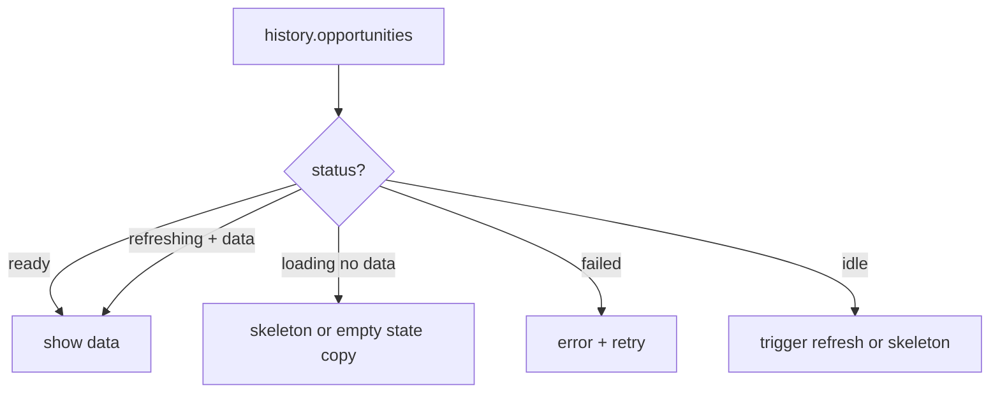

| File | Work |
|------|------|
| `selectors.ts` | `projectHistorySlice(slice)` helper |
| Views | Distinguish “never loaded” vs “empty table” |

**Done when:** Cold open History shows skeleton, not fake “no history yet” when DB has rows.

---

### B2-5 · Batched history command (Rust, optional)

**Problem:** Six IPC calls per refresh → timing skew (Stats 0 vs History 10).

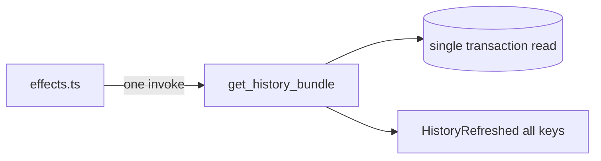

| File | Work |
|------|------|
| `src-tauri/src/lib.rs` | `get_history_bundle` command |
| `db.rs` | One fn returning struct |
| `effects.ts` | Replace fan-out |

**Done when:** One round-trip; atomic snapshot time.

**Risk:** Medium touch surface. Do after B2-2 if fan-out still hurts.

---

### B2-6 · Reactor vs DB (TD-004)

**Problem:** `promote_lead` / cycle state read RAM; History reads SQLite.

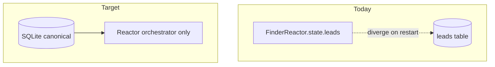

| Phase | Work |
|-------|------|
| 6a | `get_reactor_state` hydrate leads from DB on read |
| 6b | Drop in-memory lead list; promote reads DB |
| 6c | Document: reactor = session orchestration, not store |

**Done when:** Restart → promote still finds lead by id.

---

### B2-7 · FE tests (TD-007)

**Problem:** MVU regressions (prep merge, history refresh) have no automated guard.

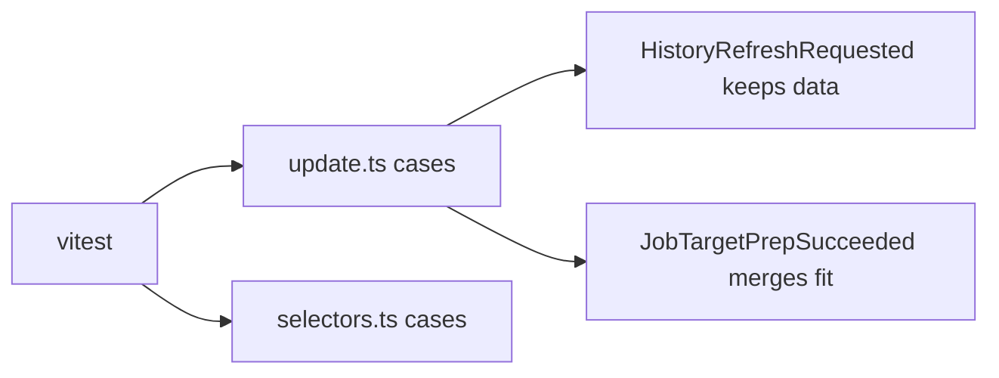

| File | Work |
|------|------|
| `package.json` | vitest script |
| `src/core/finder/update.test.ts` | Table-driven msg → model |
| `src/core/finder/selectors.test.ts` | Projection edge cases |

**Done when:** `pnpm test` runs in CI; covers B2-2/B2-4 behaviors.

---

### B2-8 · SearchRun “prev” in Discover (UX gap)

**Problem:** History search rows only `PresetSelected` + `ScreenChanged`. Full tweet replay lives in Lookup (or Xplore).

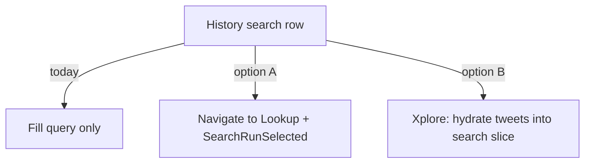

| File | Work |
|------|------|
| `history-screen.tsx` | Button label honest: “Reuse query” vs “Open in Lookup” |
| Optional | Wire `SearchRunSelected` + consumer in Xplore / Discover |

**Done when:** No button promises replay it does not deliver.

---

### B2-9 · cv-promote-guard wave (report Wave 3)

**Problem:** CV is distillation packet + localStorage; no devprofile sidecar.

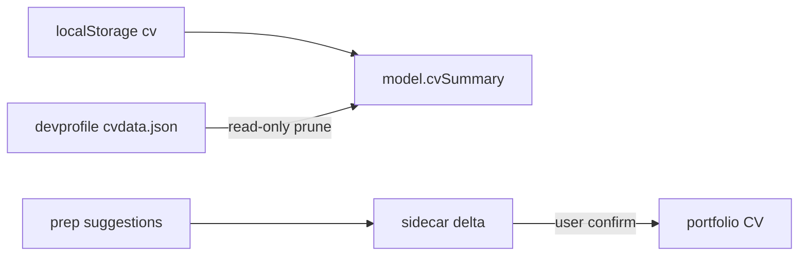

| File | Work |
|------|------|
| `.agents/skills/cv-promote-guard/SKILL.md` | Follow guard |
| Rust / effects | Load path; never auto-write external |

**Done when:** Prep CV suggestions trace to sidecar; promote needs confirm.

---

### B2-10 · Platform backlog (Phase 2–3)

| ID | Blueprint | When |
|----|-----------|------|
| TD-008 | xAI key check via MVU in Settings | With credentials refactor |
| TD-014 | SSRF allowlist on `fetch_job_page` | Before public URL paste |
| TD-013 | `spawn_blocking` for SQLite | Under load |
| TD-010 | Structured `AppError` in Rust IPC | Before MCP |
| MCP | Expose search / analyze / prep as tools | After B2-6 + B2-7 |

---

## 6. Suggested sprint order

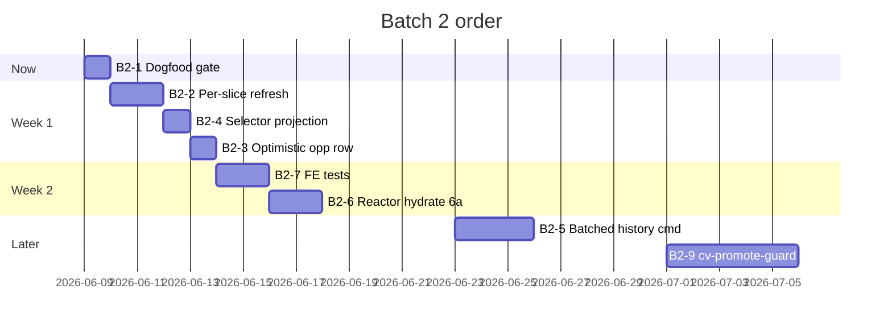
(Note: target UX uses Discover + Xplore; "jobs" language in cards is historical.)
---

## 7. File index (batch 2 touch map)

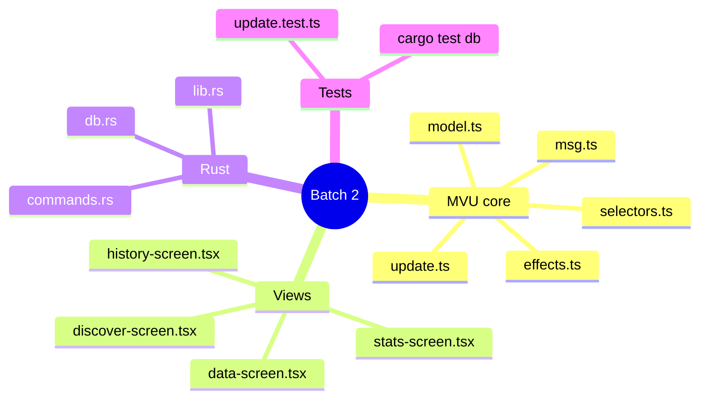

---

## 8. Acceptance — batch 2 complete

- [ ] B2-1 dogfood script passes on real Greenhouse URL  
- [ ] Post-evaluate History/Data/ Discover rail never blank when prior data existed  
- [ ] Failed history slice shows error; stale data still visible  
- [ ] `pnpm test` covers refresh + prep merge  
- [ ] Reports updated: Phase 0 checkboxes in tech-debt-deep-dive (terminology aligned to Discover/Xplore)  

---

## 9. Related reports

| Doc | Use |
|-----|-----|
| [quick-job-target-feedback.md](./quick-job-target-feedback.md) | Slice A/B/C checklist (mostly done) |
| [ux-review-v0.2-job-target.md](./ux-review-v0.2-job-target.md) | Waves 1–2 done; Wave 3 → B2-9 |
| [tech-debt-deep-dive.md](./tech-debt-deep-dive.md) | TD IDs |
| [ux-review-v0.1-dogfood.md](./ux-review-v0.1-dogfood.md) | Stats vs History baseline |

---

*Plain rule: fix trust on secondary screens before new features. Hero loop is already the product hook.* (Current: Discover rail + Xplore for X.)
