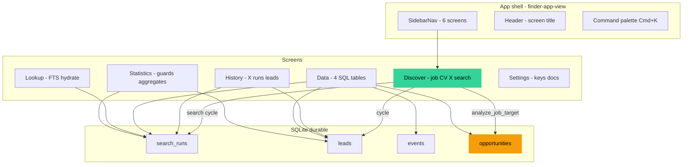
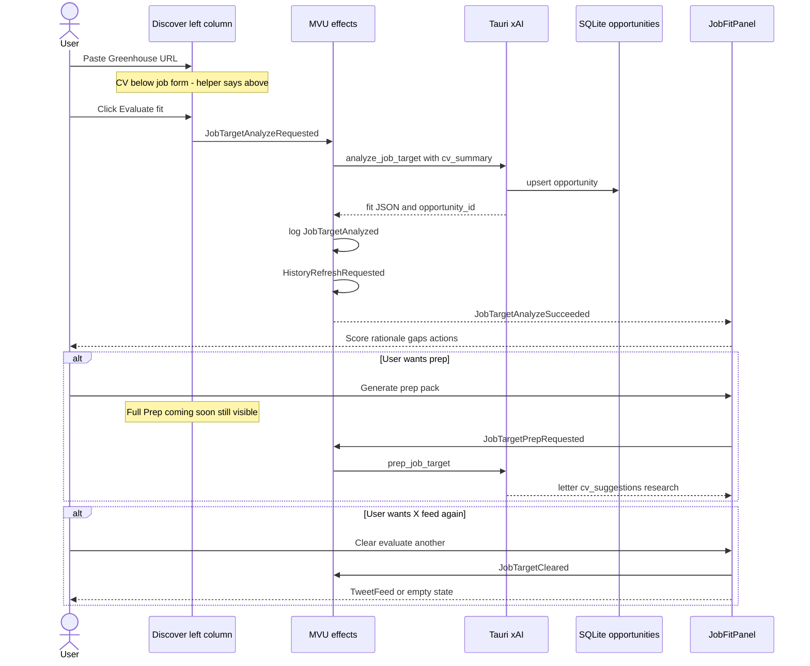
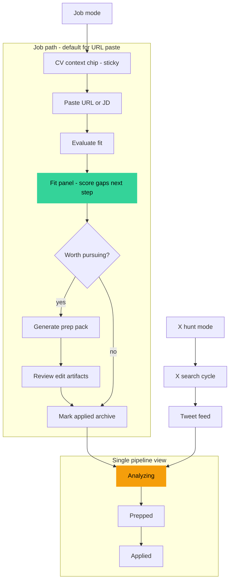
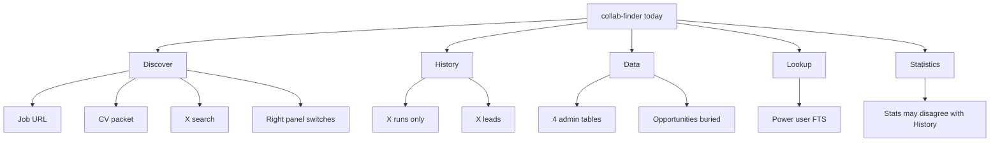
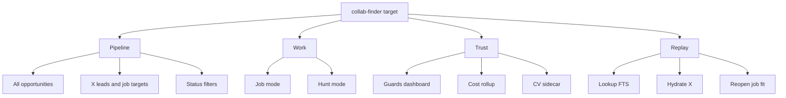
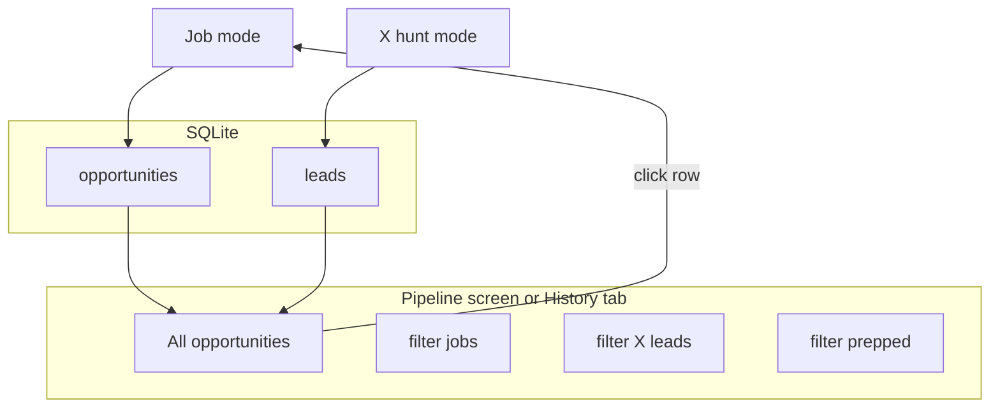

> **Note: Frozen / historical document**
> This report is preserved in its state from `main` (pre-intuitive-shell / Discover+Xplore / terminology migration work).
> It accurately reflects the project state and progress *at the time it was written*. Content and terminology may be outdated relative to current code.
> Moved to `reports/fixed/` to keep active reports relevant to recent changes.

# collab-finder v0.1 — UX / product review (dogfood)

**Audience:** Implementer, designer, PM  
**Date:** 2026-06-08  
**Scope:** Full six-screen shell after Quick Job Target + Slice A/B/C partial ship  
**Evidence:** Live dogfood session (Greenhouse xAI URL), screenshots in `reports/assets/ux-review-2026-06/`  
**Lenses:**

1. **Lens 1** — UI/UX expert + designer + developer (visual system, IA, code alignment)
2. **Lens 2** — Daily power user (~1 week habit) + human interaction (friction, trust, usefulness psychology)

**Related:** [quick-job-target-feedback.md](./quick-job-target-feedback.md) (feature-specific implementer checklist)

---

## Executive summary

| Dimension | Grade | One-line verdict |
|-----------|-------|------------------|
| Visual design | **B+** | Cohesive dark pro-tool; orange accent reads intentional |
| Core job-fit flow | **A-** | Greenhouse URL → 78/100 structured fit **works and feels valuable** |
| Information architecture | **C+** | Jobs vs X vs Data vs History fragmented; no unified pipeline |
| Trust & consistency | **C** | Copy bugs, dual prep affordances, Stats/History number mismatch |
| Daily-driver readiness | **B-** | Strong for *first* analyze; weak for *revisit*, persistence, closure |

**Bottom line:** The grok-4.3 fit panel is the hook. After a week, friction is **organizational** (where did my job go? do I trust these numbers?) not **analytical** (is the fit good?). Fix trust + continuity before adding more features.

---

## Screenshot gallery (session evidence)

| # | File | Screen | What it shows |
|---|------|--------|---------------|
| 1 | [01-discover](./assets/ux-review-2026-06/01-discover-job-fit-greenhouse.png) | Discover | Greenhouse URL → **78/100** fit, gaps, recommended action, prep button |
| 2 | [02-statistics](./assets/ux-review-2026-06/02-statistics.png) | Statistics | Reactor guards + aggregates (**0 searches** shown) |
| 3 | [03-history](./assets/ux-review-2026-06/03-history.png) | History | **10 search runs** timeline (contradicts Statistics) |
| 4 | [04-data](./assets/ux-review-2026-06/04-data-search-runs.png) | Data | Search Runs tab; Opportunities **(17)** tab exists |
| 5 | [05-lookup](./assets/ux-review-2026-06/05-lookup.png) | Lookup | FTS + run detail (empty states) |
| 6 | [06-settings](./assets/ux-review-2026-06/06-settings.png) | Settings | X bearer + xAI key connected |

### Discover — fit analysis (hero flow)


*Greenhouse URL `job-boards.greenhouse.io/xai/jobs/49560…` → structured fit on right. Mission/location gaps surfaced. This is the product’s strongest moment.*

### Statistics vs History — trust gap

| Statistics | History |
|------------|---------|
|  |  |

Same session, contradictory totals → user stops trusting Statistics.

---

## Architecture map (screens × data)



**Observation:** Job opportunities (`opportunities`) are **second-class** in navigation — visible in Data tab #4, absent from History’s mental model (“Timeline of runs and captured leads”). X-centric History vs job-centric Discover split the user’s pipeline.

---

## Flow diagrams

### Current flow — Quick Job Target (as implemented)



**Cognitive tax in current flow:**

1. Scroll past X search controls to edit CV (job-first users).
2. Two prep promises (disabled left vs active right).
3. No path from Data → reopen opportunity #17 without re-paste.
4. `cvSummary` in memory only — lost on restart (`model.ts`, no persistence effect).

---

### Target flow — low cognitive load, high usefulness



**Design principles for target flow:**

| Principle | Current violation | Target behavior |
|-----------|-------------------|-----------------|
| **One truth for actions** | Full Prep disabled + Generate prep active | Single prep CTA after fit |
| **Context before action** | CV below job form; wrong helper copy | CV above job inputs or sticky chip |
| **Closure loops** | Analyze → ??? | analyzed → prepped → applied visible in one list |
| **Reversibility** | Re-paste URL to revisit | Click opportunity row → reload fit/prep |
| **Persistence = trust** | CV edits ephemeral | Sidecar or localStorage on `CvSummaryChanged` |
| **Numbers agree** | Stats 0 vs History 10 | Single source or explicit “stale” badge |

---

### User mental model — current vs ideal





---

## Lens 1 — UI/UX expert + designer + developer

### Strengths

**Visual system** (`src/index.css`): `surface-0` (#070709), accent `#f59e0b`, DM Sans — reads as focused instrument, not generic SaaS. Score badge tones in `job-fit-panel.tsx` (≥75 success, ≥55 accent, else warning) match screenshot hierarchy.

**Discover split** (`discover-screen.tsx`): Left inputs, right outcomes. `showJobFit` priority over TweetFeed is correct product wiring.

**JobFitPanel** structure: Score → band subtitle → rationale → must/nice gaps → recommended action → actions. Matches [quick-job-target-feedback.md](./quick-job-target-feedback.md) target copy.

**MVU architecture**: Views dispatch messages; effects call ports — enables audit events, history refresh, guards. Good foundation for daily-driver polish.

### Issues (code-backed)

#### P0 — Trust breakers

| ID | Issue | Code | Fix |
|----|-------|------|-----|
| T1 | Helper says CV is “above” but CV is **below** job form | `discover-screen.tsx` L44–56 vs L169 | Reorder `CvSummaryInput` above `QuickJobTarget`, or fix copy to “below” |
| T2 | Dual prep affordances | Left L158–165 disabled “Full Prep”; `job-fit-panel.tsx` L175–182 “Generate prep pack” | Remove dead left button; one prep entry after fit |
| T3 | Stats vs History mismatch | `stats-screen.tsx` L36 uses `s?.total_searches ?? historySearches.length` — if `s.total_searches === 0` explicitly, fallback never runs | Reconcile `get_dashboard_stats` or use `max(s, history.length)` / show loading until both ready |

#### P1 — IA & discoverability

| ID | Issue | Code | Fix |
|----|-------|------|-----|
| I1 | Icon-only sidebar | `sidebar-nav.tsx` — labels `sr-only` + `title` only | Expand labels at `md+` or hover tooltips with delay |
| I2 | Opportunities table is read-only admin | `data-screen.tsx` L175–188 — no row click | `OpportunitySelected` → Discover + load fit/prep |
| I3 | Title/company always `—` for Greenhouse | `fetch_job_page` / analyze path | Parse `<title>`, og:meta, Greenhouse JSON-LD |
| I4 | History ignores job opportunities | `history-screen.tsx` — X runs + X leads only | Add “Job targets” section or rename screens |

#### P2 — Polish

| ID | Issue | Fix |
|----|-------|-----|
| P1 | Left column scroll stack too long | Mode toggle collapses X search in job mode |
| P2 | Prep in `<pre>` not review UI | Editable tabs + Copy all + sidecar save |
| P3 | Copy actions silent | Toast “Copied” |
| P4 | Footer jargon | User-facing subtitle or Settings-only |
| P5 | `text-[10px]` label fatigue | Section labels → `text-xs`; reserve 10px for metadata |

### Component responsibility map

```
finder-app-view.tsx
├── SidebarNav          → 6 screens (no labels)
├── Header              → breadcrumb + palette
└── DiscoverScreen
    ├── QuickJobTarget    → local useState(url,pasted) — LOST on navigate
    ├── CvSummaryInput    → model.cvSummary — LOST on restart
    ├── SearchWorkspace   → X query (orthogonal to job mode)
    └── JobFitPanel       → fit + prep + actions
DataScreen
└── opportunities tab   → display only, no actions
```

---

## Lens 2 — Daily power user (1+ week)

### Emotional arc

| Day | Feeling | Why |
|-----|---------|-----|
| Day 1 | **Delight** | Paste Greenhouse → honest 78/100 with relocation/mission gaps |
| Day 3 | **Friction** | “Where’s job #12?” → Data table, no click-through, re-paste URL |
| Day 5 | **Distrust** | Statistics says 0, History says 10 — which is real? |
| Day 7 | **Anxiety** | CV tweaks lost after restart; helper text wrong → “does it even use my CV?” |

### Friction matrix (psychology)

| Moment | Friction | Cognitive load | Usefulness | Fix priority |
|--------|----------|----------------|------------|--------------|
| Paste URL → Evaluate | Low | Low | **High** | — (keep) |
| Read fit result | Low | Medium | **High** | — (keep) |
| Generate prep vs Full Prep coming soon | **High** | High | Medium | P0 |
| Revisit old opportunity | **High** | High | **High** | P1 |
| Find jobs in app | Medium | High | Medium | P1 (pipeline) |
| Check progress (Stats) | **High** | Low | Low (broken trust) | P0 |
| Navigate 6 icons | Medium | Medium | Medium | P1 |
| Edit CV | Low until restart | Medium | **High** | P1 |
| Copy recommended action | Low | Low | Medium | P2 (feedback) |
| Lookup by run ID | **High** | **High** | Medium | P3 (power user OK) |

### Unspoken needs (week-long user)

1. **Closure** — evaluated → prepped → applied visible somewhere.
2. **Continuity** — reopen #17 without re-fetch/re-pay xAI.
3. **Confidence** — numbers and copy always agree; CV survives restarts.
4. **Mode clarity** — “I’m evaluating a job” vs “I’m hunting on X” without scrolling past irrelevant UI.
5. **Cost awareness** — per-run `~$0.0037` is good; weekly rollup on Stats would help budgeting.

### Usefulness verdict

| Workflow | Verdict | Notes |
|----------|---------|-------|
| First-time job fit (Greenhouse) | **Ship-quality** | Screenshot proof: 78/100, actionable gaps |
| Daily X hunt + cycle | **Usable** | History/Data support replay; Lookup for FTS |
| Job pipeline over time | **Not yet** | 17 opportunities in DB, no user-facing pipeline |
| Prep → apply | **Partial** | Generate prep exists; review/edit/sidecar immature |
| Settings / keys | **Solid** | Both X + xAI connected; clear status |

---

## Information architecture — proposed consolidation

### Today (fragmented)

```
Discover ──job analyze──► opportunities (DB)
         ──X search────► search_runs, leads (DB)

History  ──shows───────► search_runs, leads ONLY

Data     ──shows───────► all 4 tables (admin UX)

Statistics ──aggregates► search_runs, leads (jobs invisible)
```

### Proposed (unified pipeline)



**Minimal v1.1:** Add **“Job targets”** section to History (last N opportunities with score + link to Discover).  
**v1.2:** Rename Data → “Advanced” or tuck under Settings; promote Pipeline to sidebar slot.

---

## Graded scorecard

| Criterion | Weight | Score | Weighted |
|-----------|--------|-------|----------|
| First-run job fit value | 25% | 9/10 | 2.25 |
| Visual coherence | 15% | 8/10 | 1.20 |
| Navigation / IA | 15% | 6/10 | 0.90 |
| Trust (copy, numbers, promises) | 20% | 5/10 | 1.00 |
| Revisit & persistence | 15% | 5/10 | 0.75 |
| Power-user depth (Lookup, Data) | 10% | 7/10 | 0.70 |
| **Total** | | | **6.8 / 10** |

---

## Prioritized roadmap

### Wave 1 — Trust fixes (1–2 sessions)

- [ ] **T1** Reorder CV above Quick Job Target OR fix helper copy
- [ ] **T2** Remove disabled “Full Prep (coming soon)” from left column
- [ ] **T3** Fix Statistics aggregates vs History (code + verify in dogfood)
- [ ] **P3** Toast on clipboard copy

### Wave 2 — Continuity (2–3 sessions)

- [ ] **I2** Opportunity row click → `OpportunitySelected` → Discover + reload fit
- [ ] Persist `cvSummary` (localStorage or app-data sidecar on `CvSummaryChanged`)
- [ ] Persist Quick Job Target URL in session (or model slice) across navigate
- [ ] Extract title/company from Greenhouse HTML in `fetch_job_page`

### Wave 3 — Pipeline & mode clarity (3–5 sessions)

- [ ] Discover mode toggle: Job | X hunt (collapse irrelevant left sections)
- [ ] History: “Job targets” section (score, company, status, Open)
- [ ] Stats: include opportunity count + cumulative xAI cost
- [ ] Sidebar labels at `md+`

### Wave 4 — Prep maturity (Slice C completion)

- [ ] Prep review UI (editable tabs, not `<pre>` dump)
- [ ] cv-promote-guard sidecar for CV suggestions
- [ ] Status transitions: `analyzed` → `prepped` → `applied` / `archived`
- [ ] Re-enable unified prep CTA with low-score confirm guard

---

## Code touch list

| File | Wave | Change |
|------|------|--------|
| `src/view/screens/discover-screen.tsx` | 1, 3 | CV order; remove dead prep button; mode toggle |
| `src/components/finder/job-fit-panel.tsx` | 1, 4 | Copy toast; prep review UI |
| `src/view/screens/stats-screen.tsx` | 1, 3 | Stats reconciliation; job + cost metrics |
| `src-tauri/src/db.rs` | 1 | Verify `get_dashboard_stats` vs `get_search_history` |
| `src/view/screens/data-screen.tsx` | 2 | Row actions for opportunities |
| `src/view/screens/history-screen.tsx` | 3 | Job targets section |
| `src/core/finder/msg.ts` / `effects.ts` | 2 | `OpportunitySelected`, CV persist effect |
| `src/components/layout/sidebar-nav.tsx` | 3 | Visible labels |
| `src-tauri/src/lib.rs` | 2 | Greenhouse title/company extraction |

---

## Acceptance criteria (UX wave 1)

Dogfood with same Greenhouse URL after Wave 1:

- [ ] CV helper text matches visual order (above or below — consistent)
- [ ] Exactly **one** prep entry point (result panel only until left button removed)
- [ ] Statistics **Total searches** equals History run count (±0) after Refresh
- [ ] Copy recommended action shows brief confirmation
- [ ] `pnpm build` + manual screenshot parity with [01-discover](./assets/ux-review-2026-06/01-discover-job-fit-greenhouse.png)

---

## Appendix — ASCII flow comparison

### Current (high cognitive load)

```
[Discover left — scroll stack]
  Job URL + JD
  [Evaluate] [Full Prep DISABLED ← confusion]
  CV summary (below URL, text says "above" ← bug)
  X Search workspace
  Presets...
        │
        ▼ dispatch
[Discover right]
  JobFitPanel OR TweetFeed
  [Generate prep ← active]  ← contradicts left

[Elsewhere]
  History → X only
  Data → Opportunities (17) but dead rows
  Stats → 0 searches ← contradicts History
```

### Target (low cognitive load)

```
[Discover — Job mode]
  CV chip (sticky, persisted)
  Job URL + JD
  [Evaluate fit]
        │
        ▼
  Fit panel → [Generate prep] → review → archive
        │
        ▼
[Pipeline / History]
  #17 xAI SWE · 78 · prepped · [Open]
        │
        click ──► back to Discover with loaded state

[Statistics]
  10 searches · 17 jobs · $0.04 xAI this week  ← one truth
```

---

## References

- Screenshots: `reports/assets/ux-review-2026-06/`
- Feature checklist: [quick-job-target-feedback.md](./quick-job-target-feedback.md)
- Architecture: [docs/agentic-architecture.md](../docs/agentic-architecture.md)
- Commands: [docs/tauri-commands.md](../docs/tauri-commands.md)

---

*Report generated from live v0.1 dogfood session. Re-run Greenhouse checklist after each UX wave.*
