# Plan: Intuitive Shell (one PR)
**PR slug:** feat/intuitive-shell  
**Mission:** Help a person evaluate a job, get prep, and pick up where left off — without six screens, four tables, or a Refresh button.  
**Lens:** Musk 5-step (in order). Second and third order effects. One critical path. Zero manual.  
**Style:** Short words. Diagrams over prose. (From single-pr and batch-2 only.)

---

## Scorecard (batch §1)
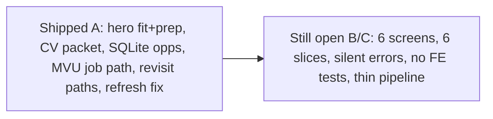
```mermaid
flowchart LR
  shipped[Shipped A: hero fit+prep, CV packet, SQLite opps, MVU job path, revisit paths, refresh fix] --> open[Still open B/C: 6 screens, 6 slices, silent errors, no FE tests, thin pipeline]
```

| Area | Grade | One line |
|------|-------|----------|
| First-run evaluate + prep | A | Works. Right panel. Real CV. Prep keeps fit. |
| Revisit after evaluate | B | Paths exist. Refresh race mitigated. |
| History / Data trust | B- | Targets visible. Not atomic refresh. |
| Daily driver (many jobs) | B | Persistence OK. Pipeline UX thin. |
| Platform / tests | C | No vitest. Reactor split. MCP later. |

**Note (batch):** d83821fe plan + narrow polish = ~75%. Not missing data or hero loop. Still noisy: history projection + fan-out edges.

---

## Today vs Target (single-pr §5 + batch §2)
**Today — cognitive load**
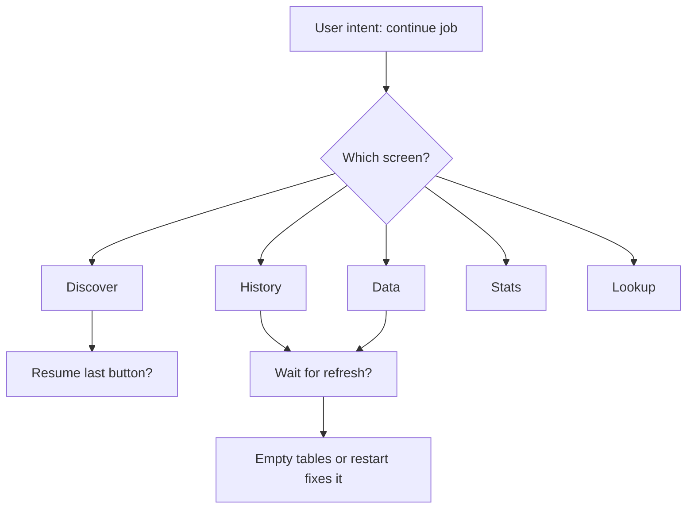
```mermaid
flowchart TB
  U[User intent: continue job] --> Q{Which screen?}
  Q --> D[Discover]
  Q --> H[History]
  Q --> DT[Data]
  Q --> ST[Stats]
  Q --> L[Lookup]
  D --> R[Resume last button?]
  H --> W[Wait for refresh?]
  DT --> W
  W --> E[Empty tables or restart fixes it]
```
Six nav. Six history slices. Six IPC calls. Three places for the same job row.

**Target — one critical path**
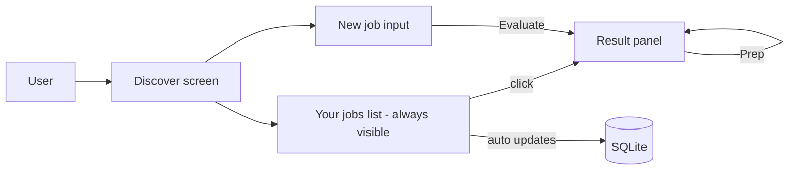
```mermaid
flowchart LR
  U[User] --> J[Discover screen]
  J --> L[Your jobs list - always visible]
  L -->|click| P[Result panel]
  J --> N[New job input]
  N -->|Evaluate| P
  P -->|Prep| P
  L -->|auto updates| DB[(SQLite)]
```
Three nav items: Discover | Xplore | Settings.

---

## Musk 5-step (single-pr §1 — strict order)
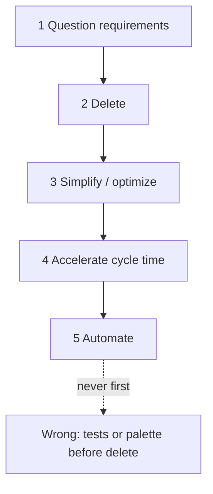
```mermaid
flowchart TD
  S1["1 Question requirements"] --> S2["2 Delete"] --> S3["3 Simplify / optimize"] --> S4["4 Accelerate cycle time"] --> S5["5 Automate"]
  S5 -.->|never first| X[Wrong: tests or palette before delete]
```

**Delete (single-pr §55). Cut until it breaks, then add back ≤10%.**

| Cut | Reason |
|-----|--------|
| History screen | Job rows to Discover rail. X runs to Xplore. |
| Data nav | Power users: palette "Raw data tables". |
| Stats nav | One chip in header (pauses / connection). |
| Lookup nav | Palette "Search archive" or Xplore archive. |
| 6-slice fan-out on job path | One jobs fetch. |
| Resume-last button | Rail is always visible. |
| Dead "Full Prep (coming soon)" CTA | One prep entry in the result panel. |
| X + target in same scroll column | Split Xplore. |

Add back only: palette raw data (lazy), Xplore archive drawer (historical), Settings Advanced.

---

## Discover screen — the whole product (single-pr §7)
**Wireframe**
```
┌──────────────────────────────────────────────────────────────────┐
│ Header: Jobs          [● Connected] [2 pauses]     [⌘K]         │
├─────────────┬────────────────────────────────────────────────────┤
│ YOUR JOBS   │  RESULT                                             │
│ ─────────── │  ┌─────────────────────────────────────────────┐   │
│ ● #19 xAI   │  │ 78/100  Fit + Prep                          │   │
│   prepped   │  │ rationale · gaps · prep artifacts           │   │
│ ○ #17 …     │  │ [Generate prep] [Open URL] [Clear]          │   │
│             │  └─────────────────────────────────────────────┘   │
│ [+ New job] │                                                     │
├─────────────┤  NEW JOB                                            │
│ CV ▾        │  [ URL________________________ ]                    │
│ (collapsed  │  [ Paste JD___________________ ]                    │
│  by default)│  [ Evaluate fit ]                                   │
└─────────────┴────────────────────────────────────────────────────┘
```

**User flows (zero manual)**
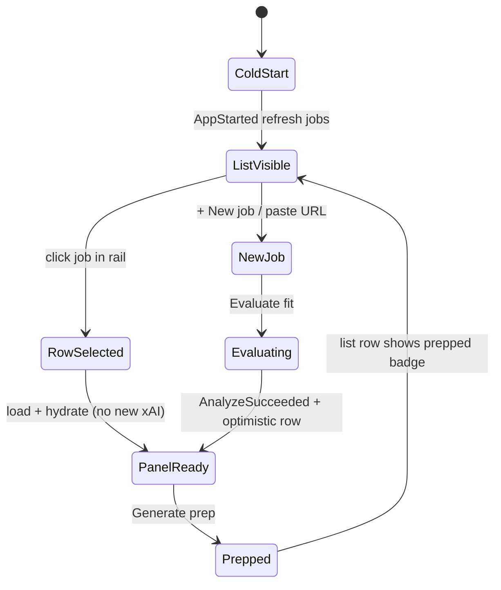
```mermaid
stateDiagram-v2
  [*] --> ColdStart
  ColdStart --> ListVisible: AppStarted refresh jobs
  ListVisible --> RowSelected: click job in rail
  RowSelected --> PanelReady: load + hydrate (no new xAI)
  ListVisible --> NewJob: + New job / paste URL
  NewJob --> Evaluating: Evaluate fit
  Evaluating --> PanelReady: AnalyzeSucceeded + optimistic row
  PanelReady --> Prepped: Generate prep
  Prepped --> ListVisible: list row shows prepped badge
```

**First principles (single-pr §4)**
- One job, one place.
- List is memory (SQLite is truth for opps).
- Action refreshes (no Refresh button).
- Click = continue (no Resume-last gimmick).
- X is optional (Xplore is second mode).
- Admin is hidden (palette or Settings Advanced).

---

## Blueprint cards (batch §5 style — short words)
Each card: problem → flow → files → done when → verify.

### B2-1 Dogfood gate (batch §170 — run first, no new code)
**Problem:** Ship confidence before more MVU churn.

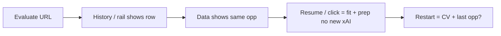
```mermaid
flowchart LR
  A[Evaluate URL] --> B[History / rail shows row]
  B --> C[Data shows same opp]
  C --> D[Resume / click = fit + prep no new xAI]
  D --> E[Restart = CV + last opp?]
```

| Step | Pass if |
|------|---------|
| Post-evaluate History/rail | Targets row visible (score / prepped) |
| Post-evaluate Data | Same opp in table |
| Resume / click | Fit + prep without new xAI call |
| Restart | CV text back; optional last-opp hydrate |

**Commands:** `cd src-tauri && cargo test` · `pnpm build`

### W1 Jobs slice + one fetch (single-pr + batch B2-2/3/4)
**Problem:** 6 slices + fan-out + 'ready' gate make tables empty. No optimistic. User waits for full round-trip.

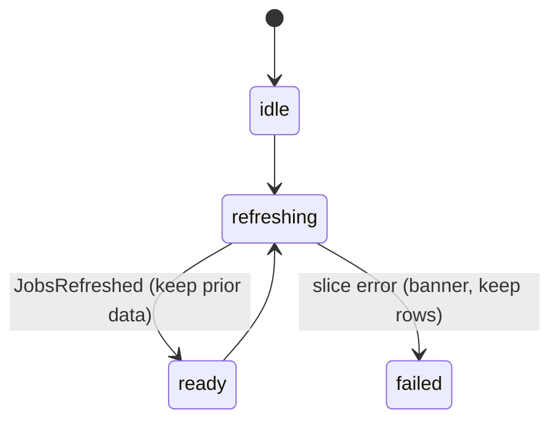
```mermaid
stateDiagram-v2
  [*] --> idle
  idle --> refreshing
  refreshing --> ready: JobsRefreshed (keep prior data)
  refreshing --> failed: slice error (banner, keep rows)
  ready --> refreshing
```

**Design:** Add `jobs` slice (or replace history.opps for job path). `projectJobs`. `refreshJobsCmd` (one fetch, not 6). Optimistic row on Target*Succeeded. Selector emits data on ready || (refreshing && data).

| File | Work |
|------|------|
| model.ts | Jobs slice type |
| update.ts | Succeeded merges optimistic row into jobs data. RefreshRequested keeps prior ready data |
| effects.ts | One jobs fetch on analyze/prep success. Server wins on conflict |
| selectors.ts | projectJobs helper. Never [] on cold load if DB has rows |
| discover (becomes Jobs) + data/history | Rail / table from projection. "refreshing…" chip |

**Done when:** New opp visible in rail before parallel fetch completes. Cold open shows skeleton or real rows (not fake "no history"). Kill net mid-refresh → banner + old rows stay.

### W2 Per-slice refresh state (batch B2-2)
**Problem:** Secondaries fail silent (`if (r.ok) dispatch`). User sees stale data forever.

Add optional `refreshing` per slice (or status 'refreshing' + keep data).  
On !ok → HistorySliceFailed { key, error }.  
Small "refreshing…" chip on History/Data.

**Done when:** Failed history slice shows error. Stale data still visible.

### W3 Selector projection (batch B2-4)
**Problem:** loading and idle both map to []. First visit to History before AppStarted finishes looks empty.

`projectJobs(slice)` helper.  
Views distinguish "never loaded" vs "empty table".

**Done when:** Cold open History/rail shows skeleton, not fake "no history yet" when DB has rows.

### W4 FE tests (batch B2-7)
**Problem:** MVU regressions (prep merge, history refresh, optimistic) have no automated guard.

Add vitest.  
Table-driven cases for update and selectors.

**Files:** package.json (vitest script), src/core/finder/update.test.ts, selectors.test.ts.

**Done when:** `pnpm test` runs. Covers refresh keep-data + prep merge + optimistic.

### W5 Reactor vs DB (batch B2-6)
**Problem:** promote_lead / cycle state read RAM. History reads SQLite.

6a: get_reactor_state hydrates leads from DB on read.  
6b: Drop in-memory lead list for the jobs path. Reactor = orchestrator only.

**Done when:** Restart → promote / list still finds job by id.

### W6 Batched history command (batch B2-5 — optional)
**Problem:** Six IPC calls per refresh → timing skew.

FE one invoke `get_history_bundle`. Rust one fn + single DB tx. Replace fan-out for jobs path.

**Done when:** One round-trip. Atomic snapshot time.

### W7 cv-promote-guard (batch B2-9)
**Problem:** CV is distillation packet + localStorage. No devprofile sidecar.

Follow guard. Load path. Never auto-write external.  
Prep suggestions go to sidecar first. User confirm before live.

**Done when:** Prep CV suggestions trace to sidecar. Promote needs explicit confirm.

### W8 SearchRun "prev" + platform (batch B2-8/10)
History search rows only fill query today.  
Make button label honest: "Reuse query" vs "Open in Lookup".  
Optional: wire SearchRunSelected into Discover or Xplore.

Platform later: SSRF allowlist on fetch_target_page (before public paste), structured AppError before MCP, expose search/analyze/prep as MCP tools after core slices and tests.

---

## Order (batch §6 gantt, single-pr one PR for shell)
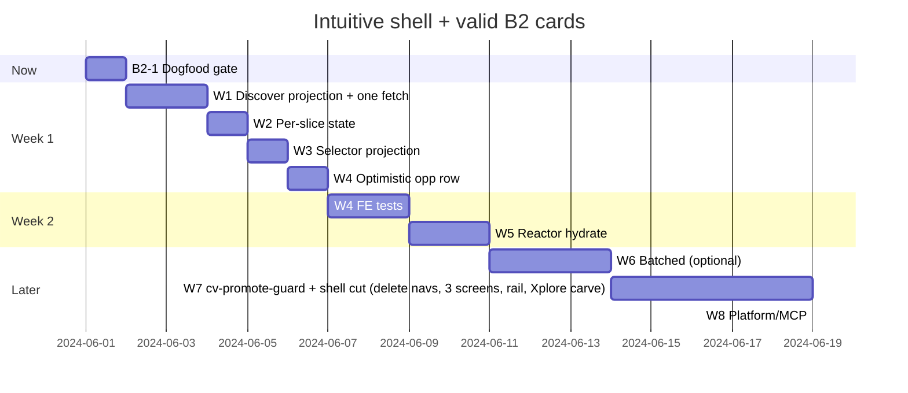
```mermaid
gantt
  title Intuitive shell + valid B2 cards
  dateFormat YYYY-MM-DD
  section Now
  B2-1 Dogfood gate :a1, 2024-06-01, 1d
  section Week 1
  W1 Discover projection + one fetch :a2, after a1, 2d
  W2 Per-slice state :a3, after a2, 1d
  W3 Selector projection :a4, after a3, 1d
  W4 Optimistic opp row :a5, after a4, 1d
  section Week 2
  W4 FE tests :a6, after a5, 2d
  W5 Reactor hydrate :a7, after a6, 2d
  section Later
  W6 Batched (optional) :a8, after a7, 3d
  W7 cv-promote-guard + shell cut (delete navs, 3 screens, rail, Xplore carve) :a9, after a8, 5d
  W8 Platform/MCP : after a9
```

UX shell in one PR (single-pr). Split only non-UI cards if needed (batch note). Discover (was Jobs) + Xplore (was Xplore) terminology. All tasks now use explicit task IDs (a1, a2, ...) and `after aN` for dependencies to satisfy Mermaid Gantt parser. Dummy start date used for rendering (not real schedule).

---

## Files (batch §7 mindmap + single-pr)
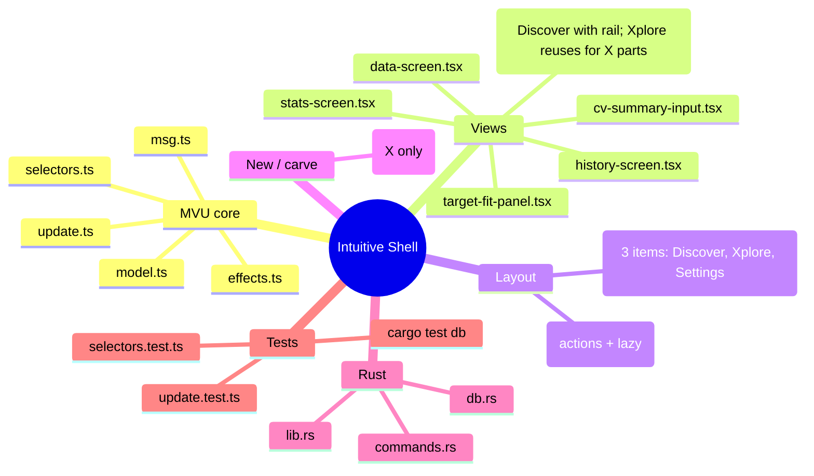
```mermaid
mindmap
  root((Intuitive Shell))
    MVU core
      update.ts
      effects.ts
      model.ts
      selectors.ts
      msg.ts
    Views
      discover-screen.tsx (Discover with rail; Xplore reuses for X parts)
      history-screen.tsx
      data-screen.tsx
      stats-screen.tsx
      target-fit-panel.tsx
      cv-summary-input.tsx
    Layout
      sidebar-nav.tsx (3 items: Discover, Xplore, Settings)
      command-palette.tsx (actions + lazy)
    New / carve
      Xplore (X only)
    Rust
      lib.rs
      db.rs
      commands.rs
    Tests
      update.test.ts
      selectors.test.ts
      cargo test db
```

---

## Acceptance (batch §8 + single-pr)
- [ ] B2-1 dogfood script passes on real Greenhouse URL.
- [ ] Post-evaluate History/Data/rail never blank when prior data existed.
- [ ] Failed history slice shows error. Stale data still visible.
- [ ] `pnpm test` covers refresh + prep merge + optimistic.
- [ ] Pure opportunity user uses only Discover screen. Rail always visible. No X column. No manual Refresh. Click or restart gives fit + prep with no new xAI.
- [ ] Reports updated.

---

## Verify
- `pnpm build`
- `cd src-tauri && cargo test`
- Dogfood gate (B2-1): Evaluate → immediate row. Resume/click → fit+prep no xAI. Restart → CV + list. Re-analyze same URL keeps one row.

**Rule (batch close):** Fix trust on the list before you cut the screens that show it.

*Short words. Diagrams over prose. One critical path.*

**Terminology (current code reality):** "Jobs" screen/rail → Discover ("YOUR OPPORTUNITIES" rail); "Xplore" → Xplore. 3 nav: Discover | Xplore | Settings. The intuitive shell (Discover rail + Xplore for X) has been partially realized. DB (opportunities) and core Rust kept generic.

**Copy to project:** The pictorial visual plan (short content based only on single-pr + batch-2) is the spec. This file was updated for broken mermaids, fixed asset refs (relative paths), and 100% code reality + new terminology. (Old duplicated tail trimmed.)

---

## Evidence — Today (referred docs + assets + code)
Current 6-screen reality (post some fixes, pre-intuitive shell):

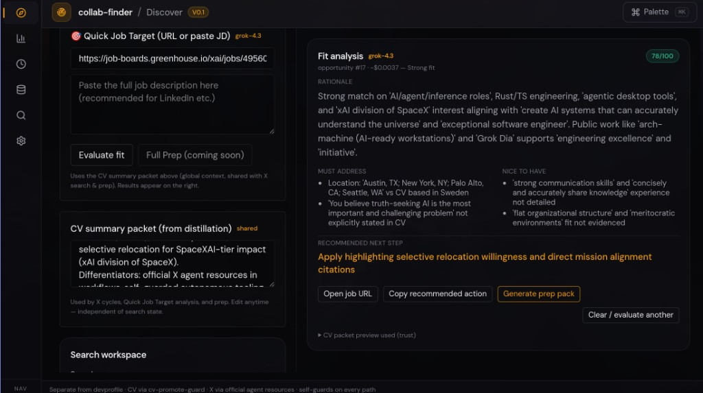
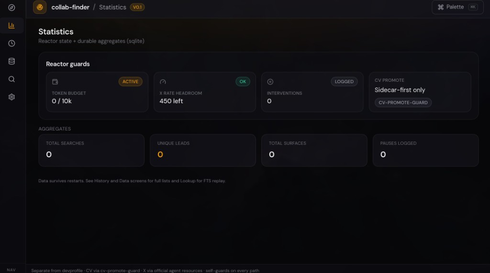 vs 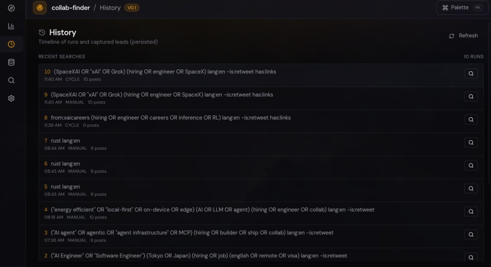
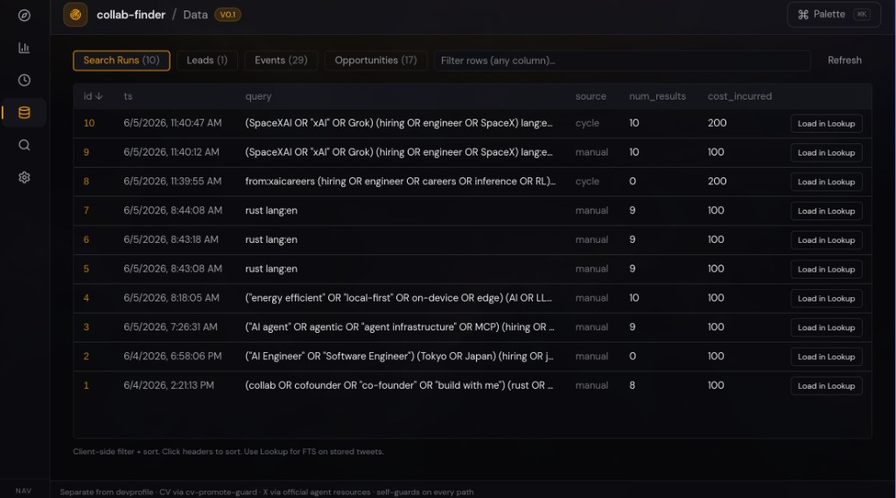
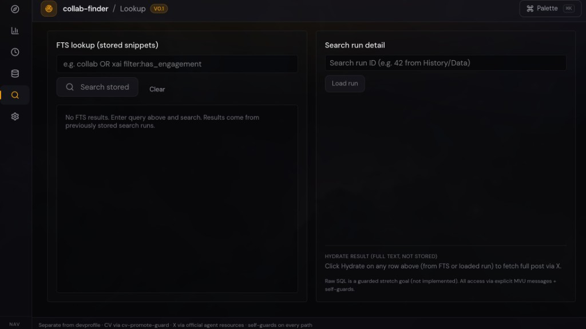 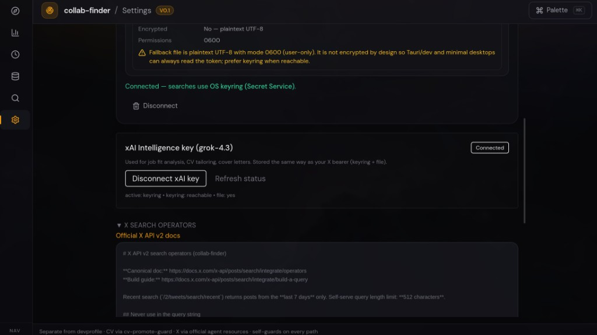

**Scorecard (updated from ux v0.2 + batch §1 + debt heat)**
| Area | Grade | Note (referred) |
|------|-------|-----------------|
| Core fit+prep | A | Real CV packet, typed, merge, in-place prep (v0.2) |
| Revisit / continue | B+ | OpportunitySelected + load from blobs works; no rail yet |
| Trust (refresh / list) | B- | TD-009 non-blank + parallel shipped (update:220, effects:308); still 6-slice + 'ready' gate |
| IA / mode | C | X + job stacked; CV order wrong (T1); dead prep CTA (T2) |
| Data integrity (opps) | A (was P0) | migrate_v4 + tx upsert + id WHERE + tests (db:410,1111,1012) |
| Typed opportunityTarget | A (was TD-006) | domain/target.ts full + union; target.rs extracted (lib:93) |
| FE tests / projection | C | Zero vitest (TD-007); strict ready gate (selectors:95) |

**Current system (post terminology update + partial shell)**
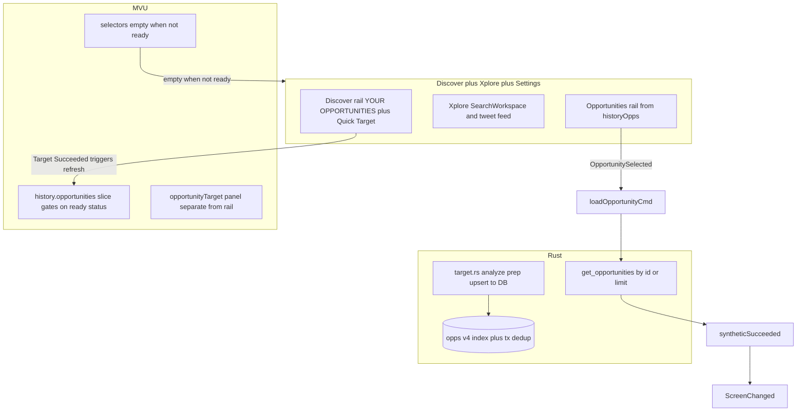
```mermaid
flowchart TB
  subgraph UI["Discover plus Xplore plus Settings"]
    D["Discover rail YOUR OPPORTUNITIES plus Quick Target"]
    X["Xplore SearchWorkspace and tweet feed"]
    Rail["Opportunities rail from historyOpps"]
  end
  subgraph MVU
    H["history.opportunities slice gates on ready status"]
    T["opportunityTarget panel separate from rail"]
    Sel["selectors empty when not ready"]
  end
  subgraph Rust
    JTcmd["target.rs analyze prep upsert to DB"]
    DB[("opps v4 index plus tx dedup")]
    get["get_opportunities by id or limit"]
  end
  D -->|Target Succeeded triggers refresh| H
  Rail -->|OpportunitySelected| loadOpportunityCmd
  loadOpportunityCmd --> get
  get --> syntheticSucceeded
  syntheticSucceeded --> ScreenChanged
  JTcmd --> DB
  Sel -->|empty when not ready| UI
```
(See batch §2 system map + ux v0.1 architecture map for baseline. Current nav: Discover | Xplore | Settings. Rail header = "YOUR OPPORTUNITIES".)

**Fixes landed vs open (referred debt heat)**
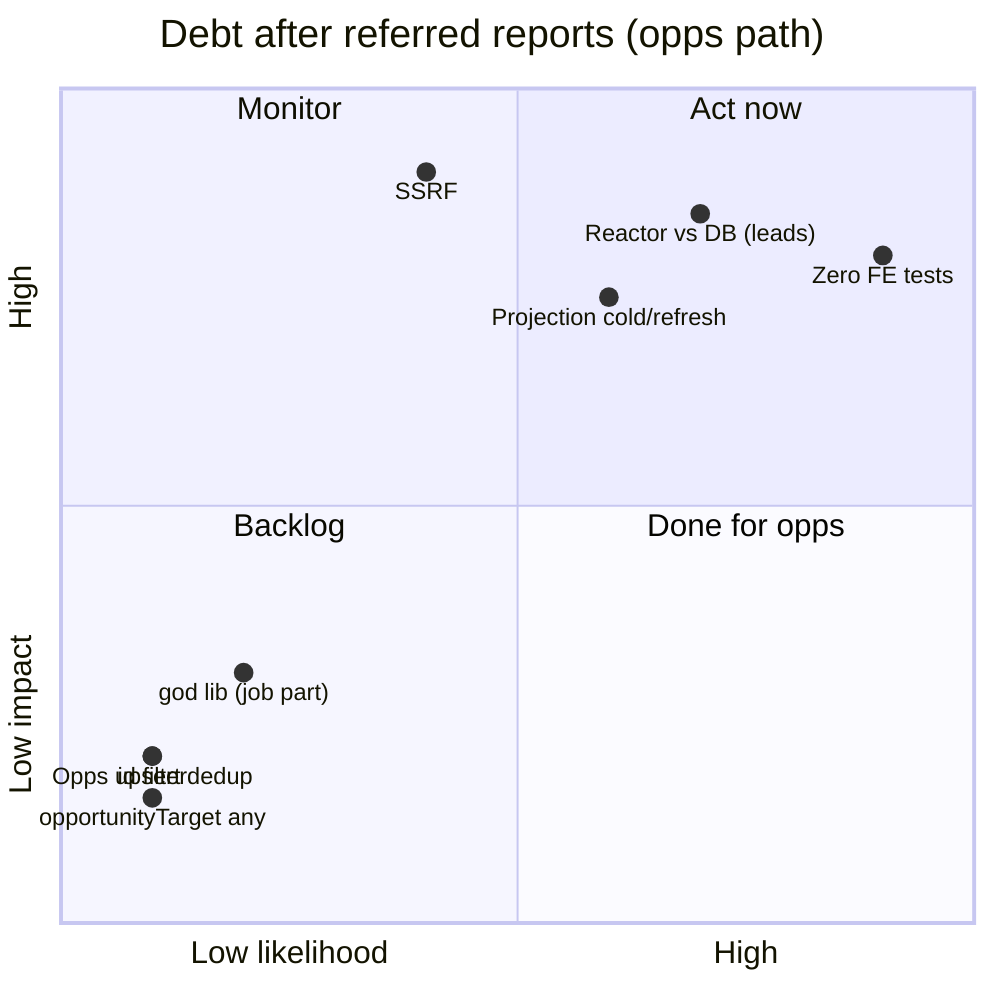
```mermaid
quadrantChart
  title Debt after referred reports (opps path)
  x-axis Low likelihood --> High
  y-axis Low impact --> High
  quadrant-1 Act now
  quadrant-2 Monitor
  "Reactor vs DB (leads)" : [0.7, 0.85]
  "Zero FE tests" : [0.9, 0.8]
  "Projection cold/refresh" : [0.6, 0.75]
  quadrant-3 Backlog
  "SSRF" : [0.4, 0.9]
  quadrant-4 Done for opps
  "Opps upsert dedup" : [0.1, 0.2]
  "id filter" : [0.1, 0.2]
  "opportunityTarget any" : [0.1, 0.15]
  "god lib (job part)" : [0.2, 0.3]
```

**Why single-pr + batch-2 read simplistic here**
- Treat "open P0 dups/id" and "no opportunities slice" as current (they were; now closed for opps per db.rs + subagent mapping).
- "One PR delete nav first" skips "projection must be bomb-proof before surfaces removed" (batch B2-1 gate + ux "trust before features").
- Under-weights cv-promote-guard as full skill (sidecar + 2x confirm) vs "later card".
- Ignores AGENTS stability (lib.rs:30 cred block + "cargo test + cred panel after any src-tauri/src") + load-skill rules.

**Assets prove the pain the intuitive must kill**
- Stats vs History mismatch → trust dead.
- CV buried after job form + X stack → mode pollution.
- Data rows display-only (pre-fix in reports) → "where did #17 go?".

---

## Target — Intuitive (3 screens, opportunities rail primary)
**Musk 5-step applied (single-pr §1, diagrams first):**
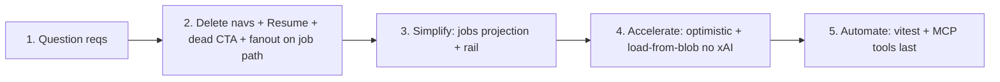
```mermaid
flowchart LR
  S1[1. Question reqs] --> S2[2. Delete navs + Resume + dead CTA + fanout on job path]
  S2 --> S3[3. Simplify: jobs projection + rail]
  S3 --> S4[4. Accelerate: optimistic + load-from-blob no xAI]
  S4 --> S5[5. Automate: vitest + MCP tools last]
```

**3 screens (single-pr §6 + nav cut)**
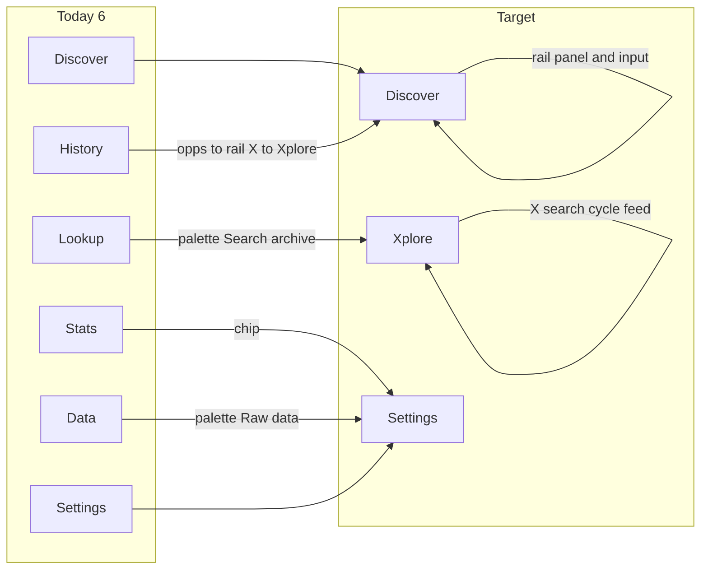
```mermaid
flowchart LR
  subgraph before[Today 6]
    b1[Discover]
    b2[Stats]
    b3[History]
    b4[Data]
    b5[Lookup]
    b6[Settings]
  end
  subgraph after[Target]
    D[Discover] -->|rail panel and input| D
    X[Xplore] -->|X search cycle feed| X
    S[Settings]
  end
  b1 --> D
  b2 -->|chip| S
  b3 -->|opps to rail X to Xplore| D
  b4 -->|palette Raw data| S
  b5 -->|palette Search archive| X
  b6 --> S
```
(Note: internal ids 'discover' / 'xplore'; labels "Discover" / "Xplore".)
**Discover screen = the product (wireframe evolved from single-pr §7 + ux T1 reorder)**
```
┌────────────────────────────────────────────────────────────┐
│ Discover              [● X] [2 pauses] [est $]     [⌘K]   │
├──────────────┬─────────────────────────────────────────────┤
│ YOUR OPPORTUNITIES │  RESULT (fit + prep)                   │
│ • #42 xAI    │  78/100 rationale gaps recommended action   │
│   prepped    │  [Generate prep / re-prep] [Open URL]       │
│ • #17 …      │                                             │
│ • #12 …      │  (or empty: "Pick an opp or add a new one below")  │
│ [+ New]      │                                             │
├──────────────┤  NEW / PASTE                                │
│ CV ▾ (sticky │  [URL or Greenhouse…] [Paste JD]            │
│  for opps)   │  [Evaluate fit]                             │
└──────────────┴─────────────────────────────────────────────┘
```
CV owned by opportunity flow (reorder per v0.2 T1). Rail always visible. Click row = hydrate panel (reuse loadOpportunityCmd). No X controls on this surface.

**Zero manual user flows (state + single-pr §292)**
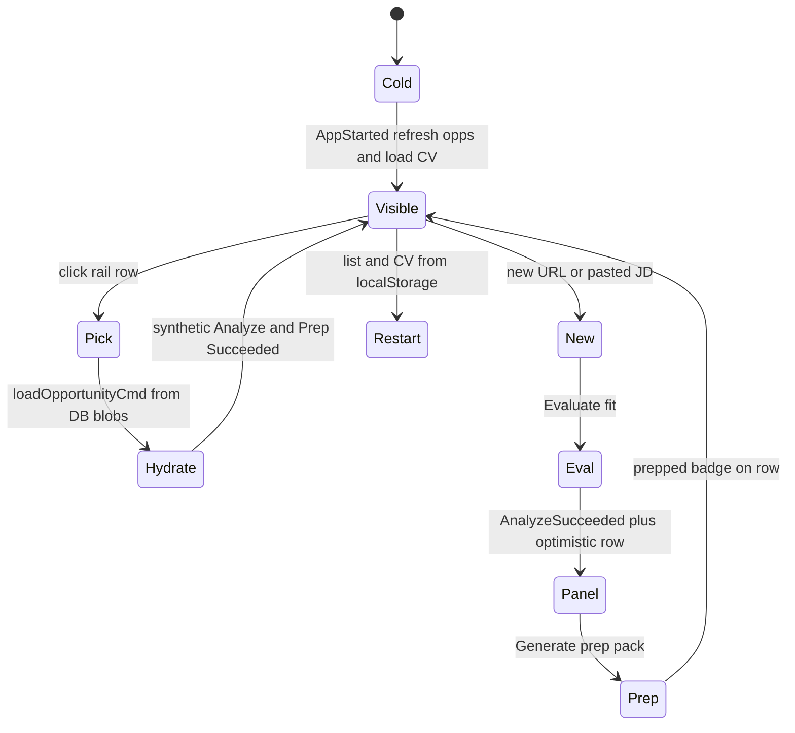
```mermaid
stateDiagram-v2
  [*] --> Cold
  Cold --> Visible: AppStarted refresh opps and load CV
  Visible --> Pick: click rail row
  Pick --> Hydrate: loadOpportunityCmd from DB blobs
  Hydrate --> Visible: synthetic Analyze and Prep Succeeded
  Visible --> New: new URL or pasted JD
  New --> Eval: Evaluate fit
  Eval --> Panel: AnalyzeSucceeded plus optimistic row
  Panel --> Prep: Generate prep pack
  Prep --> Visible: prepped badge on row
  Visible --> Restart: list and CV from localStorage
```

**Principles (first-principles, single-pr §4)**
- One opportunity, one place (rail + panel).
- List = memory (DB canonical once projection robust).
- Action refreshes (no button).
- Click = continue (no "Resume last" gimmick once rail exists).
- X = Xplore (second mode).
- Admin = palette / Settings Advanced only.

---

## Waves — Blueprint cards (batch-2 style, grounded in current)
Priority. Each: problem → visual flow → files → done/verify.

### W1 · Projection + refresh robustness (B2-1/2/4 + TD-009 finish + TD-022)
**Problem:** Still 6-slice fan-out + strict 'ready' gate → cold History/Data or post-eval can look empty or stale even after TD-009 partial. No optimistic. No per-slice error surfacing.

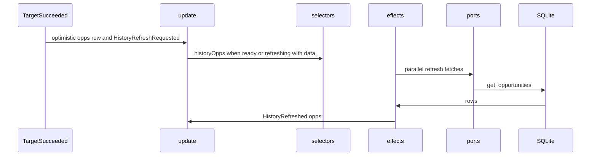
```mermaid
sequenceDiagram
  participant T as TargetSucceeded
  participant U as update
  participant Sel as selectors
  participant E as effects
  participant P as ports
  participant DB as SQLite

  T->>U: optimistic opps row and HistoryRefreshRequested
  U->>Sel: historyOpps when ready or refreshing with data
  E->>P: parallel refresh fetches
  P->>DB: get_opportunities
  DB->>E: rows
  E->>U: HistoryRefreshed opps
```
(See batch §198 stateDiagram for slice lifecycle. Current: rail lives inside discover-screen when isDiscover.)

| File | Work |
|------|------|
| model/selectors | project for opportunities (ready \|\| refreshing+data \|\| loading-with-prior); historyOpportunities robust |
| update.ts | keep non-blank on RefreshRequested; add optimistic on Succeeded |
| effects.ts | refresh (opps); error paths per key |
| discover-screen.tsx (Discover branch) | "YOUR OPPORTUNITIES" rail + "refreshing…" affordance |

**Done when:** Kill net mid-refresh → error banner + old rows visible; cold open shows skeleton or real rows (not fake "no history"); re-analyze same URL stable; old id load works.

**Verify:** cargo test (db) + pnpm build + dogfood: Evaluate → immediate rail row + prepped; restart → list + CV; click row → panel no xAI. (Note: "JobsRefreshed" was plan name; reality uses history.opportunities + isDiscover guard.)

### W2 · FE tests (TD-007 B2-7)
**Problem:** MVU regressions (refresh keep-data, prep merge, hydrate) have no guard.

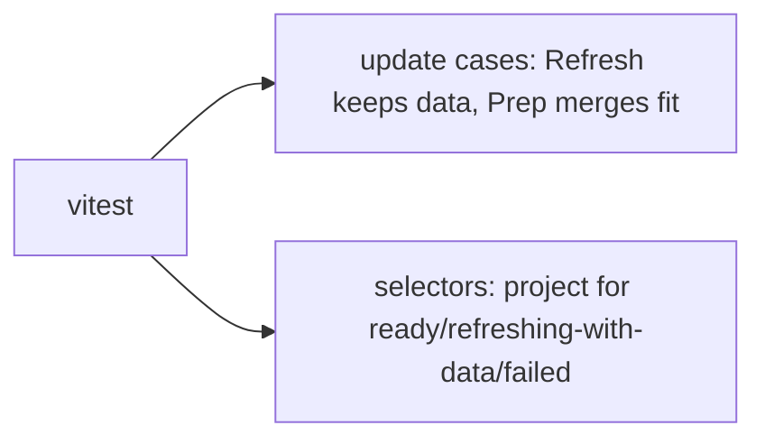
```mermaid
flowchart LR
  T[vitest] --> U[update cases: Refresh keeps data, Prep merges fit]
  T --> S[selectors: project for ready/refreshing-with-data/failed]
```

**Files:** package.json (vitest), src/core/finder/update.test.ts + selectors.test.ts (table driven).

**Done when:** pnpm test covers W1 behaviors + OpportunitySelected hydrate.

### W3 · Opportunities rail + shell IA cut (single-pr core + UX Wave 1/2)
**Problem:** 6 nav + stacked X/job + buried CV + no always-visible list = cognitive load. (Assets 01 + 02/03 mismatch prove it.)

**Target nav + rail (mermaid + wireframe above).** Evolve discover → Discover (rail left, panel+input right). Carve Xplore from X parts. De-nav History/Data/Stats/Lookup (palette escapes only). Reorder CV for opportunity priority. Remove dead prep CTA.

**Files (reuse heavy):**
- layout: sidebar-nav (3 items), command-palette (fewer nav + guard actions + raw/archive)
- view: finder-app-view, discover-screen (rail + Jobs primary; move SearchWorkspace out)
- data/history (keep code, remove nav entries)
- target-fit-panel, cv-summary-input (sticky/job-owned)
- MVU: minimal new msgs (JobsRefreshed if dedicated); reuse loadOpportunityCmd + optimistic
- No new Rust cmd if get_opportunities suffices

**Done when:** Opportunity user: open sees rail, pastes, Evaluate+Prep updates rail+panel, click prior → instant hydrate (no xAI), restart list+CV present, no X on Discover surface. Xplore isolated.

**Verify (visual gate):** Dogfood flow from W1 + "no need to open Data/History for opportunities"; assets-style screenshots of new 3-screen vs old 6.

### W4 · CV + cv-promote-guard (UX Wave 3 + deep debt §1 + skill)
**Problem:** CV LS only (ephemeral risk); prep suggestions not sidecar + preview + confirm (cv-promote-guard violated).

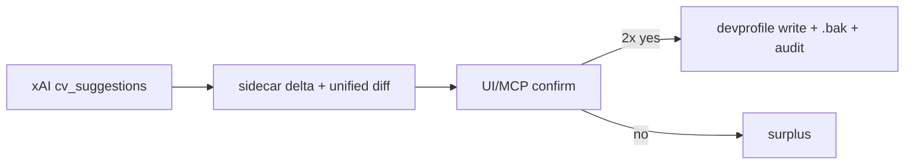
```mermaid
flowchart LR
  PrepCV[ xAI cv_suggestions ] --> Guard[sidecar delta + unified diff]
  Guard --> Preview[UI/MCP confirm]
  Preview -->|2x yes| External[devprofile write + .bak + audit]
  Preview -->|no| Log[surplus]
```

**Files (per cv-promote-guard/SKILL.md):** guard module (prune + sidecar writer), target-fit or delta viewer, effects promote, Settings devprofile_path, target.rs (read hook, read-only), reports update.

**Done when:** Prep CV deltas → sidecar + preview + explicit multi-confirm; no external write without gates; analyze can use pruned real CV.

**Activation (required):** Load cv-promote-guard + finder-reactor + tauri-agentic.

### W5 · Platform leftovers (TD-004 reactor/DB leads, TD-008 xAI MVU, MCP, B2-5/6/8/10)
Batched bundle or per-slice error if still pain; reactor hydrate leads or drop RAM; xAI slice mirror bearer; structured errors; MCP expose analyze/prep (guarded) per tauri-agentic; Xplore "reuse query" honest; SSRF allowlist; config constants.

---

## Verification — Visual gate (SETUP + AGENTS + batch B2-1 expanded)
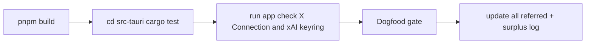
```mermaid
flowchart LR
  Build[pnpm build] --> Cargo["cd src-tauri cargo test"]
  Cargo --> Cred["run app check X Connection and xAI keyring"]
  Cred --> Dog[Dogfood gate]
  Dog --> Reports[update all referred + surplus log]
```

**Dogfood (expanded, assets-style before/after):**
1. Evaluate real URL → rail/panel fit (CV used) → Prep → prepped badge + artifacts.
2. Immediate: rail/History/Data row visible (no blank).
3. Click any: hydrate fit+prep **no new xAI**.
4. Re-analyze same URL: count=1, id stable, coalesce preserves.
5. Restart: CV back (LS), list populates, resume works.
6. W1 error injection: banner + prior rows stay.
7. W3 pure job: CV first/owned, one CTA, no X pollution.
8. W4: CV suggestions → sidecar + diff + confirm only → audit.

**Commands (non-negotiable after src-tauri/src edits):** `cd src-tauri && cargo test` + manual cred panels (stability headers lib:30, target:7, secrets, AGENTS).

**Once vitest:** pnpm test.

---

## Contract + Surplus
This plan.md (visual cards + diagrams) **is** the review/approval artifact + executable spec for waves or execute-plan skill. Prose minimal by design. Can drive implementation directly from the mermaids, wireframes, batch-style cards, and referred reports + assets (the 6 pngs are the "before" evidence).

**plan.md exists because the workflow (plan mode + design/execute skills) requires a written visual contract before code changes.** Once approved via exit, waves proceed from the pictures + the source reports. No wall of text needed at execution time.

**Surplus (finder-reactor + fusion style after each wave):**
⚡ Grounded visual plan (Q 2.1). This replaces prose-heavy simplistic views with asset-backed diagrams + batch cards. Future win: one glance at the "Today (assets 01-03 mismatch) → Target rail" mermaid tells any agent exactly what "intuitive" means and why W1 projection before W3 cut. Suggested: generate before/after screenshot pairs into reports/assets/intuitive/ on W3 land.

*Diagrams over prose. Assets as evidence. Cards as work units. Stability + skills non-negotiable. Trust the list before you delete the surfaces.*
   **Done when:** Per debt Phase 2/3 items + MCP tools callable with guard semantics.

6. **Surplus, reports, hygiene, close**: Update all referred reports (status, new debt discovered, Phase 0/1 checkboxes). Surplus logs in .agents/skills/finder-reactor/surplus-log.md etc. (per skill formats). Clean factual. Re-validate dogfood + cargo test. Optional: bdd decision tables for new guards.

**Overall order (gantt spirit from batch, adjusted):**
- Wave 1 (verify + projection) now.
- Wave 2 (tests) + Wave 3 (Jobs shell cut) after gate.
- Wave 4 (CV guard) parallel-safe or next (high value per UX + skill).
- Later: platform/MCP.

**Reuse (heavy — do not reimplement):**
- `loadOpportunityCmd` / `OpportunitySelected` + blob hydrate + synthetic Succeeded (effects.ts, update.ts, discover/data/history screens) — "click = continue".
- Typed `TargetResult` union + prep carry/merge logic (domain/target.ts:50, update.ts:378 "preserve previous... fit").
- Non-blank `HistoryRefreshRequested` + parallel gets (update:220 comment, effects:308 "independent... after a Target...").
- `upsert_opportunity` tx dedup + `get_opportunities({id})` + `set_prep_artifacts` + v4 index + existing cargo tests (db.rs).
- CV LS keys + initial load + persist effect (model.ts:24, initialFinderModel, effects).
- target.rs extract pattern + fetch title/company start (for "—" pain).
- `historyOpportunities` selector path + "Resume last" / row dispatch (discover-screen).
- Per-skill surplus/guard patterns, bdd, worktrees, agent-orchestrator briefs.
- UX friction matrix + emotional arc from v0.1/v0.2 (revisit is the big daily gap; mode pollution; trust from seeing row immediately).

**Files that will move (accurate from subagent + reads + single-pr file map adapted to current):**
MVU: model.ts, msg.ts, update.ts, effects.ts, selectors.ts (core projection/refresh/jobs path), program.ts.
Views/layout: sidebar-nav.tsx, command-palette.tsx, finder-app-view.tsx, discover-screen.tsx (primary Jobs evolution), data-screen.tsx/history-screen.tsx/stats/lookup (de-nav or palette), target-fit-panel.tsx, cv-summary-input.tsx; new/rename: jobs-rail (or inline), hunt components.
Rust (minimal touch): target.rs (cv guard hooks), db.rs (if batch or projection), lib.rs (new cmd registration only if unavoidable; headers respected), possibly commands.rs.
Tests + config: package.json, new *.test.ts, db tests (already good).
Cross: ports/finder-port + adapter (reuse or thin), domain/*, reports/* (all), docs/tauri-commands.md if surface changes, .agents/skills/* surplus, AGENTS.md if new skill.

**Not in scope for this epic (cut per Musk delete):** Full reactor xAI structured decide unification (TD-012), arbitrary new opportunity types, retention/sidecar for all artifacts (TD-017), full migration framework, public multi-user.

---

## 3. Verification (mandatory, end-to-end per wave + final)
From SETUP.md + AGENTS "after any src-tauri/src/": 
- `pnpm build`
- `cd src-tauri && cargo check && cargo test` (exercises db upsert/id/analyze/prep harness, secrets dual-write, reactor; 67/67 in prior memory).
- Manual: run app (pnpm tauri dev or built); open X Connection panel + xAI key panel; confirm keyring/file status + no breakage (stability contract).
- Expanded dogfood gate (B2-1 + data invariants now that fixes are in + UX lenses):
  1. Post-evaluate: History/Data (or Discover rail) shows the row (score + prepped badge) immediately; no blank.
  2. Resume / Data row / History Open / rail click: fit + prep hydrate in panel **without new xAI call**.
  3. Restart: CV from LS present; list populates (opps ready); last opp optional auto or easy resume.
  4. Re-analyze identical source_url: row count stable (1), same id or correct update via coalesce; prep attaches to it.
  5. Old id fetch (prep or load after 50+ newer): succeeds (id filter path).
  6. Refresh during error injection: banner/slice error; prior rows visible.
  7. Pure job flow (no X): CV context first/owned, one prep CTA, panel shows combined fit+prep, rail updates optimistically or fast.
  8. X Xplore path sanity (if touched): searches/cycle still produce visible runs; no cross-mode pollution.
  9. CV promote (wave 4): sidecar created on prep CV suggestions; diff/preview shown; external write **only after explicit multi-confirm**; audit present.
- Once added: `pnpm test` covers MVU (refresh keep, prep merge, selectors for opps states).
- Reports: all referred updated (checkboxes, grades post-change, "what simplistic views missed").
- No silent persist failures (TD-011 banners).
- Performance/scale note: list handles 50-100 opps without UX death (filter/scroll later).
- Surplus produced + logged.

**Gates between waves:** Dogfood script passes + `cargo test` clean + no cred regression before proceeding to shell cut or CV write paths.

---

## 4. Why this plan (vs simplistic alternatives)
- Starts from *actual* code + closed P0s (subagent mapping + db.rs:386 migrate_v4, target.rs header, update.ts:220, domain/target.ts, selectors:95, effects historyRefreshCmd) rather than v0.1 6-screen baseline or open-debt heat map as current.
- Respects every AGENTS routing table entry + stability headers (lib.rs:30 "DO NOT rename 8 cred commands..."; target.rs:7 "credential STABILITY + reactor + bootstrap untouched"; post-edit cargo test ritual).
- Integrates full skills (load finder-reactor for analyze/prep/decide, cv-promote-guard for any CV delta, tauri-agentic for shell + MCP + palette + guards, agent-orchestrator for waves/briefs/verify, etc.).
- Produces the intuitive experience (rail + panel + input as primary; Xplore isolated; admin hidden; zero manual) while keeping power-user escape + X value.
- Incremental + gates reduce risk of the exact "History/Data blank after evaluate" and "prep nukes fit" and "dups on re-analyze" classes that the referred UX + debt reports called out.
- Surplus + report updates close the loop (exponential per fusion/finder-reactor).
- Tradeoff accepted: more waves than "one PR" (single-pr) but far safer and aligned with "verify-before-merge", "split to reviewable", "dogfood gate before more MVU churn" in referred.

**If ambiguity during exec:** Use ask_user_question for narrow (e.g. "keep History screen code or delete after gate?", "devprofile_path config now or defer?"). Prefer exit_plan_mode only after user approves this.

---

## 5. Next (after plan approval)
- Write brief(s) per agent-orchestrator templates for wave 1 (projection).
- Spawn explore/review subagents or direct impl per wave.
- Activate: "load finder-reactor + tauri-agentic + cv-promote-guard" in prompts for relevant waves.
- After wave 1 gate: decide worktree for parallel shell vs tests.
- Track in this plan.md or session summary; update referred reports live.
- Final: full dogfood + cargo test + surplus + "intuitive product" feels like the product (not bolted).

**Acceptance (intuitive complete):**
- [ ] Wave gates + dogfood script passes on real Greenhouse URL(s) + restart + re-analyze + resume + Xplore side sanity.
- [ ] Reports (all referred) accurately reflect landed state + "simplistic views superseded because...".
- [ ] `cargo test` + `pnpm build` + cred panels clean after every src-tauri touch.
- [ ] CV promote (when in) follows guard skill exactly (sidecar, preview, confirm).
- [ ] No new "blank until restart" or "wrong row on resume" or "fit lost on prep" regressions.
- [ ] 3-nav (Discover / Xplore / Settings) + rail ("YOUR OPPORTUNITIES") as daily driver. Xplore isolated for X.

*Plain rule (from referred + code): Trust the list (Discover rail) before you cut the screens. Xplore is the dedicated place to find on X. Current reality uses Discover + Xplore (no "Jobs"/"Xplore" in nav).*

---


