# Single PR — Intuitive product shell

**PR slug:** `feat/intuitive-shell` (one reviewable unit)  
**Lens:** Musk 5-step (in order) · second & third-order effects · one critical path · zero manual  
**Supersedes:** Incremental batch-2 slices for UX — same fixes, one redesign  
**Audience:** Implementer · you · future agents

---

## 0. Mission (one sentence)

Help a person **evaluate a job, get prep, and pick up where they left off** — without learning six screens, four tables, or when to press Refresh.

Everything else is support or **cut**.

---

## 1. Musk five-step — applied to this PR (strict order)

**Do not reorder.** Most teams fail at step 5 first (more automation, more screens, more refresh logic). That cements the wrong design.

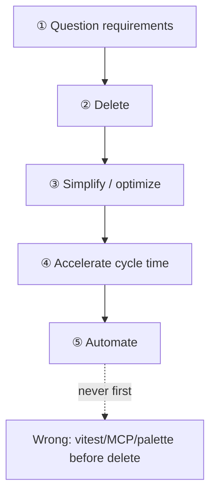

### ① Question every requirement

Each requirement must name **who** asked and **what happens if we drop it**.

| Requirement | Who said it | Still needed? | Verdict |
|-------------|-------------|---------------|---------|
| 6 sidebar screens | Early shell scaffold | No — user has one intent: opportunities | **Drop nav** |
| History + Data both show opps | Reports Wave 2 | No — duplicate surfaces | **One rail** |
| Manual Refresh | Implicit “dashboard” pattern | No — action must refresh | **Drop button** |
| Statistics screen | v0.1 guards view | No for daily path | **Header chip** |
| Lookup as primary nav | FTS power feature | No for 95% sessions | **Palette / Xplore archive** |
| `historyRefreshCmd` × 6 | TD-009 patch mindset | No on main path | **One opps fetch (Discover)** |
| Command palette screen hops | Agent ergonomics | No — 3 screens exist | **Actions only** |
| X + job on same scroll column | v0.1 layout | No — mode pollution | **Split Xplore** |
| Resume-last button | PR6a continuity | No if list always visible | **Delete** |
| Reactor dashboard for opps | TD-004 | No — SQLite is truth for opps | **DB-only list** |
| vitest for MVU | TD-007 | Yes — but **step ⑤ only** | **After delete** |

**Dumb requirement test:** “We need Data tab 4 so users trust persistence.”  
**Answer:** Trust comes from **seeing the row on Discover**, not from an admin table.

### ② Delete — if you are not adding back ~10%, you did not delete enough

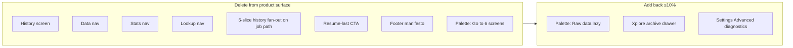

**Delete first in code** (commits 1–2), before polishing Discover layout. Polishing a six-screen shell is step ③ on the wrong object.

### ③ Simplify / optimize — only after delete

| Optimize (allowed now) | Not yet (would be lipstick) |
|------------------------|-----------------------------|
| `opps` slice (in Discover) + projection | Per-slice refresh flags × 6 |
| Optimistic row on `Target*Succeeded` | New loading skeleton system |
| Collapsible CV strip | Sticky CV + chip + tooltip stack |
| One `get_opportunities` or snapshot IPC | Batched mega-bundle before delete proven |

### ④ Accelerate cycle time — make the happy path fast

| Lever | Effect |
|-------|--------|
| Row click → `loadOpportunityCmd` (no screen change) | TTC ↓ |
| Optimistic list update before IPC returns | Perceived save ↓ |
| No blank-to-loading on refresh | No “restart fixes it” |
| AppStarted: opps list + optional last opp hydrate | Return visit ↓ |
| Xplore isolated | Discover never waits on X fetch |

**Metric:** Time-to-continue (TTC) §18 — the step-④ scoreboard.

### ⑤ Automate — last

| Automate | When |
|----------|------|
| vitest: `update` opps refresh + optimistic merge | After Discover screen ships |
| `cargo test` (existing db) | Every commit |
| MCP / agents driving 6 screens | **Reject** — agents inherit human nav; 3 screens only |
| Auto-retry history fan-out | **Reject** — wrong model |

**Rule:** Do not add agent-only nav or test harness that recreates deleted screens.

---

## 2. Second-order thinking — what happens after we ship

First order = what we intended. Second order = what happens *because* of that.

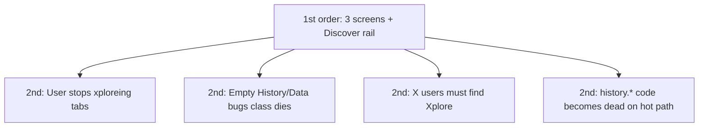

| 1st order (intent) | 2nd order (consequence) | Design response in this PR |
|--------------------|-------------------------|----------------------------|
| Remove History/Data nav | Power user cannot browse raw SQL daily | Palette › Raw data **lazy** — not nav |
| Single `jobs` slice | Xplore screen needs its own `xRuns` slice | Add **only** on Xplore; do not merge |
| Delete Refresh | User cannot “force fix” stale UI | `projectOpportunitys` keeps last-good + banner on fail |
| Collapsed CV default | User may not see CV before first evaluate | Empty-state copy: “CV used for fit — expand to edit” |
| Optimistic row insert | Rare mismatch if server row differs | Background `OpportunitysRefreshed` reconciles |
| Split Xplore | Opportunity-only user never discovers X | **OK** — mission is jobs; Xplore label clear |
| vitest last | Short window without FE regression net | Keep PR small; dogfood F1–F8 mandatory |

**Anti-pattern (2nd order failure):** Delete nav but **keep** `historyRefreshCmd` on target success → bugs move to Discover rail instead of dying. **Must** switch trigger to refresh in effects.

---

## 3. Third-order effects — consequences of consequences

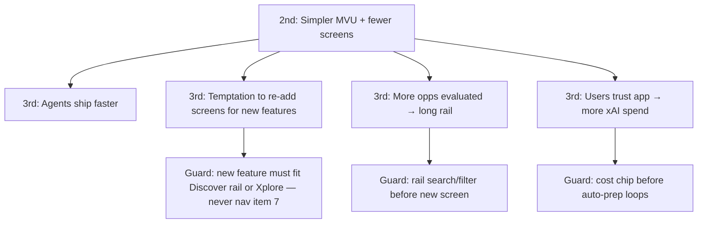

| 2nd order | 3rd order | Guard (write in PR or follow-up) |
|-----------|-----------|----------------------------------|
| Faster dev | Feature creep restores Statistics “just for one chart” | **Nav freeze:** 3 items; charts → Advanced |
| Users evaluate more opps | Rail > 30 rows; scroll fatigue | **Rail cap + search in-place** (not new screen) |
| DB trust rises | User runs prep on everything; cost surprise | Header **est. cost** on prep CTA (defer full guard) |
| Dead `history.*` on hot path | Agent reintroduces fan-out “for completeness” | Delete triggers from job effects in same PR |
| Xplore obscure | X feature atrophy | Xplore sidebar icon + one dogfood X script |
| Single PR success | “Let’s split intuitive shell into 8 PRs again” | **One PR** — commits inside, not Graphite stack |

**Third-order trap for this product:** Success on Discover → stakeholders ask for “pipeline CRM” → six screens return under new names. **Counter:** pipeline = **sorted rail + status badge**, not new IA.

---

## 4. First principles (unchanged, now gated by §1–3)

| Rule | Meaning |
|------|---------|
| **One opportunity, one place** | Fit, prep, and “my opportunities” live on **one screen** (Discover). |
| **List is memory** | If SQLite has it, the UI shows it. No xplore. |
| **Action refreshes** | Success on analyze/prep/search **updates the list**. No Refresh button. |
| **Click = continue** | Row click loads that opportunity into the panel. No “Resume last” gimmick. |
| **X is optional** | Opportunity path (Discover) is default. X is a **second mode** (Xplore), not a scroll past the form. |
| **Admin is hidden** | Raw SQL tables, FTS, reactor stats → palette or Settings › Advanced only. |
| **Fail loud, keep data** | Errors get a banner. Last good rows stay on screen. |

SpaceX-style: **remove until it breaks, then add back the minimum (≤10%).** (Implemented with Discover rail + Xplore.)

---

## 5. Today vs target

### Today — cognitive load

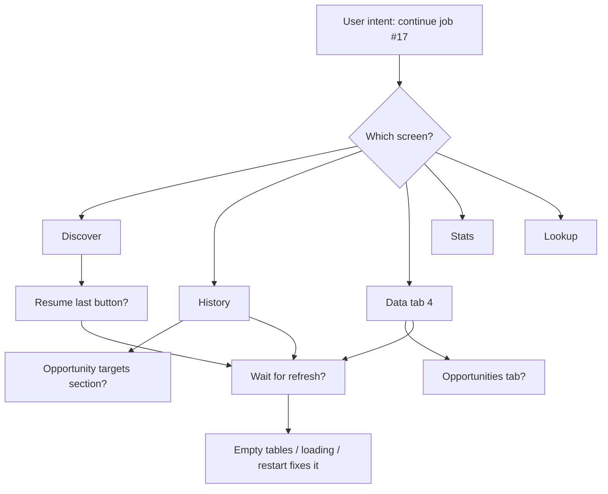

**Six nav items · six history slices · six IPC calls · three places for the same job row.**

### Target — one critical path

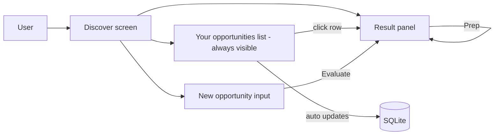

**Three nav items:** Discover · Xplore · Settings. (Xplore for X search/cycle.)

---

## 6. Navigation cut

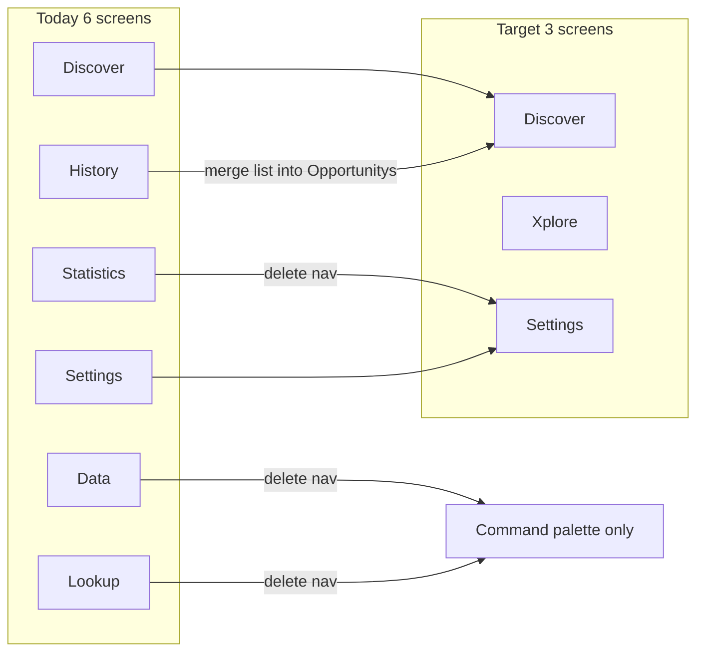

| Screen | Fate | Why |
|--------|------|-----|
| **Discover** | (primary) | Hero loop stays; layout with rail. |
| **History** | **Remove** | Opp rows → Discover rail. X runs → Xplore. |
| **Data** | **Remove from nav** | Power users: palette “Raw data tables”. |
| **Statistics** | **Remove from nav** | One status chip in header (pauses / connection). |
| **Lookup** | **Remove from nav** | Palette “Search archive” or Xplore › Archive. |
| **Settings** | **Keep** | Keys + Advanced (diagnostics). |
| **Xplore** | **New** | X query, cycle, tweet feed only. |

---

## 7. Discover screen — the whole product (opportunities rail primary)

### Layout (wireframe)

```
┌──────────────────────────────────────────────────────────────────┐
│ Header: Discover      [● Connected] [2 pauses]     [⌘K]         │
├─────────────┬────────────────────────────────────────────────────┤
│ YOUR OPPORTUNITIES │  RESULT                                      │
│ ─────────── │  ┌─────────────────────────────────────────────┐   │
│ ● #19 xAI   │  │ 78/100  Fit + Prep                          │   │
│   prepped   │  │ rationale · gaps · prep artifacts           │   │
│ ○ #17 …     │  │ [Generate prep] [Open URL] [Clear]          │   │
│ ○ #12 …     │  └─────────────────────────────────────────────┘   │
│             │  — or empty: “Pick an opp or add a new one below”  │
│ [+ New]     │                                                     │
├─────────────┤  NEW / PASTE                                        │
│ CV ▾        │  [ URL________________________ ]                    │
│ (collapsed  │  [ Paste JD___________________ ]                    │
│  by default)│  [ Evaluate fit ]                                   │
└─────────────┴────────────────────────────────────────────────────┘
```

### User flows (zero manual)

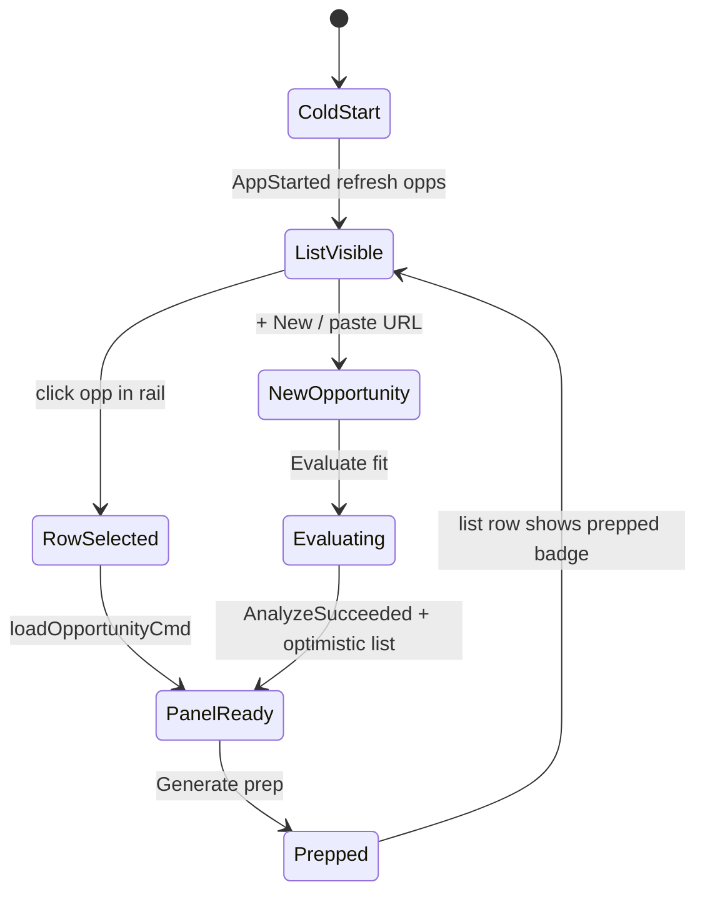

| User thought | UI answer (no doc needed) |
|--------------|---------------------------|
| “Where are my opportunities?” | Left rail, always. |
| “Continue last one?” | Top row is most recent — click it. |
| “Did it save?” | Row appears / badge updates. |
| “What do I do first?” | Empty panel copy + URL field. |
| “Where’s my CV?” | Expand **CV** strip; edits persist. |

**Delete from Discover screen:** Resume-last button, separate History/Data navigation, X search block (moves to Xplore), PauseLog wall (→ header chip), DecisionPanel unless cycle ran from Xplore.

---

## 8. Xplore screen — optional mode

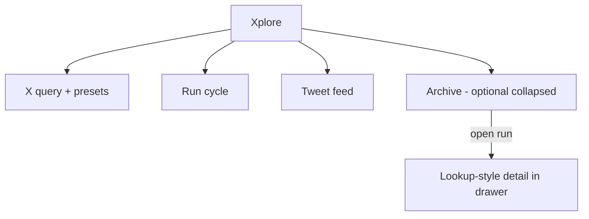

**Rule:** No job URL field on Xplore. No CV required for browse (cycle may still use model CV).

---

## 9. Settings — keys + basement

| Section | Content |
|---------|---------|
| **Connection** | X bearer · xAI key (today’s panels) |
| **Advanced** | Raw tables link · reactor JSON · export DB path |

No philosophy footer on every screen — one line in Settings if needed.

---

## 10. State model — one PR fixes the report bugs

Reports: TD-009, TD-023, TD-020, empty History/Data, stuck loading, fan-out races.

**Stop treating “history dashboard” as six independent TV channels.**

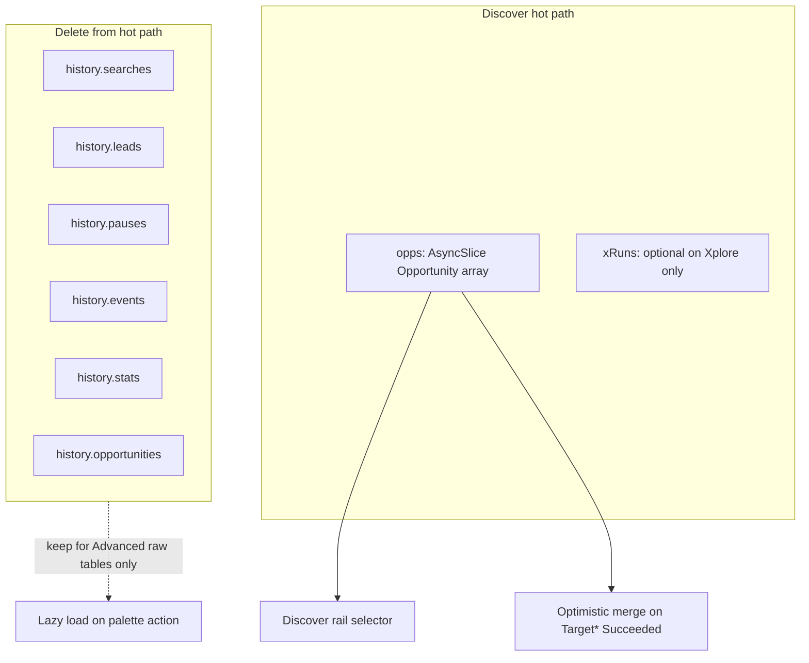

### Messages (minimal new surface)

| Msg | Role |
|-----|------|
| `DiscoverRefreshRequested` | User never dispatches — effects only |
| `DiscoverRefreshed` | `{ opportunities: Opportunity[] }` |
| `DiscoverRefreshFailed` | Banner; **keep** `opps.data` |

**Replace** `HistoryRefreshRequested` on target analyze/prep success with Discover refresh only (or optimistic-only + background refresh).

### Selector rule (fixes “empty while loading”)

```ts
// projectOpps(slice) for Discover:
//   ready → data
//   refreshing → data (same rows + subtle indicator)
//   failed → data + error flag
//   idle on first launch → skeleton, not "no jobs"
```

### Rust (small, same PR)

| Change | Why |
|--------|-----|
| Keep `get_opportunities` | Already correct id filter |
| Optional `get_jobs_snapshot` | Single IPC: opps + `total_pauses` for header chip |
| **Do not** touch secrets / credential block | STABILITY CONTRACT |

Reactor RAM vs DB (TD-004): **UI no longer reads reactor for jobs.** Promote/cycle stay on Xplore; job list is **SQLite only**.

---

## 11. Feature removal list (step ② — encouraged)

| Remove | Replacement |
|--------|-------------|
| Sidebar: Statistics, History, Data, Lookup | Opportunitys · Xplore · Settings |
| History “Refresh” button | Auto refresh |
| Data 4-tab default UX | Palette › “Raw data” |
| `historyRefreshCmd` 6-way fan-out on job path | `refreshOpportunitysCmd` |
| Resume-last button | Opportunitys rail |
| Discover X column pollution | Xplore screen |
| “Full Prep (coming soon)” | Already gone — don’t reintroduce |
| Footer essay on every screen | Settings one-liner |
| Palette 6 “Go to X screen” items | 3 screens + actions |
| `SearchRunSelected` from job contexts | Xplore archive only |
| Guard dashboard full screen | Header chip + Advanced |

---

## 12. Single PR — file map

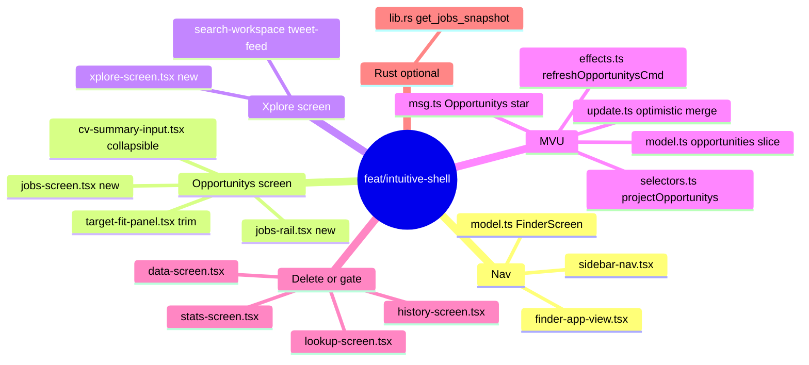

**Estimate:** ~15–22 files · one PR · no credential/STABILITY edits.

---

## 13. Implementation order — mapped to Musk steps (one PR)

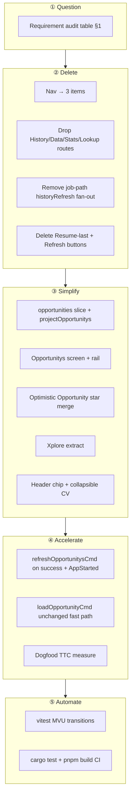

| Commit block | Musk step | Deliverable |
|--------------|-----------|-------------|
| 1–2 | ② Delete | 3 nav items; old screens unreachable from sidebar |
| 3–4 | ③ Simplify | `jobs` model + `refreshOpportunitysCmd` + selector |
| 5–6 | ③ Simplify | Opportunitys screen + rail + wire click/hydrate |
| 7 | ③ Simplify | Optimistic merge on analyze/prep success |
| 8 | ③ Simplify | Xplore screen; strip X from Opportunitys |
| 9 | ②③ | Gate raw Data via palette; palette cleanup |
| 10 | ③ | Header status chip |
| 11 | ④ | Dogfood script + TTC log in PR description |
| 12 | ⑤ | vitest — **last commit** |

**Wrong order alarm:** vitest before delete = automating the six-screen shell.

---

## 14. Flight rules (acceptance — 1000% intuitive bar)

Cold start **with keys set**, no README:

| # | Rule | Pass |
|---|------|------|
| F1 | Open app → see job list or clear “add first job” | ≤ 3 sec to understand |
| F2 | Evaluate URL → row at top + panel fills | No screen change |
| F3 | Click row → panel loads prior fit/prep | No re-xAI |
| F4 | Prep → badge on row | Same screen |
| F5 | Restart → CV + list still there | No empty flash |
| F6 | Never need Refresh | — |
| F7 | Never open Data/History to find a job | — |
| F8 | Xplore is optional; Opportunitys works with zero X knowledge | — |

**Dogfood script (5 min):** Greenhouse URL → evaluate → prep → click another row → restart → click top row. **All on Opportunitys.**

**Automated:** `cargo test` · `pnpm test` (new) · `pnpm build`.

---

## 15. Report closure matrix

Every open item from prior reports → **this PR**:

| Source | Item | How single PR closes it |
|--------|------|-------------------------|
| quick-target | Right panel, CV, MVU, visibility | Discover layout |
| ux v0.2 T1 | CV order | Collapsible CV on Opportunitys |
| ux v0.2 T2 | Dead prep button | Stay deleted |
| ux v0.2 T3 | Data rows click | Opportunitys rail |
| ux v0.2 Wave 2 | History job targets | Opportunitys rail |
| ux v0.1 | Stats vs History mismatch | One jobs snapshot; stats in chip |
| TD-001/002 | Dedup + id filter | Keep (done) |
| TD-003/011 | Pauses + persist banner | Keep (done) |
| TD-009 | Refresh fan-out | `refreshOpportunitysCmd` |
| TD-020 | Session persist | Keep + list on start |
| TD-023 | Selector leaks | `projectOpportunitys` |
| TD-004 | Dual state | UI reads DB for jobs |
| TD-007 | No FE tests | vitest in same PR |
| TD-021 | Dead code | Delete gated screens |
| batch-2 B2-2–B2-4 | Per-slice refresh, optimistic, projection | §10 |
| batch-2 B2-8 | SearchRun prev | Xplore archive only |

**Defer (not this PR):** cv-promote-guard live devprofile · MCP · SSRF · prep HTML UI · reactor full hydrate.

---

## 16. Copy rules (Orwell)

Use on Opportunitys screen only:

| Bad | Good |
|-----|------|
| “OpportunitySelected hydrate path” | “Your jobs” |
| “Evaluate fit using grok-4.3 structured output” | “Evaluate fit” |
| “No matching rows in opportunities slice” | “No jobs yet — paste a URL below” |
| “History refresh requested” | (no user-visible text) |
| “Timeline of runs and captured leads” | (gone — Xplore shows X runs) |

---

## 17. Risk & rollback (incl. 2nd / 3rd order)

| Risk | Order | Mitigation |
|------|-------|------------|
| Power user wants raw SQL | 2nd | Palette › Raw data (lazy) |
| X-heavy user | 2nd | Xplore screen; label + one X dogfood path |
| Large diff | 2nd | One PR; commits follow §13 steps |
| Regression on cycle | 2nd | Xplore-only; cargo test |
| Re-nav creep (Stats “just one chart”) | 3rd | Nav freeze in AGENTS or PR template |
| Rail overflow at 50+ jobs | 3rd | In-rail search before any new screen |
| Agent restores `historyRefreshCmd` | 3rd | Grep gate in PR checklist |

Rollback = revert one PR; DB schema unchanged. **3rd order:** rollback restores tab confusion — avoid partial revert.

---

## 18. Success metric

**Time-to-continue (TTC):** seconds from app open to seeing job #N fit panel without typing URL.

| Cohort | Today (est.) | Target |
|--------|--------------|--------|
| Returning user | 30–90 s (nav + xplore + refresh) | **< 5 s** (click top row) |
| New user | 60 s (parse 6 icons) | **< 15 s** (one field + one button) |

If TTC is not measured in dogfood, the PR is not done (step ④).

**Second-order check:** After ship, count support questions / bug reports about “where is my job” — target **zero** in first week.

**Third-order check:** 30 days out, nav item count still **3**. If not, the simplification failed upstream.

---

## 19. Related docs

| Doc | Role |
|-----|------|
| [batch-2-engineering-blueprints.md](./batch-2-engineering-blueprints.md) | Incremental path — **superseded for UX by this PR** |
| [tech-debt-deep-dive.md](./tech-debt-deep-dive.md) | TD IDs referenced in §15 |
| [ux-review-v0.2-target.md](./ux-review-v0.2-target.md) | Problem statements |

---

## 20. Decision checklist (before any line of code)

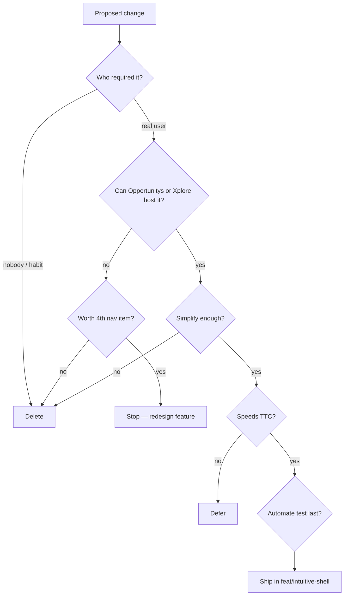

---

*Question → delete → simplify → accelerate → automate. Think two steps ahead. Guard the third.*
