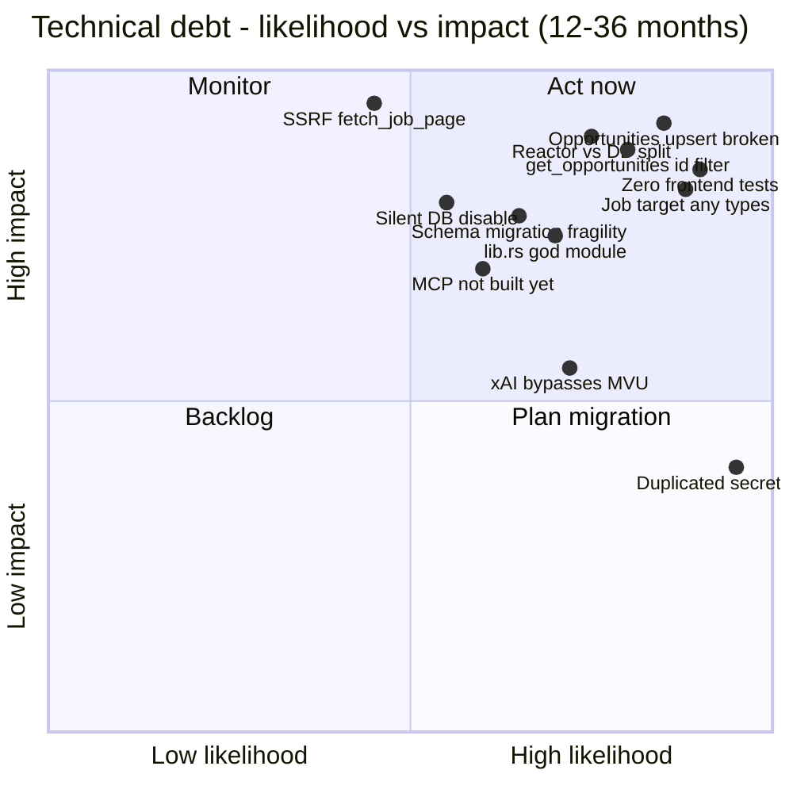
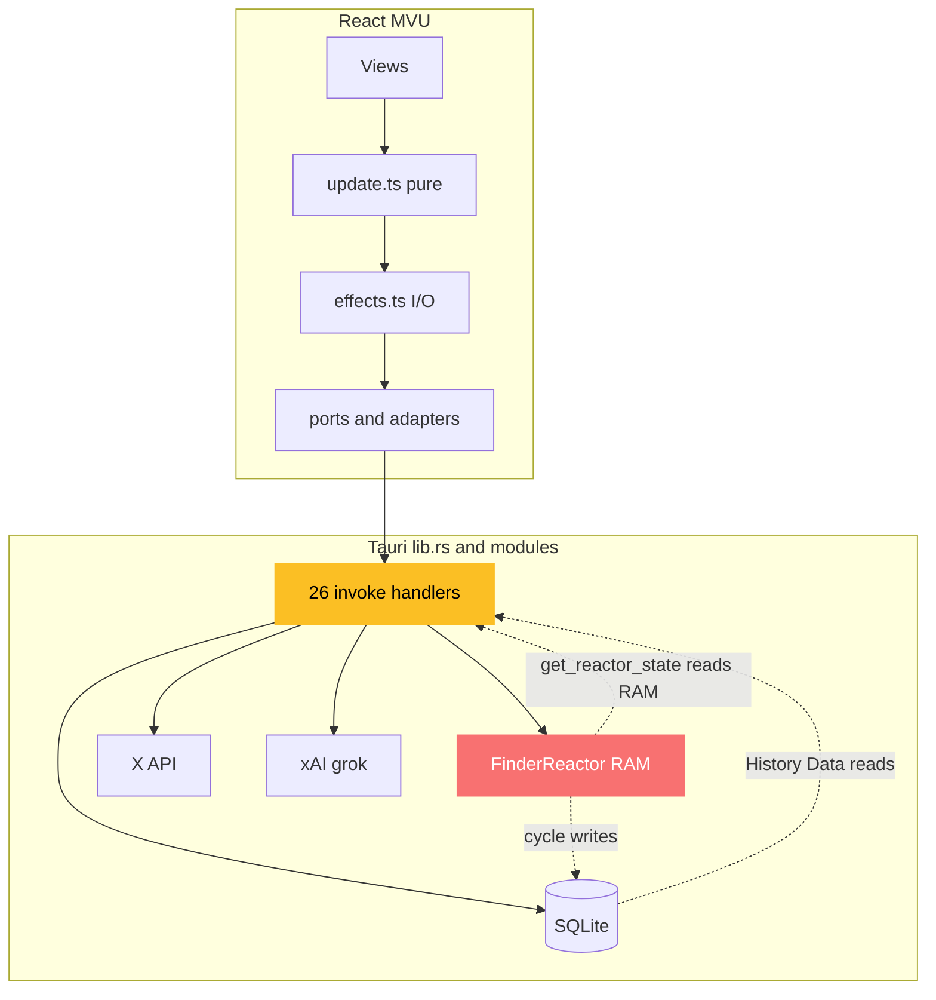
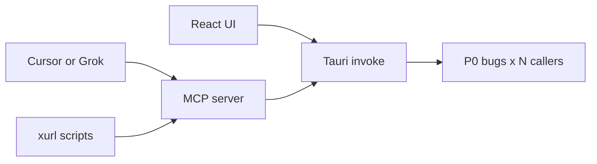

```mermaid
flowchart TB
  subgraph act_now["Act now - high likelihood and impact"]
    direction TB
    TD001[TD-001 Opportunities upsert]
    TD002[TD-002 get_opportunities id]
    TD004[TD-004 Reactor vs DB split]
    TD007[TD-007 Zero frontend tests]
    TD006[TD-006 Job target any types]
    TD005[TD-005 lib.rs god module]
  end

  subgraph monitor["Monitor - moderate"]
    direction TB
    TD008[TD-008 xAI bypasses MVU]
    TD016[TD-016 Schema migrations]
    TD018[TD-018 MCP not built]
    TD015[TD-015 Silent DB disable]
  end

  subgraph plan["Plan migration - high impact, lower likelihood"]
    TD014[TD-014 SSRF fetch_job_page]
  end

  subgraph backlog["Backlog - low impact"]
    TD019[TD-019 Duplicated secrets code]
  end
```

# collab-finder — Deep technical debt report

**Audience:** Tech lead, implementers, future agents  
**Date:** 2026-06-08  
**Horizon:** Issues that compound over **months → years** if unaddressed  
**Scope:** Rust backend (`src-tauri/`), MVU/React frontend (`src/`), cross-boundary contracts, ops/test/docs  
**Related:** [ux-review-v0.1-dogfood.md](./ux-review-v0.1-dogfood.md) (product friction), [quick-job-target-feedback.md](./quick-job-target-feedback.md) (feature checklist)

---

## Executive summary

collab-finder has a **strong architectural intent** (MVU shell, self-guards, stability contracts on credentials, snippet-only X storage) but **fast feature velocity** on job-target + multi-screen UI has outpaced **data integrity, type contracts, and test coverage**. Several items are not “cleanup” — they are **latent bugs** that will surface as opportunity count, command surface, and agent/MCP exposure grow.

| Tier | Count (approx.) | Time to bite | Theme |
|------|-----------------|--------------|-------|
| **P0 — latent bugs** | 4 | Weeks–months | Broken upsert, wrong ID fetch, dual state, dead pause persistence |
| **P1 — structural** | 8 | Months | God-module, split brain reactor/DB, zero FE tests, `any` at job boundary |
| **P2 — scaling** | 7 | Months–years | Async+SQLite blocking, SSRF, schema migrations, content policy asymmetry |
| **P3 — intentional tax** | 4 | Ongoing | Duplicated secrets pattern, stability headers — **preserve, don’t “refactor away” blindly** |

**If you fix nothing else in 2026:** fix `opportunities` dedup + ID query, unify reactor vs SQLite truth, add TS types for job-target IPC, add vitest for `update.ts`.

---

## Debt heat map (when it hurts)

Impact vs likelihood (12–36 months). **GitHub** renders `quadrantChart` (Mermaid 10.3+). The table and flowchart below are fallbacks for older previewers (e.g. some IDE panes).

| Item | Likelihood | Impact | Quadrant |
|------|------------|--------|----------|
| Opportunities upsert broken | 0.85 | 0.92 | Act now |
| get_opportunities id filter | 0.80 | 0.88 | Act now |
| Reactor vs DB split | 0.75 | 0.90 | Act now |
| Zero frontend tests | 0.90 | 0.85 | Act now |
| Job target any types | 0.88 | 0.82 | Act now |
| lib.rs god module | 0.70 | 0.75 | Act now |
| xAI bypasses MVU | 0.72 | 0.55 | Monitor |
| Schema migration fragility | 0.65 | 0.78 | Monitor |
| MCP not built yet | 0.60 | 0.70 | Monitor |
| Silent DB disable | 0.55 | 0.80 | Monitor |
| SSRF fetch_job_page | 0.45 | 0.95 | Plan migration |
| Duplicated secrets code | 0.95 | 0.40 | Backlog |



<details>
<summary>Fallback flowchart (IDE previewers without quadrantChart)</summary>



</details>

---

## Architecture today vs where pressure builds



**Pressure point:** Two sources of truth (reactor RAM vs SQLite) + growing `lib.rs` surface + untyped job-target boundary. MCP/agents will call the same handlers — errors and silent failures multiply.

---

## P0 — Latent bugs (fix before scaling usage)

### TD-001 — `upsert_opportunity` does not deduplicate

**Where:** `src-tauri/src/db.rs` — schema `371–391`, upsert `983–1015`

**Problem:** `opportunities` has `id INTEGER PRIMARY KEY` only — **no UNIQUE on `source_url`**. SQL uses `ON CONFLICT DO UPDATE`, which in SQLite only fires on PRIMARY KEY / UNIQUE violations. Every analyze inserts a **new row**.

Post-insert ID recovery is a heuristic:

```sql
SELECT id FROM opportunities
WHERE (source_url = ?1 AND ?1 IS NOT NULL) OR (jd_text = ?2)
ORDER BY id DESC LIMIT 1
```

**Symptoms today:** 17 opportunities in Data tab from repeated Greenhouse runs; prep may attach to wrong row; `opportunity #17` ≠ stable identity for same URL.

**Months out:** Pipeline features (re-analyze, status workflow, MCP `analyze_job_target`) amplify duplicates. Migrations to add UNIQUE require dedup script on live DBs.

**Fix:** `UNIQUE(source_url)` where not null + proper upsert key; or explicit `UPDATE … WHERE source_url = ?`; tests in `db.rs`.

---

### TD-002 — `get_opportunities` ID filter is wrong

**Where:** `db.rs` `906–943`; used by `prep_job_target` via `lib.rs`

**Problem:** Query applies `ORDER BY last_updated DESC LIMIT ?`, then filters `filter.id` **in memory**. Target opportunity not in top N recency → empty result → prep fails silently for older jobs.

**Months out:** Grows with every job analyzed; “Generate prep” from Data row or stale session breaks unpredictably.

**Fix:** `WHERE id = ?` in SQL when `filter.id` set.

---

### TD-003 — Reactor pauses never persisted

**Where:** `finder_reactor.rs` (in-memory `state.pauses`); `db.rs` `record_pause` `539–558`

**Problem:** Guards push pause strings into RAM only. `record_pause` exists and has tests (`1142–1156`) but **is never called from production**. `get_recent_pauses` returns empty in real use.

**Months out:** Audit/compliance story (“self-guards logged”) is false. UI Stats “Pauses logged” reflects session strings in TS, not DB pauses — dual fiction.

**Fix:** Wire `record_pause` from reactor guard triggers; or drop pauses table until wired; align TS `model.pauses` vs `history.pauses`.

---

### TD-004 — Dual lead/state models (reactor RAM vs SQLite)

**Where:** `finder_reactor.rs` `46–53`, `208–238`; `lib.rs` `580`, `436–441`; `commands.rs` `64–78`

**Problem:**

| Concern | Reactor (RAM) | SQLite |
|---------|---------------|--------|
| Leads | `state.leads` | `leads` table |
| After restart | Empty / stale | Durable |
| Cycle | Writes DB | — |
| `get_reactor_state` | Reads RAM | — |
| `promote_lead` | Reads RAM stub | — |
| Analysis | Keyword heuristic | xAI for jobs only |

**Months out:** Promote/CV guard, MCP multi-session, and “refresh reactor” will fight over which store is canonical. Restart = History shows leads, reactor disagrees.

**Fix:** DB as source of truth; reactor as orchestrator; hydrate reactor from DB on start or remove in-memory leads.

---

## P1 — Structural debt (months)

### TD-005 — `lib.rs` god-module (613 lines, 26 handlers)

**Where:** `src-tauri/src/lib.rs`

**Contains:** Credential stability boundary, job pipeline (~230 lines), HTML strip, JSON schemas, search/cycle/history handlers, app bootstrap.

**Why it compounds:** Every feature touches the same file as the **8 credential commands** stability contract. `commands.rs` exists for persist helpers but job-target logic stayed inline. MCP server will mirror this surface — duplication without extraction = double maintenance.

**Fix (safe):** Extract `job_target.rs`, `html_util.rs`, keep credential block untouched per STABILITY CONTRACT headers (`lib.rs` `26–41`).

---

### TD-006 — Job-target domain untyped end-to-end (`any`)

**Where:**

| Layer | File | Issue |
|-------|------|-------|
| Model | `model.ts:68` | `jobTarget: AsyncState<any>` |
| Messages | `msg.ts:78,84` | `result: any` |
| Port | `finder-port.ts:35–37` | `Result<any, …>` |
| Effects | `effects.ts:31–33,205–206,235,262` | `Promise<any>`, `const r: any` |
| UI | `job-fit-panel.tsx` | ~15 `(result as any)` |
| Rust | `lib.rs` | `fit: serde_json::Value`, `prep: Value` |

Rust defines `JobAnalysisResult` / `JobPrepResult`; TS has `Opportunity` row type but not runtime fit/prep shapes.

**Months out:** Every xAI schema tweak breaks UI silently. Prep merge hacks (`update.ts` `346–371` with `as any`) get worse with editable artifacts + cv-promote-guard.

**Fix:** `src/core/domain/job-target.ts` mirroring serde; codegen or shared JSON schema; remove `any` from model/msg/port/adapter.

---

### TD-007 — Zero frontend tests

**Where:** No `*.test.ts(x)` in repo; `package.json` only `build` (tsc + vite).

**Rust has:** `db.rs`, `secrets.rs`, `finder_reactor.rs`, `x_query.rs`, etc.

**Gap:** No TS↔Rust contract tests; no pure MVU tests for `update.ts`, `flows.ts`, `selectors.ts`.

**Months out:** Refactors to job-target, history refresh, or screen shell regress without signal. Agents merge broken MVU transitions routinely.

**Fix:** Vitest + tests for `update.ts` / `flows.ts` first (pure, highest ROI).

---

### TD-008 — xAI credentials bypass MVU

**Where:** `settings-screen.tsx` `XaiKeyPanel` — local `useState`, direct `safeInvoke`

X bearer: `CredentialsSlice` + ports + effects + Settings re-probe on `ScreenChanged`.

xAI key: parallel ad-hoc panel; no global banner integration; no shared connection flow.

**Months out:** Third secret (e.g. devprofile path) = third pattern. MCP `ask_user` gates won’t see xAI errors consistently.

**Fix:** `XaiCredentialsSlice` mirroring bearer pattern.

---

### TD-009 — `historyRefreshCmd` fan-out race

**Where:** `effects.ts` `279–307`

Six parallel fetches each dispatch partial `HistoryRefreshed`. Secondary failures silently ignored. Triggered from AppStarted, search/cycle success, job analyze/prep — thundering herd.

**Months out:** Stats/History UX bugs (0 vs 10 searches) worsen under timing; new slices add 7th fetch.

**Fix:** Single batched port call or one atomic `HistoryRefreshed` with full payload; loading state for all slices.

---

### TD-010 — `Result<T, String>` everywhere

**Where:** All Tauri commands; adapters map to `AppError`

**Problem:** No typed variants (rate limit, auth, DB locked, validation). UI can’t retry intelligently; MCP tools can’t expose structured tool errors.

**Months out:** Error handling becomes copy-paste string matching.

**Fix:** `thiserror` enum in Rust; serde to TS discriminated union.

---

### TD-011 — Best-effort persistence swallows failures

**Where:** `lib.rs` `165–180` (`unwrap_or(0)` on upsert); `commands.rs` persist helpers; `log_event` always Ok

**Problem:** User sees success; DB write failed. Audit trail gaps invisible.

**Months out:** Debugging “where did my opportunity go?” requires log archaeology.

**Fix:** Return write status to UI; surface banner on persist failure; don’t log success if insert failed.

---

### TD-012 — Split intelligence layer (reactor heuristic vs xAI)

**Where:** `finder_reactor.rs` `120–157` (keyword fit); `lib.rs` + `xai.rs` (structured grok for jobs)

Comments promise xAI structured decisions for cycle; not implemented.

**Months out:** Users trust job fit (78/100) but X cycle decisions feel arbitrary. Unifying is a large migration (reactor tests, guard semantics, cost model).

---

## P2 — Scaling & longevity (months–years)

### TD-013 — Async handlers + blocking SQLite (double mutex)

**Where:** `lib.rs` `AppDb(StdMutex<SqliteStore>)`; `db.rs` `conn: Mutex<Connection>`

All `async` commands lock std mutex on Tokio runtime — no `spawn_blocking`. WAL + `busy_timeout=5000` helps but serializes writers.

**Years out:** Concurrent search + job analyze + history refresh → IPC latency spikes; poisoned mutex kills all DB access.

**Fix:** Dedicated blocking pool or `spawn_blocking` for DB; single lock layer.

---

### TD-014 — `fetch_job_page` SSRF + unbounded fetch

**Where:** `lib.rs` `89–111` — registered IPC command

Any URL from webview fetched server-side. No scheme allowlist, no private-IP block, response body unbounded before 8k truncate.

**Years out:** Security review blocker for distributed builds; malicious JD link probes localhost.

**Fix:** Allowlist `https://`; block RFC1918; max bytes read; optional domain presets (Greenhouse, Lever).

---

### TD-015 — Silent DB disable on init failure

**Where:** `db.rs` `144–154`, `401–416`

Open/path failure → in-memory disabled store; writes return `Ok(0)` / empty vectors.

**Years out:** Permission bugs on Linux/macOS look like “app works, history empty.” No UI indicator.

**Fix:** `DbHealth` status command; banner in Settings/Stats when disabled.

---

### TD-016 — Schema migration fragility

**Where:** `db.rs` `SCHEMA_VERSION = 3`; manual ladder `migrate_v1`…`v3`

| Risk | Detail |
|------|--------|
| Non-transactional migrate | Partial failure leaves DB inconsistent |
| v2 data mutation | Truncates all tweet text + FTS rebuild — slow, irreversible at scale |
| No checksum | `schema_migrations` idempotency only |
| Downgrade | Older app vs newer DB = opaque errors |

**Years out:** Every feature (cost ledger, job pipeline status, MCP audit) adds migration debt. One bad deploy bricks user history.

**Fix:** Transaction-wrapped migrations; backup prompt; migration tests with fixture DBs.

---

### TD-017 — Content storage policy asymmetry

| Data | Policy |
|------|--------|
| X tweets | Snippet 280 chars, hydrate on demand — tested, documented |
| Job descriptions | Full text in `opportunities.jd_text` — unbounded |
| LLM artifacts | Full JSON in `analysis_json`, `prep_artifacts_json` |

**Years out:** DB size, backup privacy, inconsistent compliance story vs X snippet policy.

**Fix:** JD truncation policy; artifact sidecar files; retention settings.

---

### TD-018 — Hardcoded business constants (grep archaeology)

| Constant | Location |
|----------|----------|
| CV fallback bio | `lib.rs` `135–137` |
| Fit threshold 70, cost 10k | `finder_reactor.rs` |
| x rate 450 | `finder_reactor.rs` |
| grok-4.3 pricing | `xai.rs` |
| JD 8000 / preview 600 | `lib.rs` |
| Prep gate 45 in UI | `job-fit-panel.tsx` `175` |

**Years out:** Product tuning requires multi-file changes; reactor guards disagree with job-target gates.

**Fix:** `config.toml` or Rust `FinderConfig` loaded once; expose read-only in Settings.

---

### TD-019 — Duplicated secrets implementation (intentional)

**Where:** `secrets.rs` — bearer + xAI mirrored (~300 lines); `file_store.rs` vs `xai_key_store.rs`

Stability contract **requires** duplication to avoid regression (`secrets.rs` `58–59`).

**Years out:** Every security fix applied twice; third secret triples cost. **Do not abstract blindly** — extract shared *test harness* only.

---

## P3 — Frontend / MVU specific

### TD-020 — Session state not persisted

**In MVU, lost on restart:**

- `cvSummary`, `query`, `activeScreen`
- `jobTarget` result blob
- `model.pauses` (session strings)
- Quick Job Target URL/JD (`useState` in `discover-screen.tsx` `121–122`)

Opportunities persist in SQLite but Discover never reloads them into `jobTarget`.

---

### TD-021 — Dead and duplicate UI code

| Item | Location |
|------|----------|
| `history-dashboard.tsx` | Not imported anywhere |
| Tweet rows | `lookup-screen.tsx` vs `tweet-feed.tsx` |
| Credential panels | MVU `credentials-panel.tsx` vs Settings `XaiKeyPanel` |
| `@deprecated` `lib/types.ts` | Still used by 3 components |

---

### TD-022 — `AsyncState` cannot express loading-with-data

Prep flow merges prior fit via `as any` during loading (`update.ts`). `JobTargetPrepFailed` drops prior fit (`373–379`).

**Fix:** `AsyncState` variant `{ status: 'loading'; data?: T }` or separate `jobTargetFit` + `jobTargetPrep` slices.

---

### TD-023 — Selector/view leaks

`selectFinderView` returns full `model` + projections; screens read `view.model` directly. `history.pauses` loaded never projected. `jobTarget` not in `FinderViewState`.

---

## Security boundary summary

| Boundary | Status | Notes |
|----------|--------|-------|
| Credential IPC | **Good** | Internal getters; stability contract |
| Plaintext file fallback | **Documented** | `0600`, tradeoff stated |
| Keyring heal on read | **Surprising** | Side effect on Settings open |
| `fetch_job_page` | **Weak** | SSRF |
| `log_event` | **Open** | Arbitrary payload size → DB bloat |
| `hydrate_tweet` | **Good** | Full text memory-only |

---

## Documentation & product drift

| Doc | Drift |
|-----|-------|
| `README.md` | Says “17 handlers”; actual `generate_handler!` has **26** commands |
| `docs/tauri-commands.md` | Job-target documented; MCP “planned” |
| `SKILL.md` / architecture docs | Promise MCP + xAI cycle; reactor still heuristic |
| `cv-promote-guard` skill | devprofile integration pending; fallback CV in Rust |

**Years out:** Agents read stale docs; implement against fantasy API.

**Fix:** Command count automation in CI; doc check script vs `generate_handler!`.

---

## Test coverage matrix

| Area | Rust tests | TS tests | Integration |
|------|------------|----------|-------------|
| SQLite core / migrate | ✅ extensive | — | — |
| X bearer secrets | ✅ | — | — |
| xAI key lifecycle in secrets.rs | ❌ | — | — |
| xai structured_chat | partial (cost only) | — | — |
| analyze/prep/fetch job | ❌ | — | — |
| upsert_opportunity | ❌ | — | — |
| strip_html_basic | ❌ | — | — |
| MVU update/effects | — | ❌ | — |
| IPC contract TS↔Rust | — | ❌ | ❌ |

---

## MCP / agent exposure (future multiplier)

Planned MCP will wrap the same 26 commands. **Debt multiplier:**



Untyped errors, silent DB failures, and duplicate opportunities become **agent-visible failures** at scale. Fix P0–P1 before MCP ship.

---

## Intentional debt (preserve, manage)

| Item | Why it exists | Manage by |
|------|---------------|-----------|
| Duplicated bearer/xAI secrets | Stability contract | Shared tests, not shared impl |
| STABILITY headers in lib/secrets/app_dirs | Repeated regressions | Never “clean up” credential block in drive-by refactors |
| Snippet-only X storage | Policy + compliance | Extend policy to JD/artifacts explicitly |
| Best-effort search persist | UX never block search | Separate “persist failed” telemetry |

---

## Prioritized remediation roadmap

### Phase 0 — Data integrity (1 week)

1. TD-001 UNIQUE + real upsert on `opportunities`
2. TD-002 SQL `WHERE id = ?` for opportunity fetch
3. Tests for upsert + prep-by-id
4. TD-011 surface persist failures to UI banner

### Phase 1 — Single truth (2–3 weeks)

5. TD-004 reactor hydrates from DB or drops RAM leads
6. TD-003 wire `record_pause` or remove dead table reads
7. TD-009 consolidated history refresh
8. TD-006 TS domain types for job-target

### Phase 2 — Hardening (1–2 months)

9. TD-007 vitest for MVU core
10. TD-014 SSRF guards on fetch
11. TD-013 spawn_blocking for SQLite
12. TD-005 extract job_target module (no credential touch)
13. TD-008 xAI into MVU

### Phase 3 — Platform (3–12 months)

14. TD-010 structured errors
15. TD-016 migration framework hardening
16. MCP server with contract tests
17. TD-012 unify xAI intelligence for cycle + jobs
18. TD-017 retention / sidecar policy for JD + prep artifacts

---

## Acceptance criteria (Phase 0 done)

- [ ] Re-analyzing same Greenhouse URL updates **one** row (count stable)
- [ ] `prep_job_target(opportunity_id: 1)` works when 50+ newer opportunities exist
- [ ] `cargo test` includes opportunity upsert + id filter cases
- [ ] Failed DB write shows user-visible banner (not silent `Ok`)
- [ ] README handler count matches `generate_handler!`

---

## Code reference index

| ID | Primary files |
|----|----------------|
| TD-001, TD-002 | `src-tauri/src/db.rs`, `src-tauri/src/lib.rs` |
| TD-003, TD-004, TD-012 | `src-tauri/src/finder_reactor.rs`, `commands.rs` |
| TD-005, TD-014, TD-011 | `src-tauri/src/lib.rs` |
| TD-006, TD-020–023 | `src/core/finder/*`, `job-fit-panel.tsx` |
| TD-007 | `package.json`, new `*.test.ts` |
| TD-008 | `settings-screen.tsx`, `credentials-panel.tsx` |
| TD-009 | `effects.ts`, `update.ts`, `stats-screen.tsx` |
| TD-013, TD-015, TD-016 | `db.rs`, `lib.rs` |
| TD-019 | `secrets.rs`, `secrets/*` |

---

## Closing verdict

The project is **architecturally pointed in the right direction** (MVU, guards, official X resources, credential stability contracts). The debt that will **bite hardest** is not cosmetic — it is **wrong opportunity identity**, **split reactor/DB truth**, and **untyped job-target contracts** at the exact moment you scale from “dogfood one URL” to “pipeline of 50+ jobs + MCP agents.”

Treat Phase 0 as **bugfix, not refactor**. Everything else can ride the UX waves in [ux-review-v0.1-dogfood.md](./ux-review-v0.1-dogfood.md) — but build pipeline UX on correct data first.

---

*Generated from static analysis + subagent exploration of `src-tauri/` and `src/`. Re-validate after major merges to `feat/job-target-analysis` or main.*
